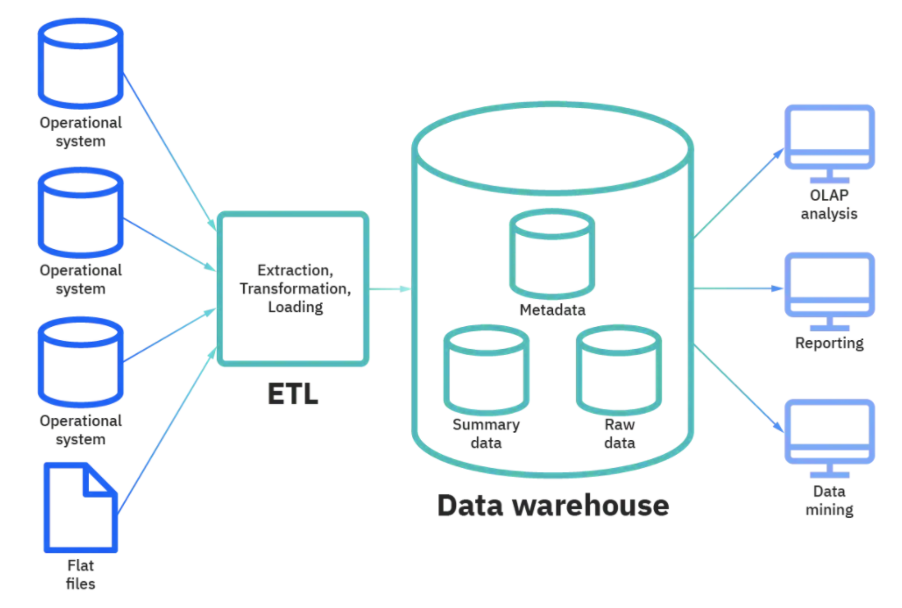
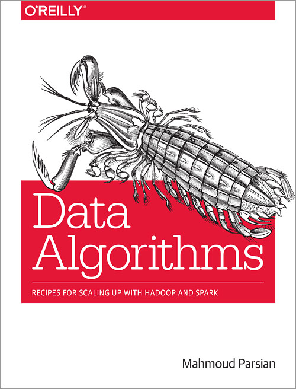

# data-warehousing

---------

## 0. Git Repository

* This repository is a place for **Data Warehousing** 
  Course (MSIS-2621) at Santa Clara University.
  
* [MSIS 2621: Business Intelligence and Data Warehousing](https://www.scu.edu/business/graduate-degrees/ms-programs/ms-information-systems/curriculum/)
	* [Graduate School, Leavey School of Business](https://www.scu.edu/business/)
	* [Department of Information Systems & Analytics](https://www.scu.edu/business/isa/)

* Spring Quarter 2024 (January-March)
	* Class room: Lucas Hall (LH) 310
	* Office: 316U, Lucas Hall (LH)
	* Office Hours: via scheduled Zoom and by appointment

---------

## 1. Course Information: 
	
	This course  is about  data warehousing  and  its 
	role in carrying out modern business intelligence 
	for  actionable  insight  to address new business 
	needs. A data warehouses is the central component 
	of a modern data stack (a modern data  stack is a 
	combination  of  various  software  tools used to 
	collect,  process,  and  store  data  on  a  well 
	integrated    cloud   based    data    platform). 

----------

## 2. Class Meeting Dates & Hours

* **Class meeting dates**: 
	* Start: January 9, 2024
	* End: March 21, 2024
	* Final Exam week: March 18-21, 2024

* **Class hours**:  
	* Tuesday 5:45 PM - 7:20 PM PST
	* Thursday 5:45 PM - 7:20 PM PST

-----------

## 3.  [Instructor, Adjunct Professor: Mahmoud Parsian](https://www.scu.edu/business/isa/faculty/parsian/)

## 4.  [Prerequisite](./webdocs/prerequisite.md)

## 5.  [Course Description & Concepts](./webdocs/course_description.md)

## 6.  [Glossary of Big Data, MapReduce, Spark, Data Warehousing](./slides/glossary/glossary_of_big_data_and_mapreduce.md)

## 7.  [Required Books and Papers](./webdocs/required_books.md)

## 8.  [Optional Books and References](./webdocs/optional_books.md)

## 9.  [Required Software: MySQL and Python](./webdocs/required_software.md)

## 10.  [Syllabus, Winter Quarter 2024](./syllabus/2024-01-Winter/README.md)

## 11. [Grading and Class Conduct](./webdocs/grading_and_class_conduct.md)

## 12. [Python Tutorials](./webdocs/python_tutorials.md)

## 13. [SQL Tutorials](./webdocs/sql_tutorials.md)

## 14. [Office Hours](./webdocs/office_hours.md)

## 15. [Midterm Exam](./webdocs/midterm_exam.md)

## 16. [Final Exam](./webdocs/final_exam.md)

## 17. Mahmoud Parsian's Latest Books: 

-------

### Data Algorithms with Spark 

------

### PySpark Algorithms 

-------

### Data Algorithms 

