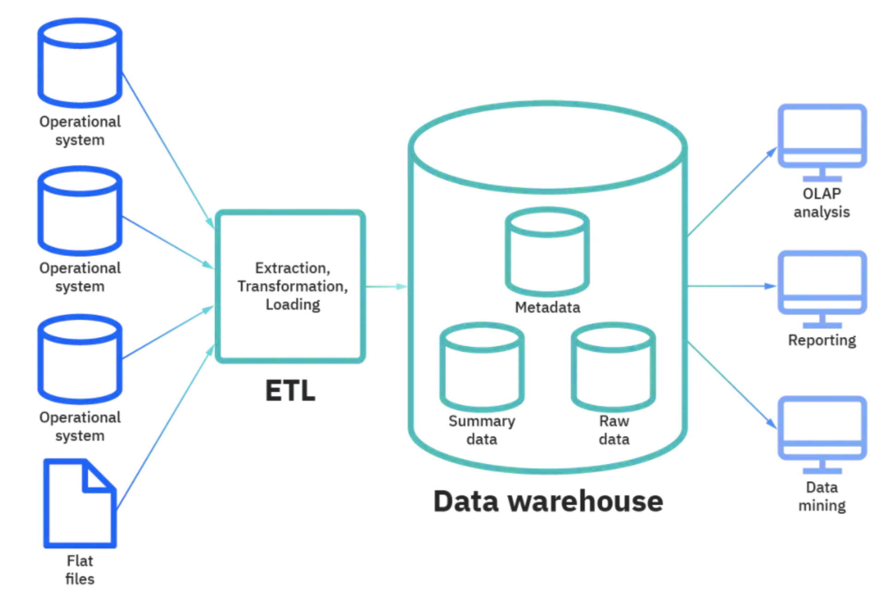
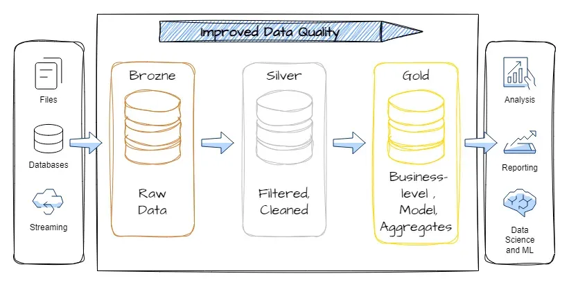

# data-warehousing   Sprint Quarter 2026   March 31 - June 6, 2026

## What is a Database? 

>  the DATABASE helps to perform the **fundamental operation of business**:
> 
* keep customer records
* product records
* transactions, 
* patient profile records
* patient DNA samples,
* ...

## What is a Data Warehouse?

>  the DATA WAREHOUSE helps you to **analyze your business**.

## What is a Data Warehouse?

		Where do you store a petabyte of data for  
		business intelligence?  A  data warehouse, 
		that’s where. Data spans for 2+ years...
		
		At  its  core, a   Data  Warehouse  is  a 
		centralized, read-optimized system designed 
		specifically for querying, reporting,  and 
		analytics. It’s where  your business  data 
		goes  after it’s  been cleaned, structured,  
		and denormalized for performance. 
		
		Unlike operational databases that are built 
		for transactions —  fast  inserts,  updates, 
		deletes — a warehouse is built for OLAP (online 
		analytical processing): aggregations, joins, 
		historical trends, and slow-but-heavy queries.
		

## What is Data Warehousing?

		Data  warehousing (DW) is a technique 
		of gathering and  analyzing data from 
		many sources to get valuable business 
		insights. Typically, a data warehouse 
		integrates and analyzes business data 
		from many sources. 	
			
		The data  warehouse  is the  basis of 
		the business intelligence (BI) system, 
		which can analyze and report on data.

## Skills you will develop: 

		Derive insights from data by 
		building analytical, managerial 
		and baseline technical skills.

---
## Classic Data Warehousing

---

## Medallion Architecture Data Warehousing

---------

## Example Medallion Architecture

---------

## 1. Git Repository

* This repository is a place for Data Warehousing 
  course at the [Department of Information Systems & Analytics, Santa Clara University](https://www.scu.edu/business/isa/).

## 2. [Instructor, Adjunct Professor: Mahmoud Parsian](https://www.scu.edu/business/isa/faculty/parsian/)

## 3. [Teaching Assistant (TA): Mohini Yadav](https://www.linkedin.com/in/mohini-yadav13/)

## 4. [Course Information & Description](./webdocs/docs/course_info_and_desc.md)

## 5. [Academic Integrity](webdocs/docs/academic_integrity.md)

## 6. [Class Meeting Dates & Hours](./webdocs/docs/class_meeting_dates_hours.md)

## 7. [Prerequisite](./webdocs/docs/prerequisite.md)

## 8. [Glossary of Big Data, MapReduce, Spark, Data Warehousing](https://github.com/mahmoudparsian/big-data-mapreduce-course/blob/master/slides/glossary/README.md)

## 9. [Required Books](./webdocs/docs/required_books.md)

## 10. [Required Software: MySQL, Python, Tableau](./webdocs/docs/required_software.md)

## 11. [Syllabus, Spring Quarter 2026](./syllabus/README.md)

## 12. [Grading and Class Conduct](./webdocs/docs/grading_and_class_conduct.md)

## 13. [Python Tutorials](./webdocs/docs/python_tutorials.md)

## 14. [SQL Style Guide](./webdocs/docs/sql_style_guide.md)

## 15. [SQL Tutorials](./webdocs/docs/sql_tutorials.md)

## 16. [Office Hours](./webdocs/docs/office_hours.md)

## 17. [Midterm Exam](./webdocs/docs/midterm_exam.md)

## 18. [Final Exam](./webdocs/docs/final_exam.md)

## 19. [Mahmoud Parsian's Published Books](./webdocs/docs/mahmoud_parsian_books.md)

