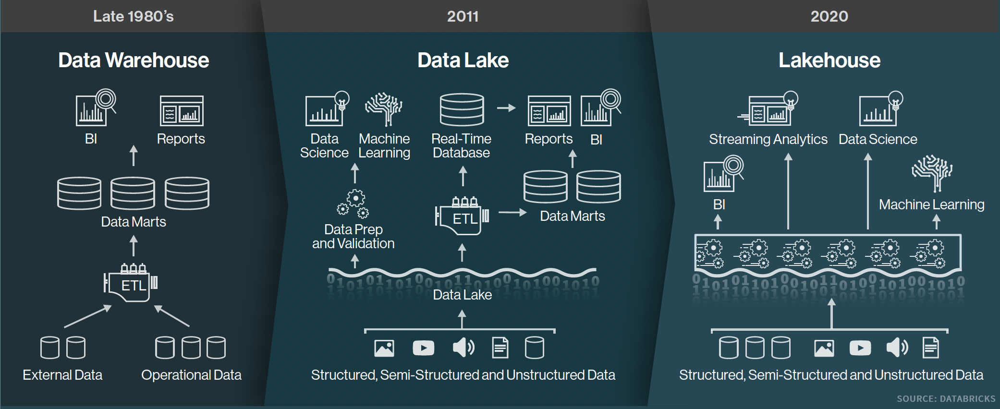
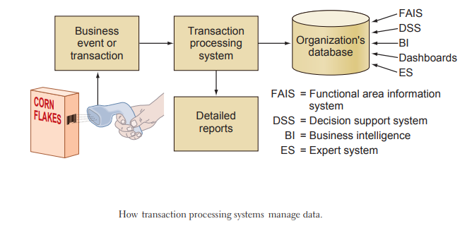
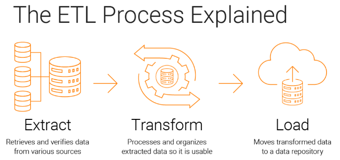
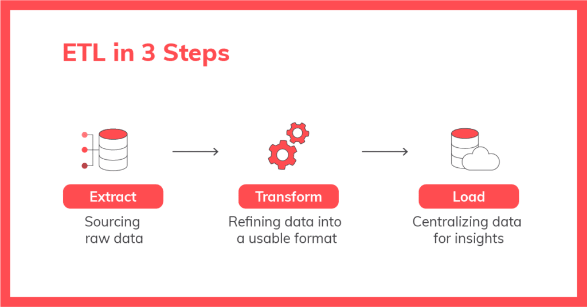
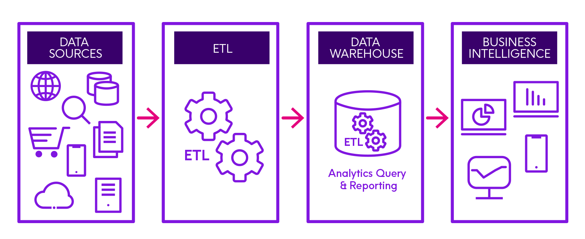
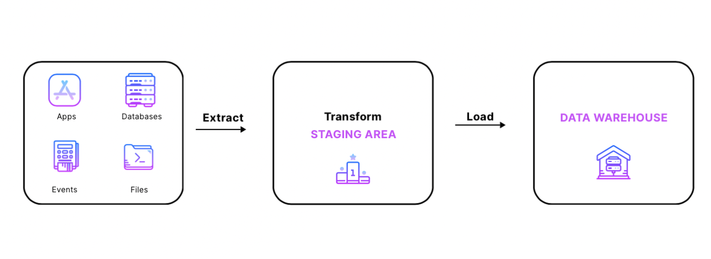
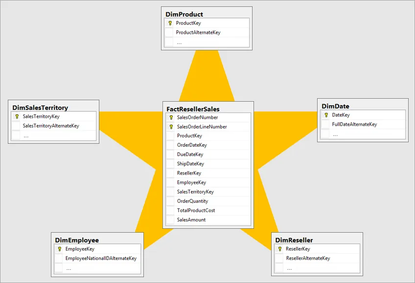
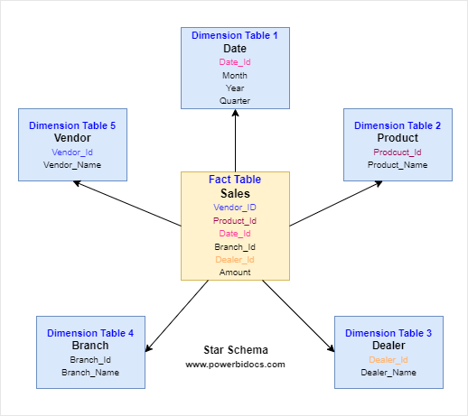
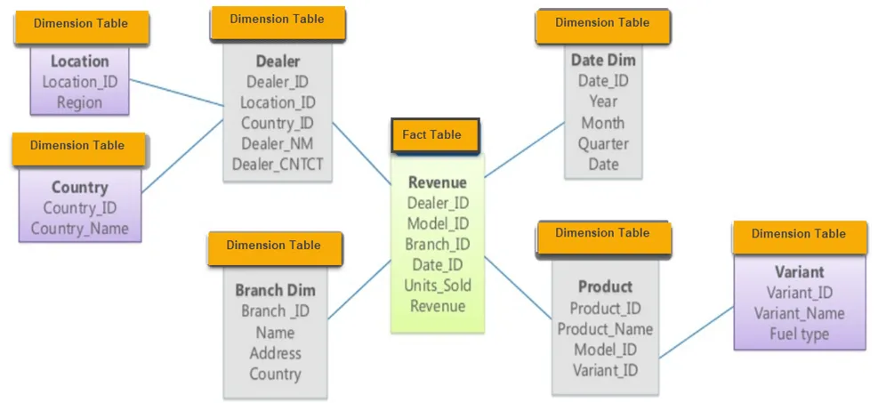

# Data Warehousing Concepts

		According to Bill Inmon, considered
		the "father of data warehousing":
		
		"a data warehouse is defined as a 
		"1. subject-oriented,  
		 2. integrated, 
		 3. time-variant, and 
		 4. non-volatile 
		collection of data in support of 
		management's decision making process."

------

## Data Warehouse Architecture

-------

## Modern Data Warehouse Architecture

------

## What is a Data Warehousing

	Data warehousing is a process of 
	collecting, storing, and managing 
	data from different sources to 
	support business decision-making. 
	
	It involves the integration of data 
	from various operational systems into 
	a central repository, known as a 
	data warehouse.
	

## What is a Data Warehouse
	A centralized repository that stores 
	integrated historical data from 
	various sources. 

	It is optimized for reporting and analysis 
	rather than transaction processing.

-------

## 4 key points of the Data Warehouse

	What are the 4 key points of the 
	data warehouse environment?

	1. Subject-oriented

	2. Time-variant

	3. Integrated

	4. Non-volatile

## Explanation of 4 points of a Data Warehouse:

* **Subject-oriented**:

		A data warehouse is designed to analyze 
		data related to specific business subjects 
		like sales, customers, or products, rather 
		than handling day-to-day transactions. 

* **Integrated**:

		Data from different sources is consolidated 
		and transformed to ensure  consistency  in 
		format and meaning before being stored in 
		the warehouse. 

* **Time-variant**:

		Data in a warehouse is organized with 
		a time dimension,  allowing  users to 
		analyze  trends  and  patterns over 
		different time periods. 

* **Non-volatile**:

		Once data is loaded into a data warehouse, 
		it is not modified or deleted, preserving 
		historical data for analysis. 

------

## What is the purpose of building a Data Warehouse? 

		The primary purpose of building a data warehouse 
		is to create a centralized repository where large
		amounts of data from various sources can be
		consolidated, cleaned, and stored for analysis,
		enabling businesses to extract valuable insights 
		and make data-driven decisions through reporting 
		and business intelligence tools; essentially 
		providing a single source of truth for historical 
		data to support informed decision-making across 
		the organization. 
		
		1. What are the top-10 products sold last week?

		2. What are the top-10 most profitable products

		3. What was the most common method for payments?

		4. What state was the most profitable for PC slaes

		5. What state was the least profitable for iPhone slaes

		6. What is the % of customers (male, female) 
		   for buying product X

------

## What is an Operational System

	An operational system is a company's 
	infrastructure that supports its 
	day-to-day operations. It's made 
	up of hardware and software, and 
	includes things like networking, 
	power systems, HVAC, and IT.
	
	An operational system is a term used 
	in data warehousing to refer to a 
	system that is used to process the 
	day-to-day transactions of an organization. 
	
	These systems are designed in a manner 
	that processing of day-to-day transactions 
	is performed efficiently and the integrity 
	of the transactional data is preserved. 
	
	The purpose of an operational system 
	is to help a business run smoothly 
	and effectively. 
	
### Example of an Operational System

### Key points about operational systems:

* Focus on transactions:
			
			They are primarily designed to 
			handle high volumes of routine 
			transactions efficiently. 

* Real-time processing:

		Many operational systems require 
		near-instantaneous data processing 
		to support timely decision-making. 

* Data integration:

		They often integrate data from 
		multiple   sources   within an 
		organization  to  provide a 
		comprehensive view of operations. 

### Characteristics of an Operational System

Here are some characteristics of an operational system:

* Efficient processing
		
		An operational system is designed 
		to process transactions efficiently 
		while maintaining the integrity of 
		the data. 

* Self-service

		Staff, customers, suppliers, and 
		other partners should be able to 
		access the system and interact with 
		the data that's relevant to them. 

* Up to date

		An operational system needs to be 
		kept up to date to run smoothly. 

* Automated

		An automated solution can save 
		time, effort, and cost compared 
		to manual interaction. 

------

## ETL (Extract, Transform, Load)

	The process of extracting data from 
	source systems, transforming it to 
	meet the data warehouse’s requirements, 
	and loading it into the data warehouse.

	ETL ensures that data is cleansed, 
	standardized, and integrated before 
	being stored in the data warehouse.

	ETL = "Extract, Transform, and Load". 
	It's a process that combines data from 
	multiple sources into a single database 
	or data warehouse. 
	
	The data is then cleaned, organized, 
	and prepared for storage, analysis, 
	and machine learning.
	
 

## 3 steps of the ETL process:

* Extract:

		Data is extracted from one or more systems 

* Transform:

		The data is cleaned and organized using 
		business rules 

* Load:

		The data is loaded into a target repository, 
		such as a data warehouse or data lake 

--------

--------

## Example of an ETL
	A common example of an ETL process 
	would be a retail company extracting 
	sales data from multiple store locations, 
	then transforming that data by combining 
	it with website traffic and customer 
	demographics, and finally loading it 
	into a data warehouse for analysis to 
	identify sales trends and optimize 
	inventory management; essentially, 
	taking raw data from various sources, 
	cleaning and standardizing it, and 
	then placing it in a format suitable 
	for analysis

---------

## Data Mart

	A subset of a data warehouse that 
	is designed for a specific business 
	line, department, or function.

	Data marts can be independent or 
	linked to the main data warehouse.

## Dimensional Modeling

	A modeling technique used in 
	data warehousing to organize 
	and structure data for:
	 
		1. easy querying and
		 
		2. reporting.

	It involves defining dimensions (descriptive
	attributes) and facts (numeric measures) to 
	create a star or snowflake schema.

# Star Schema

		A star schema is a database model that 
		organizes data into a central fact table 
		surrounded by dimension tables, forming 
		a star shape. 
		
		It's a common design used in data warehousing 
		and business intelligence (BI) applications.
		A dimensional model where a central fact table 
		is connected to dimension tables, forming
		a star-like structure.
		
		Denormalized: Star schemas are intentionally
		denormalized to speed up performance, which
		introduces some data redundancy. 

## Star Schema Example-1

## Star Schema Example-2

* Fact Table: 

		At the center of the star schema is 
		the fact table. This table contains 
		quantitative  data,  often  numeric 
		measures or metrics, that represent 
		the business processes being analyzed. 
			
		Examples include sales revenue, quantity 
		sold, or profit.

* Dimension Tables: 

		Surrounding the fact table are dimension 
		tables. Each dimension table represents 
		a specific aspect or attribute related 
		to the business process. 
		
		Dimensions are descriptive and provide 
		context to the data in the fact table. 
		Examples of dimensions could be time, 
		geography, product, or customer.

* Relationships: 

		The fact table and dimension tables 
		are connected through relationships 
		established by keys. 
		
		A primary key in a dimension table 
		is linked to a foreign key in the 
		fact table.  These  relationships 
		allow for the integration of data 
		across different dimensions.

* Attributes: 

		Each dimension table contains attributes 
		that provide details about the dimension. 
		
		For example, a time dimension might have 
		attributes such as year, quarter, month, 
		and day. 
		
		Attributes in dimension tables are used 
		for filtering, grouping, and labeling 
		data in the fact table.

## Advantages of the Star Schema:

* Simplicity: 

		The star schema is straightforward 
		and easy to understand. Its simplicity 
		makes it user-friendly for both database 
		administrators and end-users.
		
* Query Performance: 

		The star schema is designed for optimal 
		query performance. Queries can be executed 
		quickly because the structure allows for 
		efficient joins between the fact table 
		and dimension tables.

* Flexibility: 

		The star schema is flexible and adaptable 
		to changes in business requirements. New 
		dimensions can be added, and existing ones 
		can be modified without significant impact 
		on the overall structure.

* Scalability: 

		The star schema is scalable, making it 
		suitable for large data warehouses. As 
		the volume of data grows, the star schema 
		can handle it effectively, provided proper 
		indexing and optimization are implemented.

## Disadvantages of the Star Schema

	1. Denormalized data can cause integrity 
	   issues. 

	2. Maintenance may appear simple at the 
	   beginning, but the larger data warehouse 
	   you need to  maintain, the  harder  it 
	   becomes (due to data redundancy).

	3. Disk space: It requires a lot more 
	   disk space than snowflake schema to 
	   store the same amount of data.

# Snowflake Schema

	The snowflake schema is another type 
	of dimensional  data model  used  in 
	data warehousing, similar to the star 
	schema. 
	
	Like the star schema, it organizes data 
	for efficient querying and reporting, 
	but the snowflake schema takes a more 
	normalized approach to the structure. 
	
	The term “snowflake” refers to the shape 
	the schema takes on when visualized: a 
	central fact table surrounded by dimension 
	tables that are further normalized into a 
	branching, snowflake-like pattern.

## General Structure of Snowflake Schema

	
## Example of Snowflake Schema

* Fact Table: 

		At the center of the star schema is the 
		fact table. This table contains quantitative 
		data, often numeric measures or metrics, 
		that represent the business processes being 
		analyzed.
		
		Examples include sales revenue, quantity 
		sold, or profit.

* Dimension Tables: 

		Surrounding the fact table are dimension 
		tables. Each dimension table represents a 
		specific aspect or attribute related to 
		the business process. 
		
		Dimensions are descriptive and provide 
		context to the data in the fact table. 
		
		Examples of dimensions could be time, 
		geography, product, or customer.

* Sub-Dimensions: 

		Each dimension table in the snowflake 
		schema can have sub-dimensions or related 
		tables that store additional attributes. 
		These sub-dimensions help to reduce 
		redundancy by separating data into 
		different tables.

* Normalization: 

		The snowflake schema employs normalization 
		techniques by breaking down dimension tables 
		into smaller, related tables. This reduces 
		data redundancy and improves data integrity 
		but can result in more complex queries due 
		to additional joins.

* Relationships: 

		The fact table and dimension tables are 
		connected through relationships established 
		by keys. A primary key in a dimension table 
		is linked to a foreign key in the fact table. 
		These relationships allow for the integration 
		of data across different dimensions.

* Attributes: 

		Each dimension table contains attributes 
		that provide details about the dimension. 
		
		For example, a time dimension might have 
		attributes such as year, quarter, month, 
		and day. Attributes in dimension tables 
		are used for filtering, grouping, and 
		labeling data in the fact table.

## Advantages of the Snowflake Schema:

* Reduced Redundancy: 

		The snowflake schema reduces data 
		redundancy by normalizing dimension 
		tables. This can save storage space 
		and improve data integrity.
		
* Easier Maintenance: 

		Because of the normalization, making 
		changes to the schema, such as updating 
		attributes or adding new ones, can be 
		more straightforward and less prone 
		to errors.
		
* Improved Data Integrity: 

		Normalization can enhance data integrity 
		by reducing the risk of update anomalies 
		that can occur when redundant data is 
		stored in multiple places.

* Suitability for Hierarchical Data: 

		The snowflake schema is well-suited 
		for  representing  hierarchical 
		relationships within dimensions.

## Trade-offs with the Snowflake Schema:

* Query Performance: 

		Due to the normalization and increased 
		number of joins, query performance in 
		a snowflake schema may be slightly slower 
		compared to a star schema.

* Complexity: 

		The snowflake schema can be more complex 
		to understand and work with, especially 
		for users who are not familiar with the 
		structure.

## Choice between a Star schema and a Snowflake schema		
		The choice between a star schema and a 
		snowflake schema depends on factors such 
		as the nature of the data, the specific 
		business requirements, and the balance 
		between simplicity and normalization needs 
		in the data warehouse design.

## Metadata

		Information about the data in the 
		data warehouse, including its source, 
		transformation rules, and usage.
		
		Metadata helps users understand and 
		interpret the data in the warehouse.

## Data Mining

		The process of discovering patterns 
		and relationships in data stored in 
		the data warehouse.

		Data mining techniques help uncover 
		hidden insights and support predictive 
		analysis.

------

# References

1. [Data Warehousing Concepts for Beginners by Rahul Sounder](https://medium.com/@sounder.rahul/data-warehousing-concepts-for-beginners-data-engineers-76c31be60087)

2. [ETL (Extract, Transform and Load)](https://www.precisely.com/glossary/etl)

