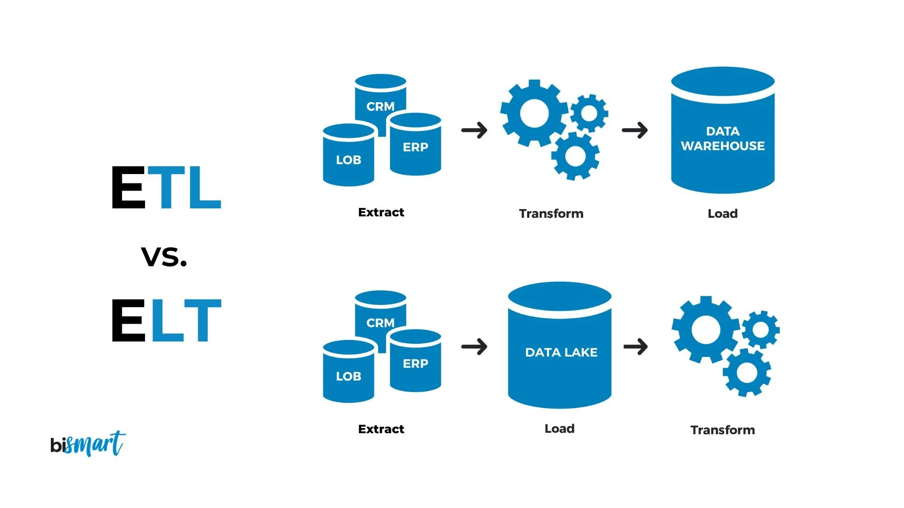
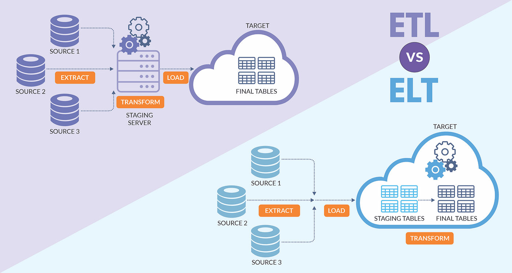

# ETL: Extract Transform Load

------
## 1. ETL and ELT in Pictures 

### 1.1 ETL in Picture 

### 1.2 ETL vs ELT 

### 1.3 ETL vs ELT 

------

## 2. What is ETL and ELT? 

### 2.1 ETL
	Extract, transform, and load (ETL) is the process 
	of combining data from multiple sources into a 
	large, central repository called a data warehouse. 
	
	ETL uses a set of business rules to clean and organize 
	raw data and prepare it for storage, data analytics, 
	and machine learning (ML). You can address specific 
	business intelligence needs through data analytics 
	(such as predicting the outcome of business decisions, 
	generating reports and dashboards, reducing operational 
	inefficiency, and more).
	
	source: https://aws.amazon.com/what-is/etl/

### 2.2 ELT

	ELT, which stands for “Extract, Load, Transform,” 
	is another type of data integration process, similar 
	to its counterpart ETL, “Extract, Transform, Load”. 
	This process moves raw data from a source system to 
	a destination resource, such as a data warehouse. 
	While similar to ETL, ELT is a fundamentally different 
	approach to data pre-processing which has only more 
	recently gained adoption with the transition to 
	cloud environments.

-------

## 3. The ETL Process

* The most underestimated process in DW development
* The most time-consuming process in DW development
* Up to 80% of the development time is spent on ETL!

### 3.1 Extract

* Extract relevant data
* Extraction can be from many data sources

### 3.2 Transform

* Transform data to DW format
* Build DW keys, etc.
* Cleansing of data

### 3.3 Load

* Load data into DW
* Build aggregates, etc.

-------
## 4. Sample ETL Program

4.1.0 [Create Parquet File by PySpark (as a data source)](./create_parquet.py)

4.1.1 [Create Parquet File by PySpark (log file)](./create_parquet.py.log)

4.2 [ETL: 1. extract, 2. transform, and 3. load](./etl_read_parquet_from_file_transform_and_load_to_mysql.py)

-------

## 5. Sample ELT Program

5.1.0 [Create Parquet File by PySpark (as a data source)](./create_parquet.py)

5.1.1 [Create Parquet File by PySpark (log file)](./create_parquet.py.log)

5.2 [ETL: 1. extract, 2. load, and 3. transform](./elt_read_parquet_from_file_and_load_to_mysql_then_transform.py)

-------

## 6. [Data Cleaning with SQL](./Data_Cleaning_with_SQL.pdf)

------

##7. [ETL Pipeline for NYC Taxi Trip Data](./ETL_Pipeline_for_NYC_Taxi_Trip_Data.pdf)

-------

## 8. ETL References

1. [Understanding ETL by O'reilly](./Understanding-ETL-by-Oreilly.pdf)

2. [What is ETL? by IBM](https://www.ibm.com/topics/etl)

3. [What is ETL (Extract Transform Load)?](https://aws.amazon.com/what-is/etl/)

4. [What is ETL? The Ultimate Guide](https://www.matillion.com/blog/what-is-etl-the-ultimate-guide)

5. [Create Your First ETL Pipeline with Python](https://anujsyal.com/create-your-first-etl-pipeline-with-python)

6. [Implementing ETL Process Using Python to Learn Data Engineering](https://www.analyticsvidhya.com/blog/2021/06/implementing-python-to-learn-data-engineering-etl-process/)

7. [Build an ETL Data Pipeline using Python](https://blog.det.life/build-an-etl-data-pipeline-using-python-139c6875b046)

8. [Setting Up ETL Using Python Simplified 101](https://hevodata.com/learn/etl-using-python/)
