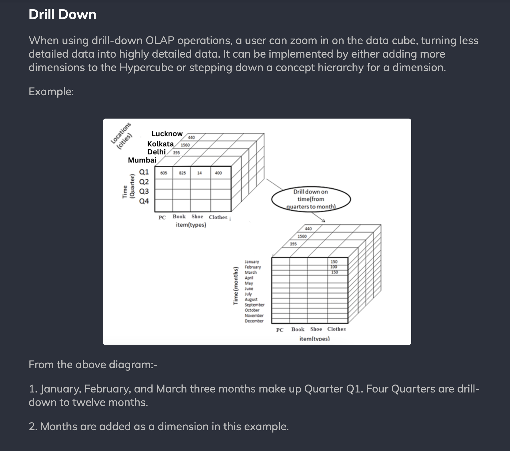
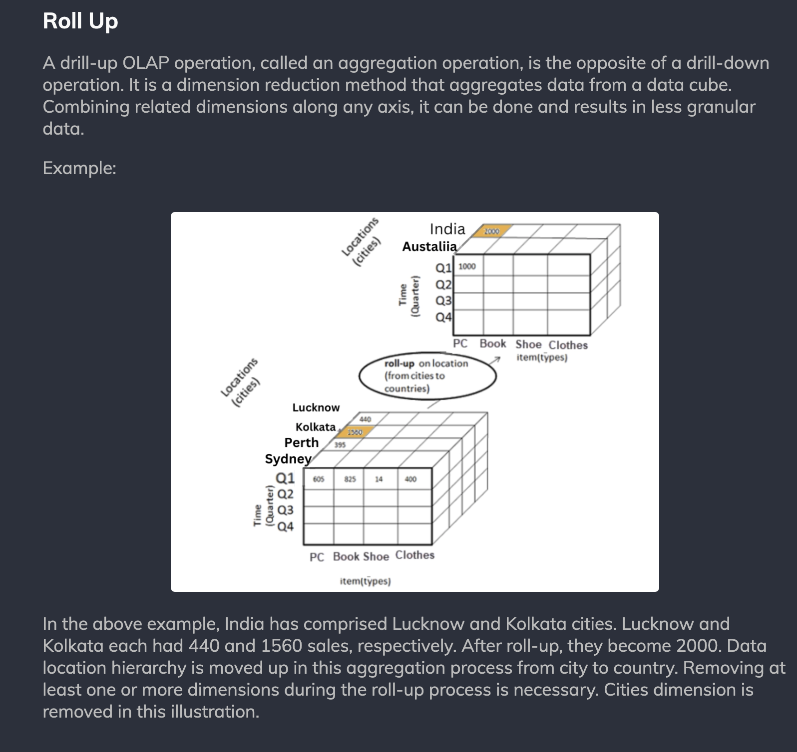
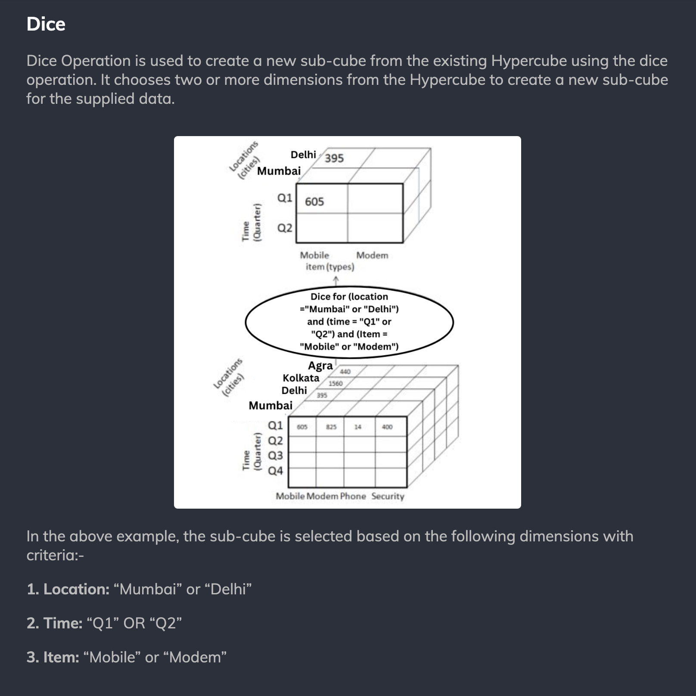
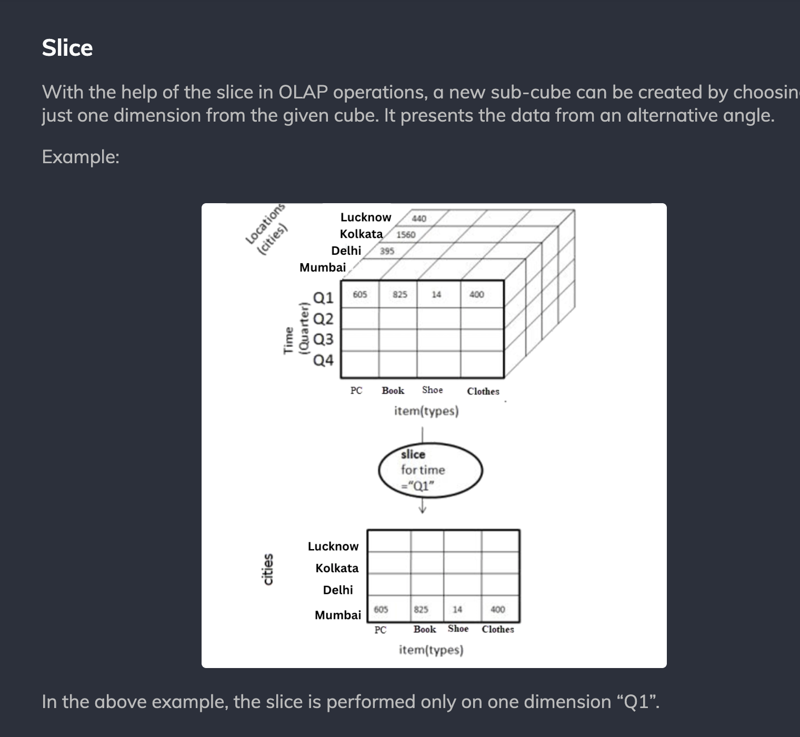

# OLAP Operations

	OLAP operations extract insights from the 
	data stored in multidimensional hypercubes. 
	These actions consist of the following:

* Drill Down
* Roll Up
* Dice
* Slice
* Pivot

----------
# Drill Down

----------
# Roll Up

----------
# Dice

----------
# Slice

----------
# Pivot

----------