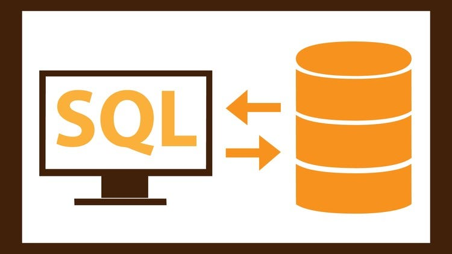

# SQL: Structured Query Language

		Structured Query Language (SQL) is 
		a programming language for storing 
		and  processing  information  in a 
		relational database.

1. [The SQL Tutorial for Data Analysis](https://mode.com/sql-tutorial/introduction-to-sql)

2. [Introduction to SQL by Larry Snyder](./introduction_to_SQL_by_Larry_Snyder.pdf)

3. [Introduction to SQL by Phil Spector](./introduction_to_SQL_by_Phil_Spector.pdf)

4. [SQL for DW by Michael Bohlen (slides: 65 pages)](./sql_for_DW_by_Michael_Bohlen_slides_65_pages.pdf)

5. [SQL Joins 101](./SQL_Joins_101.pdf)

6. [DuckDB SQL documentation](https://duckdb.org/docs/sql/introduction)

