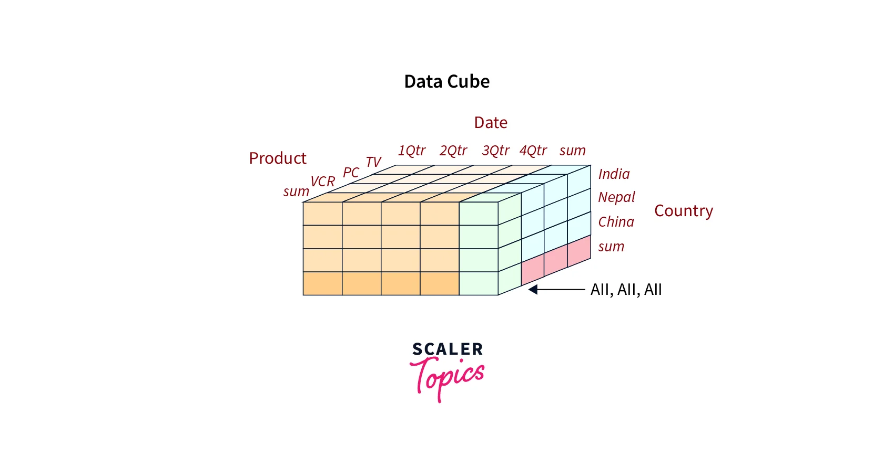

# What is a Star Schema?

## Introduction to Star Schema

* What is a **star schema**? A star schema is a 
  **multi-dimensional data model** used to organize 
  data in a database so that it is easy to understand 
  and analyze. 

* Star schemas can be applied to data warehouses, 
  databases, data marts, and other tools. 

* The star schema design is optimized for querying 
  large data sets.
  
* **Fact tables** and **dimension tables** are key 
  components of a schema in a data warehouse. A 
  **fact table** contains records that combine attributes 
  from different **dimension tables**. These records 
  allow users to analyze different aspects of their 
  business, which can aid in decision-making and 
  improving the business. 
  
* [What is Multi-Dimensional Data Model?](https://www.javatpoint.com/data-warehouse-what-is-multi-dimensional-data-model)
  A multidimensional model views data in the form of a data-cube. 
  A data cube enables data to be modeled and viewed in multiple 
  dimensions. It is defined by dimensions and facts.

## Types of Tables in Star Schema

The star schema consists of two types of tables:

#### Facts Tables

* **Facts**: Metrics of a business process. 
These are generally numeric and additive (e.g. 
amount of an invoice or the number of invoices), 
or quantitative. The fact table also contain keys 
pointing to relevant dimension tables. There is 
just one fact table at the center of the star schema.

#### Dimensions Tables

* **Dimensions**: The where, when, what, etc. (e.g. 
date/time, locations, goods sold). These typically 
contain qualitative information. There are multiple 
dimension tables in the schema, all of which are 
related to the fact table.

## Sample Multi-Dimensional Models

  
  

