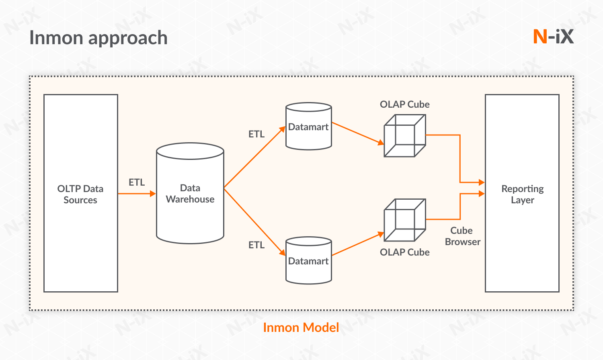
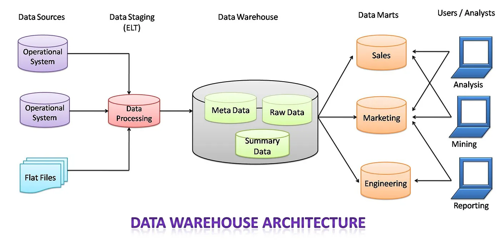

# Syllabus

--------

## Definition of a Data Warehousing

	     Bill Inmon, known as the "Father 
	     of Data Warehousing",  defines a 
	     data warehouse (DW) as a collection 
	     of data that is: 

| Data Warehouse feature    | Description  |
| ------------------------- | -------------|
| 1. **Subject-oriented**:  | Focuses on a specific area, such as sales, marketing, or distribution |
| 2. **Integrated**:        | Combines different data types from various sources |
| 3. **Non-volatile**:      | Stable and doesn't change once entered into the DW |
| 4. **Time-variant**:      | Analyzes changes over time, and typically contains multiple years of data |

	

---------

# 10 Weeks

### Week-01: [Course Outline and Introduction to Data Warehousing](./week-01-intro-to-Data-Warehousing)

* [week-01-1: Introduction to Databases and SQL](.//week-01-intro-to-Data-Warehousing/1-introduction_to_databases_and_SQL)
* [week-01-2: Course Outline & Introduction to DW](.//week-01-intro-to-Data-Warehousing/2-course-outline-and-intro-to-DW)
* [week-01-3: Complete ETL Example](.//week-01-intro-to-Data-Warehousing/3-complete_ETL_example)
* [week-01-4: Demo of Star Schema and OLAP Queries](.//week-01-intro-to-Data-Warehousing/4-demo_star_schema)

### Week-02: [`Introduction to BI and Tableau`](week-02-intro-to-BI-and-Tableau)

### Week-03: [`Introduction to ETL`](week-03-introduction-to-ETL)

### Week-04: [`Data Modeling, Join operation, and Ranking Algorithms`](week-04-modeling-join-ranking-algorithms)

### Week-05: [`ETL Detailed`](week-05_ETL_detailed)

### Week-06: [`Introduction to Data Warehousing and Star Schema`](week-06-intro-to-Data-Warehousing-and-Star-Schema)

### Week-07: [`Star Schema with Examples`](week-07-Star-Schema)

### Week-08: [`Star Schema with Examples`](week-08_Star_Schema_with_Examples)

### Week-09: [`OLAP and Business Intelligence`](week-09_OLAP_and_Business_Intelligence)

### Week-10: [`OLAP Operations`](week-10_OLAP_Operations)

