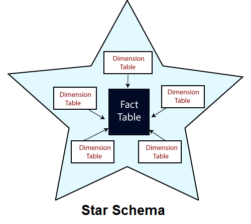

# Star Schema

------

## 1. [Stock Trading Example (class presentation)](./star_schema_a_hands_on_approach_to_modeling.adoc.pdf)

-------
## 2 [How to Design a Star Schema for a Data Warehouse](How_to_Design_a_Star_Schema_for_a_Data_Warehouse.pdf)

-------

## 3. [What is a Star Schema?](./what_is_a_star_schema_introduction.md)

-----

## 4. [Designing Star Schema](./Designing_Star_Schema.md)

-----

## 5. [Introduction to Star Schema: Question and Answer](./star_schema_question_and_answer.md)

-----

6. [What is Star Schema by Databricks](./what_is_star_schema_by_Databricks.pdf)

7. [What is Star Schema in Data Warehousing](./what_is_star_schema_in_Data_Warehousing.pdf)

8. [Data Warehousing Schemas Example Star Schema](./data_warehousing_schemas_example_Star_Schema_Snowflake_Schema.pdf)

9. [Design Star Schema for Relatonal Database](./design_star_schema_for_relatonal_database.pdf)

10. [In Depth Guide to Star Schema](./in_depth_guide_to_Star_Schema_in_Data_Warehouse_Modeling.pdf)

11. [Understand Star Schema for Power BI by Microsoft](./understand_star_schema_and_the_importance_for_power_BI_by_Microsoft.pdf)

12. [Star Schema Data Model with 3 Examples](./what_is_the_Star_Schema_Data_Model_An_Explanation_with_3_Examples.pdf)

13. [Designing the Star Schema in Data Warehousing: with 2 Examples](https://www.geeksforgeeks.org/designing-the-star-schema-in-data-warehousing/)

14. [Fact Table vs. Dimension Table - Differences Between The Two](https://www.simplilearn.com/fact-table-vs-dimension-table-article)

15. [What is Star Schema? by JavaPoint](https://www.javatpoint.com/data-warehouse-what-is-star-schema)

16. [Star Schema Examples (images)](./examples)
