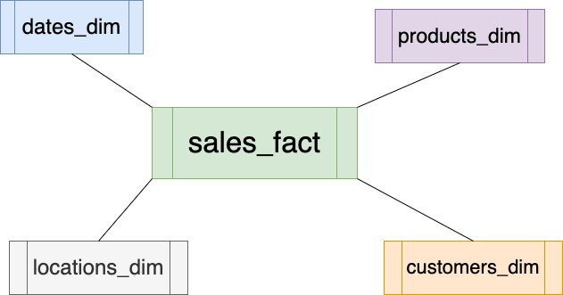

# Transactional Database --> ETL --> Star Schema --> Queries

The goal of this exercise is to show a complete story of creating a "star schema" from a transactional database by using a Python ETL. Once a "star schema" is created, then we can write our Business Intelligence SQL queries.

# 1. Database configurations
Database configurations are defined as JSON files:

* Transactional (Source) Database:
	* [`db_config_source.json`](db_config_source.json) 

* Star Schema (Target) Database:
	* [`db_config_target.json`](db_config_target.json) 

# 2. Transactional Database

The following 2 steps show how to create a 
Transactional Database:

## 2.1 [Transactional Database](./transaction_tables.sql)

## 2.2 [Create Sales Table](./db_feeder_sales_table.py)

To create 100,000 sales records for Transactional database:

~~~sh
python3 db_feeder_sales_table.py db_config_source.json 100000
~~~

--------

# 3. ETL

## 3.1 [ETL --> Star Schema](./star_schema_for_product_sales_with_ETL_mysql.py)

## 3.2 To run ETL:

~~~sh
ETL="star_schema_for_product_sales_with_ETL_mysql.py"
SOURCE_DB="db_config_source.json"
TARGET_DB="db_config_target.json"
python3 ${ETL} ${SOURCE_DB} ${TARGET_DB}
~~~
-------

# 4. Star Schema

-------

# 5. Queries

## 1. **Total Sales Amount by Product:**

## 2. **Sales Quantity by Customer:**

## 3. **Total Sales by Location:**

## 4. **Sales Amount by Month & Year:**

## 5. **Average Sales Amount by Customer Age Group:**

## 6. **Find top-2 selling products per country:**
    
