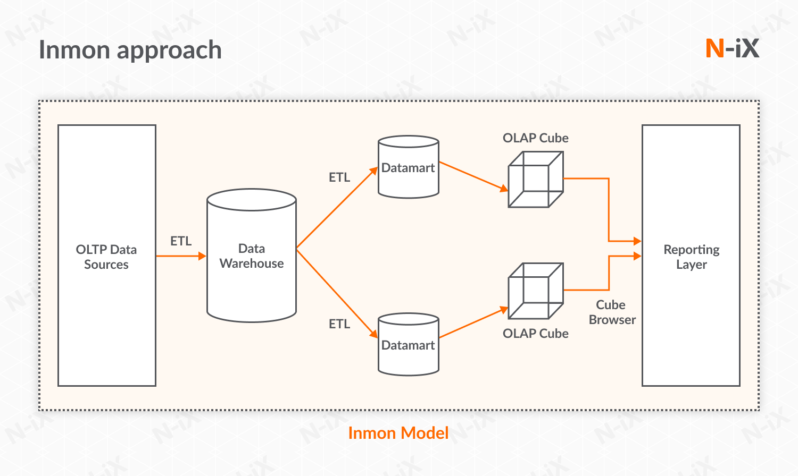

# Week-01

# Data Warehousing & Business Intelligence

* DW = Data Warehousing

* BI = Business Intelligence

## What is Data Warehousing?

	1. Data warehousing (DW) is a technique of 
	   gathering and analyzing data from many 
	   sources to get valuable business insights. 
	
	2. Typically, a data warehouse integrates and 
	   analyzes business data from many sources. 
	   The data warehouse is  the  basis  of the 
	   business intelligence (BI) system, which 
	   can analyze and report on data.
	
	3. In simple words, Data Warehousing supports 
	   a  set of frameworks and tools  that  help 
	   businesses organize, understand, and  use 
	   their data to make strategic decisions.

## 1. Course outline

## 2. Course Overview – Introduction to key concepts

	* Data Warehousing
	
	* Data Warehouse vs Operational Database
	
	* ETL
	
	* Business Intelligence
	
	* Data Modeling & Dimensional Modeling
	
	* Star Schema 
	
## 3. What is data warehousing?

## 4. Business Analysis & BI 

## 5. Required Software:

	* MySQL database
	
	* Python
	
	* Tableau

## 5. Class Projects Overview
