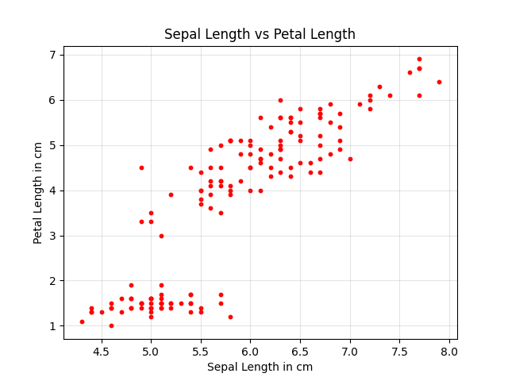

# Data Visualization Concepts

* Data Visualization is the art of presenting data 
  into a form that is easier to comprehend, visually 
  appealing, and actionable. 
* It can be a hard task to make sense out of data 
  in the form of tables. 
* This is when visualizing it in the form of charts, 
  graphs, and maps becomes important. 
* A clear representation of data makes it easy to 
  understand the patterns, trends, and outliers in 
  the data.
  
## 1. Line Chart
* A line chart, also called a line graph, is a 
  visual representation of data where individual 
  data points are connected by straight lines, 
  allowing you to easily see trends and changes 
  in data over a **continuous period of time**, 
  usually with the horizontal axis representing 
  time and the vertical axis representing the 
  measured value; it's a common tool for identifying 
  patterns and fluctuations in data sets.

* It is one of the most common charts that is used 
  to observe a single or multiple variables with the 
  change of another variable. Basically, it is used 
  in trend analysis and time series analysis. It is 
  always a best practice to use line charts with 
  continuous data, as the value of one variable can 
  be found by projecting the other variable on the 
  line at any point. 
  

------

## 2. Bar Chart

A bar chart is a graphical representation used to 
display and compare **discrete categories** of data 
through rectangular bars, where the length or height 
of each bar is proportional to the frequency or value 
of the corresponding category.

-------

## 3. Area Chart

An area chart is a type of graph that visually 
represents **data trends over time** by plotting 
a line and then filling in the area beneath it, 
essentially combining elements of a line chart 
and a bar chart, where the shaded area highlights 
the magnitude of change between data points and 
the x-axis; it's particularly useful for showcasing 
cumulative values or comparing multiple data sets 
over time. 

Key points about area charts:

* Visual representation:
A line is plotted connecting data points, and the area below that line is shaded with color, allowing for a visual emphasis on the overall trend. 
* Time-based analysis:
Area charts are typically used to show how data changes over time, with the x-axis representing time intervals. 
* Comparison capability:
Multiple data sets can be displayed on the same area chart using different colors to compare trends between them. 

## 4. Box Plots

This plot is used to get **statistical information**
about **distribution**. It shows the median, maximum, 
minimum, 25th percentile and 75th percentile values. 
It is also good to explore outliers in the dataset. 

The diagram below shows a boxplot:

------

## 5. Scatter Plot

In a scatter plot, the data is scattered **between 
the two axes**. These type of plots are basically 
used to study **the correlation between the two 
variables**. If one variable increases or decreases 
with other, they are positively correlated. If one 
variable increases as the other decreases and vice 
versa, they are negatively correlated. If there is 
no such relation, they aren’t related. It is one of 
the most common charts to observe the relation 
between two variables.

#### Basic Scatter Plot

#### Scatter Plot with Different Categories

------

## 6. Bubble Chart

A bubble chart is a data visualization tool that 
**uses bubbles to represent data points and show 
relationships between three numeric variables**: 

**What it shows:** a bubble chart plots data 
points on an x-y plane, with the size of each 
bubble representing a third variable. 

A bubble chart is similar to a scatter plot but 
is used when we **need to observe the relation 
between three variables**. In this chart, the 
size of the bubble corresponds to the third 
variable.

------

## 7. Histogram

This type of chart is used to **observe the 
frequency distribution of a variable**. 

The variable is divided into different intervals 
and the length of bars of the histogram show the 
frequency of the variable for a particular interval. Histograms can be used to observe discrete as well 
as continuous data. It is a great way to see how 
the values are being distributed and how skewed is the dataset.

------

## 8. Pie Chart

* A pie chart is a type of graph representing 
  data in a circular form, 
* With **each slice of the circle representing 
  a fraction** or proportionate part of the whole.

A Pie chart is a circular chart that is divided 
into different parts (representing slices of a 
pie) and each part represents a category of the 
variable. This type of chart is useful in showing 
proportions of different categories. It is a great representation to analyse part-to-whole relationship.

Pie Charts are ideal to visualize categorical data, 
but can also be used for discrete data (eg. shoe 
size, number of countries visited, etc.). But the 
chart can get cluttered and difficult to read if 
the values in a discrete data are a lot. For example, 
the percentage contribution of different countries 
to the world economy. This will have a lot of values. 
In such a case, the numbers can be grouped and each 
slice of the pie would represent that group. This 
would make it easier to understand, but yes, it would 
affect the quality of representation in case someone 
wants to fetch information about the exact 
contribution of each country.

------

## 9. Violin Plot

A violin plot is a **statistical graph** that 
combines the features of a box plot and a kernel 
density plot to visualize the **distribution of 
numerical data**. It's particularly useful for 
comparing the distribution of a variable across 
different categories or groups. 

A Violin plot is similar to a box plot. Along 
with the statistical information, it also provides 
a kernel density plot of the data. A **kernel 
density plot** basically shows the **distribution 
of data**. So, whenever we need to observe the 
distribution along with the statistics, such a 
plot comes in handy. Like boxplot, violin plots 
can also be used with numerical data only.

------

## 10. HeatMap

A heatmap is basically a two-dimensional plot 
which is mainly used to **analyze the correlation
 between the different fields in a dataset**. 

A heatmap is divided in square boxes that are 
colored with a specific color representing the 
correlation between the two fields it corresponds 
to. The **extreme colors represent a strong 
positive or negative correlation**.

-----

