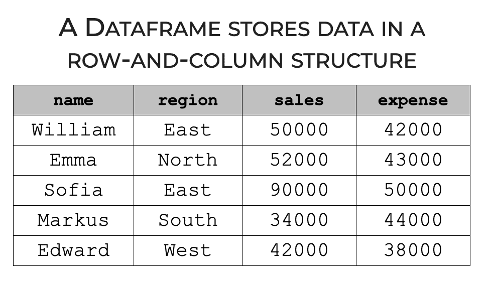

# A DataFrame in Python's Pandas Library

	When using Python as an ETL programming, 
	a DataFrame in Python's Pandas Library 
	is the key ingrediant for the ETL process.
	
	A Pandas DataFrame is a two-dimensional, 
	size-mutable, and potentially heterogeneous 
	tabular data structure with labeled axes 
	(rows and columns).
	

#### 1. [Python pandas Tutorial: The Ultimate Guide for Beginners]()

#### 2. [Pandas Tutorial: DataFrames in Python](https://www.datacamp.com/tutorial/pandas-tutorial-dataframe-python)

#### 3. [Pandas DataFrames: from w3schools](https://www.w3schools.com/python/pandas/pandas_dataframes.asp)

#### 4. [The pandas DataFrame](https://realpython.com/pandas-dataframe/)

#### 5. [Pandas Getting started tutorials](https://pandas.pydata.org/docs/getting_started/intro_tutorials/index.html)

#### 6. [Python Pandas - DataFrame](https://www.tutorialspoint.com/python_pandas/python_pandas_dataframe.htm)

