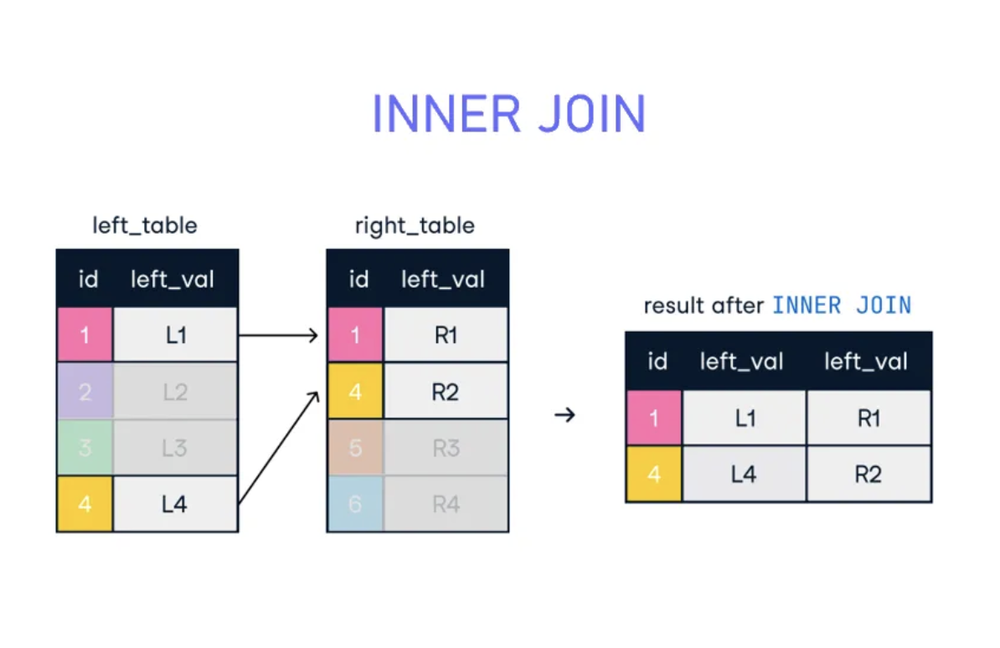
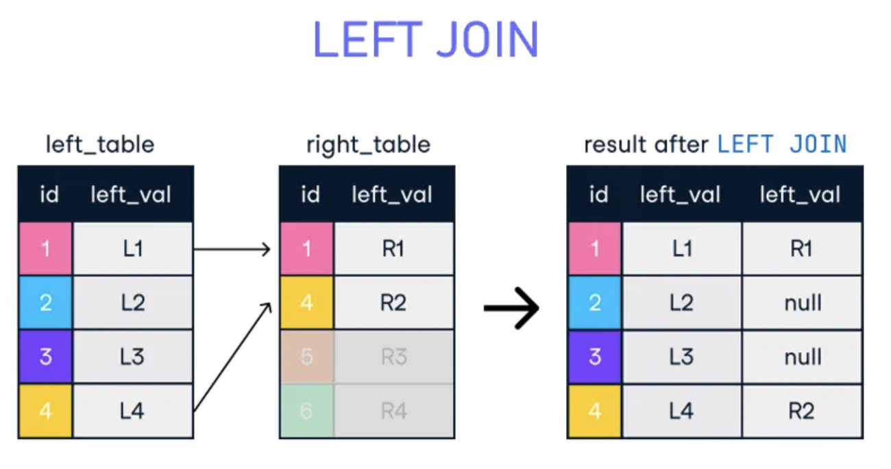
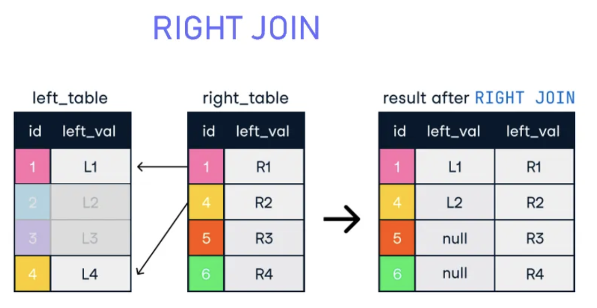
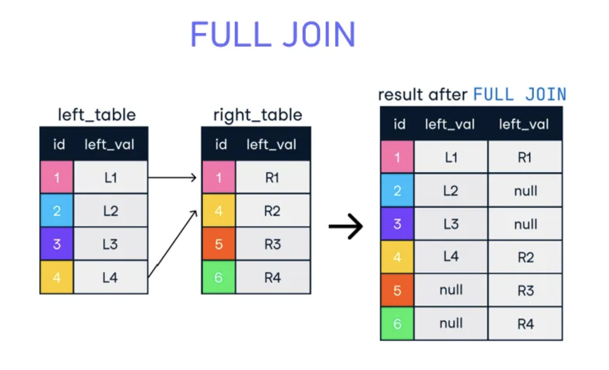

# SQL JOIN

	1. As the name shows, JOIN means 
	   to combine something. 
	
	2. In case of SQL, JOIN means "to 
	   combine two or more tables".

	3. In SQL, JOIN clause is used to 
	   combine the records from two or 
	   more tables in a database.
	
	4. In SQL, a JOIN clause is used 
	   to combine rows from two or more 
	   tables, based on a related column 
	   between them.

## Types of SQL JOIN

### 1. INNER JOIN
### 2. LEFT JOIN
### 3. RIGHT JOIN
### 4. FULL JOIN

------

## Sample Tables

**EMPLOYEE table:**

~~~sql
create table EMPLOYEE (
   EMP_ID int,
   EMP_NAME varchar(32),
   CITY varchar(32),
   SALARY int,
   AGE int
);

insert into EMPLOYEE
(EMP_ID, EMP_NAME, CITY, SALARY, AGE)
values
(1, 'Angelina', 'Chicago', 200000, 30),
(2, 'Robert', 'Austin', 300000, 26),
(3, 'Christian', 'Denver', 100000, 42),
(4, 'Kristen', 'Washington', 500000, 29),
(5, 'Russell', 'Los angels', 200000, 36),
(6, 'Marry', 'Canada', 600000, 48);

mysql> select * from EMPLOYEE;
+--------+-----------+------------+--------+------+
| EMP_ID | EMP_NAME  | CITY       | SALARY | AGE  |
+--------+-----------+------------+--------+------+
|      1 | Angelina  | Chicago    | 200000 |   30 |
|      2 | Robert    | Austin     | 300000 |   26 |
|      3 | Christian | Denver     | 100000 |   42 |
|      4 | Kristen   | Washington | 500000 |   29 |
|      5 | Russell   | Los angels | 200000 |   36 |
|      6 | Marry     | Canada     | 600000 |   48 |
+--------+-----------+------------+--------+------+
6 rows in set (0.00 sec)
~~~

**PROJECT Table:**

~~~sql
create table PROJECT (
   PROJECT_NO int,
   EMP_ID int,
   DEPARTMENT varchar(16)
);

insert into PROJECT 
(PROJECT_NO, EMP_ID, DEPARTMENT)
values
(101, 1, 'Testing'),
(102, 2, 'Development'),
(103, 3, 'Designing'),
(104, 4, 'Development'),
(200, 8, 'Top Secret 1'),
(300, 9, 'Top Secret 2');

select * from PROJECT;
mysql> select * from PROJECT;
+------------+--------+--------------+
| PROJECT_NO | EMP_ID | DEPARTMENT   |
+------------+--------+--------------+
|        101 |      1 | Testing      |
|        102 |      2 | Development  |
|        103 |      3 | Designing    |
|        104 |      4 | Development  |
|        200 |      8 | Top Secret 1 |
|        300 |      9 | Top Secret 2 |
+------------+--------+--------------+
6 rows in set (0.00 sec)

~~~

------

## 1. INNER JOIN

	In SQL, INNER JOIN selects records that 
	have matching values in **both tables**
	as long as the condition is satisfied. 
	
	It returns the combination of all rows 
	from both the tables where the condition 
	satisfies.
	

* Syntax

~~~sql
SELECT table1.column1, table1.column2, table2.column1,....  
   FROM table1   
   INNER JOIN table2  
   ON table1.matching_column = table2.matching_column;  
~~~

* Sample Query

~~~sql
   SELECT EMPLOYEE.EMP_ID, EMPLOYEE.EMP_NAME, PROJECT.DEPARTMENT   
   FROM EMPLOYEE  
   INNER JOIN PROJECT  
   ON PROJECT.EMP_ID = EMPLOYEE.EMP_ID;  
~~~

* Output

~~~sql
mysql>    SELECT EMPLOYEE.EMP_ID, EMPLOYEE.EMP_NAME, PROJECT.DEPARTMENT
    ->    FROM EMPLOYEE
    ->    INNER JOIN PROJECT
    ->    ON PROJECT.EMP_ID = EMPLOYEE.EMP_ID;
+--------+-----------+-------------+
| EMP_ID | EMP_NAME  | DEPARTMENT  |
+--------+-----------+-------------+
|      1 | Angelina  | Testing     |
|      2 | Robert    | Development |
|      3 | Christian | Designing   |
|      4 | Kristen   | Development |
+--------+-----------+-------------+
4 rows in set (0.00 sec)

~~~

* Important Points About SQL INNER JOIN

		1. INNER JOIN is a SQL JOIN operation that 
		   allows users to retrieve data matching 
		   data from multiple tables.

		2. It returns all the common rows from the 
		   tables when the join condition is met.

		3. INNER JOIN simplifies the process of 
		   handling complex queries, making database 
		   management more efficient.

		4. INNER JOIN is crucial for tasks like 
		   managing  customer  orders,  product 
		   inventories, or any relational dataset.

----- 

## 2. LEFT JOIN

	The SQL left join returns all the 
	values from **left table** and the 
	matching values from the right table. 
	If there is no matching join value, 
	it will return NULL.

* Syntax

~~~sql
SELECT table1.column1, table1.column2, table2.column1,....  
FROM table1   
LEFT JOIN table2  
ON table1.matching_column = table2.matching_column;  
~~~

* Sample Query

~~~sql
SELECT EMPLOYEE.EMP_ID, EMPLOYEE.EMP_NAME, PROJECT.DEPARTMENT   
FROM EMPLOYEE  
LEFT JOIN PROJECT  
ON PROJECT.EMP_ID = EMPLOYEE.EMP_ID;  
~~~

* Output

~~~sql
mysql> SELECT EMPLOYEE.EMP_ID, EMPLOYEE.EMP_NAME, PROJECT.DEPARTMENT
    -> FROM EMPLOYEE
    -> LEFT JOIN PROJECT
    -> ON PROJECT.EMP_ID = EMPLOYEE.EMP_ID;
+--------+-----------+-------------+
| EMP_ID | EMP_NAME  | DEPARTMENT  |
+--------+-----------+-------------+
|      1 | Angelina  | Testing     |
|      2 | Robert    | Development |
|      3 | Christian | Designing   |
|      4 | Kristen   | Development |
|      5 | Russell   | NULL        |
|      6 | Marry     | NULL        |
+--------+-----------+-------------+
6 rows in set (0.00 sec)

~~~

-----

## 3. RIGHT JOIN

		In SQL, RIGHT JOIN returns all the values 
		from the values from the rows of right table 
		and the matched values from the left table. 
		If there is no matching in both tables, it 
		will return NULL.

Result row: corrected: 4 -> R4 -> R2

* Syntax

~~~sql
SELECT table1.column1, table1.column2, table2.column1,....  
FROM table1   
RIGHT JOIN table2  
ON table1.matching_column = table2.matching_column;  
~~~

* Sample Query

~~~sql
SELECT  EMPLOYEE.EMP_ID, EMPLOYEE.EMP_NAME, 
        PROJECT.DEPARTMENT, PROJECT.EMP_ID  
FROM EMPLOYEE  
RIGHT JOIN PROJECT  
ON PROJECT.EMP_ID = EMPLOYEE.EMP_ID;  
~~~

* Output

~~~sql

mysql> SELECT  EMPLOYEE.EMP_ID, EMPLOYEE.EMP_NAME,
    ->         PROJECT.DEPARTMENT, PROJECT.EMP_ID
    -> FROM EMPLOYEE
    -> RIGHT JOIN PROJECT
    -> ON PROJECT.EMP_ID = EMPLOYEE.EMP_ID;
+--------+-----------+--------------+--------+
| EMP_ID | EMP_NAME  | DEPARTMENT   | EMP_ID |
+--------+-----------+--------------+--------+
|      1 | Angelina  | Testing      |      1 |
|      2 | Robert    | Development  |      2 |
|      3 | Christian | Designing    |      3 |
|      4 | Kristen   | Development  |      4 |
|   NULL | NULL      | Top Secret 1 |      8 |
|   NULL | NULL      | Top Secret 2 |      9 |
+--------+-----------+--------------+--------+
6 rows in set (0.01 sec)
~~~

------

## 4. FULL JOIN

		In SQL, FULL JOIN is the result of 
		a combination of both left and right 
		outer join. 
		
		Join tables have all the records from 
		both tables. It puts NULL on the place 
		of matches not found.
		

* Syntax

~~~sql
SELECT table1.column1, table1.column2, table2.column1,....  
FROM table1   
FULL JOIN table2  
ON table1.matching_column = table2.matching_column;  
~~~

* Sample Query

		There is no full joins in MySQL, 
		but you can sure emulate them.

* Output without duplicate rows (use `UNION`)

~~~sql

mysql> SELECT * FROM EMPLOYEE
    -> LEFT JOIN PROJECT ON EMPLOYEE.EMP_ID = PROJECT.EMP_ID
    -> UNION
    -> SELECT * FROM EMPLOYEE
    -> RIGHT JOIN PROJECT ON EMPLOYEE.EMP_ID = PROJECT.EMP_ID;
    
+--------+-----------+------------+--------+------+------------+--------+--------------+
| EMP_ID | EMP_NAME  | CITY       | SALARY | AGE  | PROJECT_NO | EMP_ID | DEPARTMENT   |
+--------+-----------+------------+--------+------+------------+--------+--------------+
|      1 | Angelina  | Chicago    | 200000 |   30 |        101 |      1 | Testing      |
|      2 | Robert    | Austin     | 300000 |   26 |        102 |      2 | Development  |
|      3 | Christian | Denver     | 100000 |   42 |        103 |      3 | Designing    |
|      4 | Kristen   | Washington | 500000 |   29 |        104 |      4 | Development  |
|      5 | Russell   | Los angels | 200000 |   36 |       NULL |   NULL | NULL         |
|      6 | Marry     | Canada     | 600000 |   48 |       NULL |   NULL | NULL         |
|   NULL | NULL      | NULL       |   NULL | NULL |        200 |      8 | Top Secret 1 |
|   NULL | NULL      | NULL       |   NULL | NULL |        300 |      9 | Top Secret 2 |
+--------+-----------+------------+--------+------+------------+--------+--------------+
8 rows in set (0.00 sec)
~~~

* Output with duplicate rows (use `UNION ALL`)

~~~sql

mysql> SELECT * FROM EMPLOYEE
    -> LEFT JOIN PROJECT ON EMPLOYEE.EMP_ID = PROJECT.EMP_ID
    -> UNION ALL
    -> SELECT * FROM EMPLOYEE
    -> RIGHT JOIN PROJECT ON EMPLOYEE.EMP_ID = PROJECT.EMP_ID;
+--------+-----------+------------+--------+------+------------+--------+--------------+
| EMP_ID | EMP_NAME  | CITY       | SALARY | AGE  | PROJECT_NO | EMP_ID | DEPARTMENT   |
+--------+-----------+------------+--------+------+------------+--------+--------------+
|      1 | Angelina  | Chicago    | 200000 |   30 |        101 |      1 | Testing      |
|      2 | Robert    | Austin     | 300000 |   26 |        102 |      2 | Development  |
|      3 | Christian | Denver     | 100000 |   42 |        103 |      3 | Designing    |
|      4 | Kristen   | Washington | 500000 |   29 |        104 |      4 | Development  |
|      5 | Russell   | Los angels | 200000 |   36 |       NULL |   NULL | NULL         |
|      6 | Marry     | Canada     | 600000 |   48 |       NULL |   NULL | NULL         |
|      1 | Angelina  | Chicago    | 200000 |   30 |        101 |      1 | Testing      |
|      2 | Robert    | Austin     | 300000 |   26 |        102 |      2 | Development  |
|      3 | Christian | Denver     | 100000 |   42 |        103 |      3 | Designing    |
|      4 | Kristen   | Washington | 500000 |   29 |        104 |      4 | Development  |
|   NULL | NULL      | NULL       |   NULL | NULL |        200 |      8 | Top Secret 1 |
|   NULL | NULL      | NULL       |   NULL | NULL |        300 |      9 | Top Secret 2 |
+--------+-----------+------------+--------+------+------------+--------+--------------+
12 rows in set (0.00 sec)

~~~
