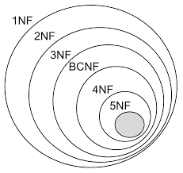

# Database Normalization

# 1. What is a Database Normalization

	Database normalization is the process 
	of organizing  data in a  database to 
	eliminate  redundancy, improve  data 
	integrity, and make the database more 
	flexible: 

	1. Eliminate redundancy: 
		Redundant data wastes disk space 
		and creates maintenance problems. 

	2. Improve data integrity: 
		Normalized relations mirror real-world 
		concepts and their interrelationships. 

	3. Make the database more flexible: 
		A fully normalized database can be 
		extended to accommodate  new  types 
		of data without changing existing 
		structure too much. 

	4. Benefits of database normalization: 
		1. Simplifies the query process 
		2. Improves workflow 
		3. Increases security 
		4. Lessens costs

	5. Normalization is commonly used when dealing 
		with large datasets. It involves breaking 
		down a large, complex  table into  smaller 
		and  simpler tables while  maintaining data 
		relationships. 

# 2. Normal Forms in DBMS

	Normalization is the process of minimizing 
	redundancy from a relation or set of relations. 
	Redundancy in relation  may  cause  insertion, 
	deletion, and update anomalies. So, it helps to 
	minimize the redundancy in relations. Normal 
	forms are used to eliminate or reduce 
	redundancy in database tables.

	Normalization of DBMS:
	
	In database management systems (DBMS), normal 
	forms are a series of guidelines that help to 
	ensure that  the  design of  a  database  is 
	efficient, organized,  and  free  from  data 
	anomalies.   There  are  several levels  of 
	normalization, each  with  its  own set  of 
	guidelines, known as normal forms.
	

	Important Points Regarding Normal Forms in DBMS:
	
	* First Normal Form (1NF): 
	
		This is the most basic level of normalization. 
		In 1NF, each table cell should contain only a 
		single value,  and each  column  should  have 
		a unique name. The first normal form helps to 
		eliminate duplicate data and simplify queries.
		
	* Second Normal Form (2NF): 
	
		2NF eliminates redundant data by requiring 
		that each non-key attribute be dependent on 
		the primary key. This means that each column 
		should be directly related to the primary key, 
		and not to other columns.
		
	* Third Normal Form (3NF): 
	
		3NF  builds on 2NF by requiring  that  all 
		non-key attributes are independent of each 
		other. This means that each column should 
		be  directly related  to the  primary key, 
		and not to any other columns in the same 
		table.
		
	* Boyce-Codd Normal Form (BCNF): 
	
		BCNF is a stricter form of 3NF that ensures 
		that each determinant in a table is a candidate 
		key. In other words, BCNF ensures  that  each 
		non-key attribute is dependent only on the 
		candidate key.

------

# Dependency & Partial Dependency

### What is a Dependency?

In database normalization, a **dependency** refers to 
a relationship between attributes (columns) in a table. 
Specifically, it describes how one attribute determines 
the value of another attribute. The most common type of 
dependency is a **functional dependency**, where the 
value of one attribute (or set of attributes) uniquely 
determines the value of another attribute.

#### Notation:
- If attribute **X** determines attribute **Y**, 
we write it as **X → Y**.

---

### What is a Partial Dependency?

A **partial dependency** occurs when a non-prime attribute (an attribute that is not part of the primary key) depends on only a part of a composite primary key, rather than the entire primary key. Partial dependencies are problematic in database design because they violate the rules of **Second Normal Form (2NF)**.

#### Example of Partial Dependency:
- Suppose a table has a composite primary key **(A, B)**.
- If a non-prime attribute **C** depends only on **A** (i.e., **A → C**), this is a partial dependency.

---

### Examples of Dependencies:

#### Example 1: Functional Dependency
**Table: Employees**

| Employee_ID | Employee_Name | Department_ID |
|-------------|---------------|---------------|
| 101         | Alice         | D01           |
| 102         | Bob           | D02           |

- **Dependency:** `Employee_ID → Employee_Name`
  - The `Employee_ID` uniquely determines the `Employee_Name`.

#### Example 2: Functional Dependency
**Table: Orders**

| Order_ID | Product_ID | Quantity |
|----------|------------|----------|
| 1001     | P101       | 2        |
| 1002     | P102       | 1        |

- **Dependency:** `Order_ID, Product_ID → Quantity`
  - The combination of `Order_ID` and `Product_ID` uniquely determines the `Quantity`.

#### Example 3: Functional Dependency
**Table: Students**

| Student_ID | Course_ID | Grade |
|------------|-----------|-------|
| 1          | C101      | A     |
| 2          | C102      | B     |

- **Dependency:** `Student_ID, Course_ID → Grade`
  - The combination of `Student_ID` and `Course_ID` uniquely determines the `Grade`.

---

### Examples of Partial Dependencies:

#### Example 1: Partial Dependency
**Table: Orders**

| Order_ID | Product_ID | Product_Name | Quantity |
|----------|------------|--------------|----------|
| 1001     | P101       | Laptop       | 2        |
| 1002     | P102       | Phone        | 1        |

- **Composite Primary Key:** `(Order_ID, Product_ID)`
- **Partial Dependency:** `Product_ID → Product_Name`
  - The `Product_Name` depends only on `Product_ID`, which is part of the composite primary key.

#### Example 2: Partial Dependency
**Table: Enrollments**

| Student_ID | Course_ID | Course_Name | Enrollment_Date |
|------------|-----------|-------------|-----------------|
| 1          | C101      | Math        | 2023-01-01      |
| 2          | C102      | Science     | 2023-02-01      |

- **Composite Primary Key:** `(Student_ID, Course_ID)`
- **Partial Dependency:** `Course_ID → Course_Name`
  - The `Course_Name` depends only on `Course_ID`, which is part of the composite primary key.

#### Example 3: Partial Dependency
**Table: Sales**

| Salesperson_ID | Region_ID | Region_Name | Sales_Amount |
|----------------|-----------|-------------|--------------|
| 101            | R01       | North       | 5000         |
| 102            | R02       | South       | 3000         |

- **Composite Primary Key:** `(Salesperson_ID, Region_ID)`
- **Partial Dependency:** `Region_ID → Region_Name`
  - The `Region_Name` depends only on `Region_ID`, which is part of the composite primary key.

---

### Key Differences:
- **Dependency:** A general relationship where one attribute determines another.
- **Partial Dependency:** A specific type of dependency where a non-prime attribute depends on only part of a composite primary key.

By resolving partial dependencies, you can achieve **Second Normal Form (2NF)** and improve the structure of your database.

------

# First Normal Form: 1NF

### What is First Normal Form (1NF)?

* First Normal Form (1NF) is the most basic level 
  of database normalization. 
* A table is in 1NF if it satisfies the following 
  conditions:

1. **Atomic Values**: Each column (attribute) contains only atomic (indivisible) values. This means no repeating groups or arrays are allowed in a single cell.
2. **Unique Column Names**: Each column has a unique name, and the order of columns does not matter.
3. **Unique Rows**: Each row in the table must be unique. This is typically ensured by having a primary key.
4. **Order Independence**: The order of rows and columns does not affect the data's meaning.

In simpler terms, 1NF ensures that the table is "flat" and does not contain any nested or repeating structures.

---

### Examples of Converting a Table into 1NF

#### Example 1: Repeating Groups in a Single Column

**Original Table (Not in 1NF):**

| Student_ID | Name       | Courses                 |
|------------|------------|-------------------------|
| 1          | John Doe   | Math, Science, History  |
| 2          | Jane Smith | English, Art            |

**Problem**: The "Courses" column contains multiple values separated by commas, violating the atomicity rule.

**Converted Table (1NF):**

| Student_ID | Name       | Course   |
|------------|------------|----------|
| 1          | John Doe   | Math     |
| 1          | John Doe   | Science  |
| 1          | John Doe   | History  |
| 2          | Jane Smith | English  |
| 2          | Jane Smith | Art      |

**Explanation**: Each course is now in a separate row, ensuring atomicity.

---

#### Example 2: Multiple Columns for Repeating Data

**Original Table (Not in 1NF):**

| Employee_ID | Name       | Skill_1 | Skill_2 | Skill_3 |
|-------------|------------|---------|---------|---------|
| 101         | Alice Brown| Python  | Java    | SQL     |
| 102         | Bob Green  | C++     | NULL    | NULL    |
| 103         | Jane Smith | Java    | NULL    | SQL     |

**Problem**: The table uses multiple columns to store similar data (skills), which is not scalable and violates 1NF.

**Converted Table (1NF):**

| Employee_ID | Name        | Skill  |
|-------------|-------------|--------|
| 101         | Alice Brown | Python |
| 101         | Alice Brown | Java   |
| 101         | Alice Brown | SQL    |
| 102         | Bob Green   | C++    |
| 103         | Jane Smith  | Java   |
| 103         | Jane Smith  | SQL    |

**Explanation**: Each skill is now in a separate row, 
eliminating the need for multiple columns.

---

#### Example 3: Nested Data in a Single Column

**Original Table (Not in 1NF):**

| Order_ID | Customer_Name | Products_Ordered                     |
|----------|---------------|--------------------------------------|
| 1001     | John Smith    | {Product: Laptop, Quantity: 1}, {Product: Mouse, Quantity: 2} |
| 1002     | Mary Johnson  | {Product: Keyboard, Quantity: 1}     |

**Problem**: The "Products_Ordered" column contains nested data (a list of products with quantities), which violates atomicity.

**Converted Table (1NF):**

| Order_ID | Customer_Name | Product  | Quantity |
|----------|---------------|----------|----------|
| 1001     | John Smith    | Laptop   | 1        |
| 1001     | John Smith    | Mouse    | 2        |
| 1002     | Mary Johnson  | Keyboard | 1        |

**Explanation**: Each product and its quantity are now in separate rows, ensuring atomicity.

---

### **First Normal Form (1NF)**
A table is in **First Normal Form (1NF)** if:  
1. All columns contain **atomic (indivisible) values**.  
2. There are **no repeating groups or arrays**.  
3. Each column contains values of **a single type**.  

---

### **Example 4: Breaking Multi-Valued Columns into Rows**
#### **Unnormalized Table (UNF)**
| student_id | student_name | subjects        |
|------------|-------------|----------------|
| 1          | Alice       | Math, Science  |
| 2          | Bob         | English, Math  |
| 3          | Charlie     | History        |

- The **"subjects"** column contains multiple values, violating 1NF.

#### **Converted to 1NF**
| student_id | student_name | subject  |
|------------|-------------|---------|
| 1          | Alice       | Math    |
| 1          | Alice       | Science |
| 2          | Bob         | English |
| 2          | Bob         | Math    |
| 3          | Charlie     | History |

✅ Now, all values are **atomic**, and there are **no multi-valued attributes**.

---

### **Example 5: Removing Repeating Groups**
#### **Unnormalized Table (UNF)**
| order_id | customer_name | product_1  | product_2  | product_3  |
|----------|--------------|------------|------------|------------|
| 101      | John Doe     | Laptop     | Mouse      | Keyboard   |
| 102      | Jane Smith   | Tablet     | Charger    | NULL       |

- The **product columns** are repeating groups, violating 1NF.

#### **Converted to 1NF**
| order_id | customer_name | product   |
|----------|--------------|-----------|
| 101      | John Doe     | Laptop    |
| 101      | John Doe     | Mouse     |
| 101      | John Doe     | Keyboard  |
| 102      | Jane Smith   | Tablet    |
| 102      | Jane Smith   | Charger   |

✅ Now, there are **no repeating groups**, and each column holds **atomic values**.

These transformations help normalize data for better consistency and query efficiency. 

### Summary

* 1NF ensures that a table is structured in a way that each cell contains a single, indivisible value, and there are no repeating groups or nested structures. 
* By converting tables into 1NF, you create a solid foundation for further normalization and efficient database design.

-------

# 2NF

### What is Second Normal Form (2NF)?

The **Second Normal Form (2NF)** is a level of database normalization that builds on the **First Normal Form (1NF)**. 

A table is in 2NF if:

1. It is in **1NF** (all attributes are atomic, and each row is unique).
2. It has **no partial dependency**, meaning no non-prime attribute (an attribute that is not part of any candidate key) is dependent on a proper subset of any candidate key.

In simpler terms, 2NF ensures that every non-key attribute in a table is fully functionally dependent on the **entire primary key**, not just part of it. This is particularly relevant for tables with composite primary keys (primary keys made up of multiple columns).

---

### Steps to Achieve 2NF

1. **Ensure the table is in 1NF**: The table must already satisfy the rules of 1NF.
2. **Identify the primary key**: Determine the primary key (or composite key) of the table.
3. **Check for partial dependencies**: If any non-key attribute depends on only part of the primary key, it violates 2NF.
4. **Decompose the table**: Split the table into smaller tables to eliminate partial dependencies.

---

### Examples of Conversion to 2NF

#### Example 1: Student Course Enrollment

**Original Table (Not in 2NF):**

| **Student_ID** | **Course_ID** | **Student_Name** | **Course_Name** | **Grade** |
|----------------|---------------|------------------|-----------------|-----------|
| 1              | 101           | John             | Math            | A         |
| 2              | 101           | Alice            | Math            | B         |
| 1              | 102           | John             | Science         | C         |

**Problem**: 

* The table has a composite primary key: `(Student_ID, Course_ID)`. 

* However, `Student_Name` depends only on `Student_ID`, and `Course_Name` depends only on `Course_ID`. This is a partial dependency.

**Solution**: Decompose the table into three tables:

1. **Students Table**:

   | **Student_ID** | **Student_Name** |
   |----------------|------------------|
   | 1              | John             |
   | 2              | Alice            |

2. **Courses Table**:

   | **Course_ID** | **Course_Name** |
   |---------------|-----------------|
   | 101           | Math            |
   | 102           | Science         |

3. **Enrollments Table**:

   | **Student_ID** | **Course_ID** | **Grade** |
   |----------------|---------------|-----------|
   | 1              | 101           | A         |
   | 2              | 101           | B         |
   | 1              | 102           | C         |

Now, all tables are in 2NF.

---

#### Example 2: Employee Project Assignment

**Original Table (Not in 2NF):**

| **Employee_ID** | **Project_ID** | **Employee_Name** | **Project_Name** | **Hours_Worked** |
|-----------------|----------------|-------------------|------------------|------------------|
| 101             | 1              | Alice             | Project X        | 20               |
| 102             | 1              | Bob               | Project X        | 15               |
| 101             | 2              | Alice             | Project Y        | 10               |

**Problem**: 

* The composite primary key is `(Employee_ID, Project_ID)`. 

* However, `Employee_Name` depends only on `Employee_ID`, and `Project_Name` depends only on `Project_ID`. This is a partial dependency.

**Solution**: Decompose the table into three tables:

1. **Employees Table**:

   | **Employee_ID** | **Employee_Name** |
   |-----------------|-------------------|
   | 101             | Alice             |
   | 102             | Bob               |

2. **Projects Table**:

   | **Project_ID** | **Project_Name** |
   |----------------|------------------|
   | 1              | Project X        |
   | 2              | Project Y        |

3. **Assignments Table**:

   | **Employee_ID** | **Project_ID** | **Hours_Worked** |
   |-----------------|----------------|------------------|
   | 101             | 1              | 20               |
   | 102             | 1              | 15               |
   | 101             | 2              | 10               |

Now, all tables are in 2NF.

---

#### Example 3: Order Details

**Original Table (Not in 2NF):**

| **Order_ID** | **Product_ID** | **Customer_Name** | **Product_Name** | **Quantity** |
|--------------|----------------|-------------------|------------------|--------------|
| 1001         | 1              | John              | Laptop           | 2            |
| 1001         | 2              | John              | Mouse            | 5            |
| 1002         | 1              | Alice             | Laptop           | 1            |

**Problem**: 

* The composite primary key is `(Order_ID, Product_ID)`. 

* However, `Customer_Name` depends only on `Order_ID`, and `Product_Name` depends only on `Product_ID`. This is a partial dependency.

**Solution**: Decompose the table into three tables:

1. **Orders Table**:

   | **Order_ID** | **Customer_Name** |
   |--------------|-------------------|
   | 1001         | John              |
   | 1002         | Alice             |

2. **Products Table**:

   | **Product_ID** | **Product_Name** |
   |----------------|------------------|
   | 1              | Laptop           |
   | 2              | Mouse            |

3. **Order_Details Table**:

   | **Order_ID** | **Product_ID** | **Quantity** |
   |--------------|----------------|--------------|
   | 1001         | 1              | 2            |
   | 1001         | 2              | 5            |
   | 1002         | 1              | 1            |

Now, all tables are in 2NF.

---

### Summary

- **2NF** eliminates partial dependencies by ensuring that non-key attributes depend on the **entire primary key**.
- To achieve 2NF, decompose tables with composite keys into smaller tables, separating attributes that depend on only part of the key.
- The examples above demonstrate how to identify and resolve partial dependencies to achieve 2NF.

### **Second Normal Form (2NF)**
A table is in **Second Normal Form (2NF)** if:  
1. **It is in 1NF** (First Normal Form).  
2. **There are no partial dependencies**, meaning:  
   - Every **non-key column** must be **fully dependent** on the **entire** primary key, not just a part of it.  

---

### **Example 4: Eliminating Partial Dependency in a Composite Key Table**
#### **1NF Table (Violating 2NF)**
| order_id | product_id | product_name | customer_id | customer_name |
|----------|-----------|--------------|------------|--------------|
| 101      | P1        | Laptop       | C1         | Alice        |
| 101      | P2        | Mouse        | C1         | Alice        |
| 102      | P3        | Keyboard     | C2         | Bob          |

**Issue:**  
- The **primary key** is **(`order_id`, `product_id`)** (composite key).  
- **`product_name`** depends **only** on **`product_id`**, not on the full key.  
- **`customer_name`** depends **only** on **`customer_id`**, not on the full key.  

#### **Converted to 2NF**
**Orders Table (Now in 2NF)**

| order_id | customer_id |
|----------|------------|
| 101      | C1         |
| 102      | C2         |

**Customers Table**

| customer_id | customer_name |
|------------|--------------|
| C1         | Alice        |
| C2         | Bob          |

**Products Table**

| product_id | product_name |
|-----------|--------------|
| P1        | Laptop       |
| P2        | Mouse        |
| P3        | Keyboard     |

**Order Details Table (Bridging Orders and Products)**

| order_id | product_id |
|----------|-----------|
| 101      | P1        |
| 101      | P2        |
| 102      | P3        |

✅ Now, **all non-key attributes fully depend on the primary key**, eliminating partial dependencies.

---

### **Example 5: Removing Partial Dependency in a Student Enrollment Table**
#### **1NF Table (Violating 2NF)**
| student_id | course_id | course_name  | student_name |
|------------|-----------|--------------|-------------|
| S1         | C101      | Math         | Alice       |
| S2         | C102      | Science      | Bob         |
| S1         | C102      | Science      | Alice       |

**Issue:**  
- The **primary key** is **(`student_id`, `course_id`)** (composite key).  
- **`course_name`** depends **only** on **`course_id`**, not on the full key.  
- **`student_name`** depends **only** on **`student_id`**, not on the full key.  

#### **Converted to 2NF**
**Students Table**

| student_id | student_name |
|------------|-------------|
| S1         | Alice       |
| S2         | Bob         |

**Courses Table**

| course_id | course_name  |
|----------|-------------|
| C101     | Math        |
| C102     | Science     |

**Enrollments Table (Bridging Students and Courses)**

| student_id | course_id |
|------------|----------|
| S1         | C101     |
| S2         | C102     |
| S1         | C102     |

✅ Now, **all non-key attributes fully depend on the primary key**, making the table **2NF compliant**.

---

### **Summary**
To convert to **2NF**, we:
- Identified **partial dependencies**.
- Split **data into separate tables** to ensure all columns depend **only on the full primary key**.

------

# 3NF

### What is Third Normal Form (3NF)?

Third Normal Form (3NF) is a level of database 
normalization used to reduce redundancy and improve 
data integrity in relational databases. 

A table is in 3NF if it satisfies the following conditions:

1. **It is in Second Normal Form (2NF):**
   - The table must already be in 2NF, meaning it should have no partial dependencies (every non-prime attribute must be fully functionally dependent on the primary key).

2. **No Transitive Dependencies:**
   - There should be no transitive dependencies, meaning no non-prime attribute should depend on another non-prime attribute. All non-prime attributes must depend only on the primary key.

In simpler terms, 3NF ensures that each column in a table is directly related to the primary key and not to other columns.

---

### Steps to Convert a Table into 3NF:

1. Ensure the table is in 2NF.
2. Identify and remove transitive dependencies by creating separate tables for attributes that depend on other non-prime attributes.

---

### Examples of Conversion to 3NF:

#### Example 1: Student Table

**Original Table (Not in 3NF):**

| Student_ID | Student_Name | Course_ID | Course_Name | Instructor_Name |
|------------|--------------|-----------|-------------|-----------------|
| 1          | John         | C101      | Math        | Dr. Smith       |
| 2          | Jane         | C102      | Science     | Dr. Brown       |
| 3          | John         | C103      | History     | Dr. Lee         |

**Problem:**
- `Course_Name` and `Instructor_Name` depend on `Course_ID`, not directly on `Student_ID` (transitive dependency).

**Solution:**
- Split the table into two tables: `Students` and `Courses`.

**Tables in 3NF:**

1. **Students:**

   | Student_ID | Student_Name | Course_ID |
   |------------|--------------|-----------|
   | 1          | John         | C101      |
   | 2          | Jane         | C102      |
   | 3          | John         | C103      |

2. **Courses:**

   | Course_ID | Course_Name | Instructor_Name |
   |-----------|-------------|-----------------|
   | C101      | Math        | Dr. Smith       |
   | C102      | Science     | Dr. Brown       |
   | C103      | History     | Dr. Lee         |

---

#### Example 2: Employee Table

**Original Table (Not in 3NF):**

| Employee_ID | Employee_Name | Department_ID | Department_Name | Manager_ID |
|-------------|---------------|---------------|-----------------|------------|
| 101         | Alice         | D01           | HR              | 201        |
| 102         | Bob           | D02           | IT              | 202        |
| 103         | Charlie       | D01           | HR              | 201        |

**Problem:**
- `Department_Name` depends on `Department_ID`, not directly on `Employee_ID` (transitive dependency).

**Solution:**
- Split the table into two tables: `Employees` and `Departments`.

**Tables in 3NF:**

1. **Employees:**

   | Employee_ID | Employee_Name | Department_ID | Manager_ID |
   |-------------|---------------|---------------|------------|
   | 101         | Alice         | D01           | 201        |
   | 102         | Bob           | D02           | 202        |
   | 103         | Charlie       | D01           | 201        |

2. **Departments:**

   | Department_ID | Department_Name |
   |---------------|-----------------|
   | D01           | HR              |
   | D02           | IT              |

---

### Example 3: Order Table

**Original Table (Not in 3NF):**

| Order_ID | Customer_ID | Customer_Name | Product_ID | Product_Name | Quantity |
|----------|-------------|---------------|------------|--------------|----------|
| 1001     | C001        | John          | P101       | Laptop       | 1        |
| 1002     | C002        | Jane          | P102       | Phone        | 2        |
| 1003     | C001        | John          | P103       | Tablet       | 1        |

**Problem:**

- `Customer_Name` depends on `Customer_ID`, and 
- `Product_Name` depends on `Product_ID` (transitive dependencies).

**Solution:**
- Split the table into three tables: `Orders`, `Customers`, and `Products`.

**Tables in 3NF:**

1. **Orders:**

   | Order_ID | Customer_ID | Product_ID | Quantity |
   |----------|-------------|------------|----------|
   | 1001     | C001        | P101       | 1        |
   | 1002     | C002        | P102       | 2        |
   | 1003     | C001        | P103       | 1        |

2. **Customers:**

   | Customer_ID | Customer_Name |
   |-------------|---------------|
   | C001        | John          |
   | C002        | Jane          |

3. **Products:**

   | Product_ID | Product_Name |
   |------------|--------------|
   | P101       | Laptop       |
   | P102       | Phone        |
   | P103       | Tablet       |

---

### Summary:
- 3NF ensures that each table has no transitive dependencies.
- It improves data integrity and reduces redundancy by organizing data into smaller, related tables.
- The examples demonstrate how to identify and resolve transitive dependencies to achieve 3NF.

### **Third Normal Form (3NF)**
A table is in **Third Normal Form (3NF)** if:  
1. **It is in 2NF** (Second Normal Form).  
2. **There are no transitive dependencies**, meaning:  
   - **Non-key columns** must depend **only on the primary key**, **not on other non-key columns**.  

---

### **Example 4: Removing Transitive Dependency in an Employee Table**
#### **2NF Table (Violating 3NF)**

| employee_id | employee_name | department_id | department_name |
|------------|--------------|--------------|----------------|
| E1         | Alice        | D101         | HR             |
| E2         | Bob          | D102         | IT             |
| E3         | Charlie      | D101         | HR             |

**Issue:**  
- **`department_name`** depends **on `department_id`**, not on **`employee_id`**.  
- This creates a **transitive dependency** (`employee_id → department_id → department_name`).  

#### **Converted to 3NF**
**Employees Table**

| employee_id | employee_name | department_id |
|------------|--------------|--------------|
| E1         | Alice        | D101         |
| E2         | Bob          | D102         |
| E3         | Charlie      | D101         |

**Departments Table**

| department_id | department_name |
|--------------|----------------|
| D101         | HR             |
| D102         | IT             |

✅ Now, **each non-key attribute depends only on the primary key**, and transitive dependency is removed.

---

### **Example 5: Removing Transitive Dependency in a Customer Orders Table**
#### **2NF Table (Violating 3NF)**

| order_id | customer_id | customer_name | customer_address|
|----------|-------------|---------------|-----------------|
| 201      | C1          | John Doe      | 123 Main St     |
| 202      | C2          | Jane Smith    | 456 Elm St      |
| 203      | C1          | John Doe      | 123 Main St     |

**Issue:**  

- **`customer_name`** and **`customer_address`** depend on **`customer_id`**, not **`order_id`**.

- This creates a **transitive dependency** (`order_id → customer_id → customer_name, customer_address`).  

#### **Converted to 3NF**
**Orders Table**

| order_id | customer_id |
|----------|------------|
| 201      | C1         |
| 202      | C2         |
| 203      | C1         |

**Customers Table**

| customer_id | customer_name | customer_address |
|------------|--------------|-----------------|
| C1         | John Doe     | 123 Main St     |
| C2         | Jane Smith   | 456 Elm St      |

✅ Now, **all non-key attributes depend only on the primary key**, eliminating transitive dependency.

---

### **Summary**
To convert a table to **3NF**, we:
1. **Identified transitive dependencies**.
2. **Moved dependent attributes** to a separate table where they directly depend on a primary key.

--------

# 3. Tutorials

The following are some tutorials for Database Normalization
 
1. [Normal Forms in DBMS](https://www.geeksforgeeks.org/normal-forms-in-dbms/)

2. [Why Normalization in DBMS is Essential for Databases](https://www.simplilearn.com/tutorials/sql-tutorial/what-is-normalization-in-sql)

3. [DBMS - Normalization](https://www.tutorialspoint.com/dbms/database_normalization.htm)

