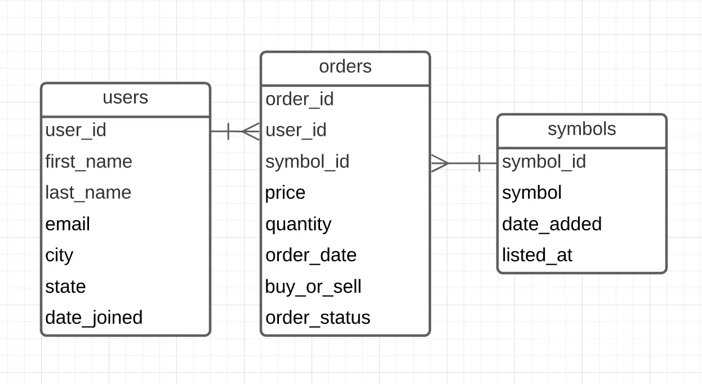
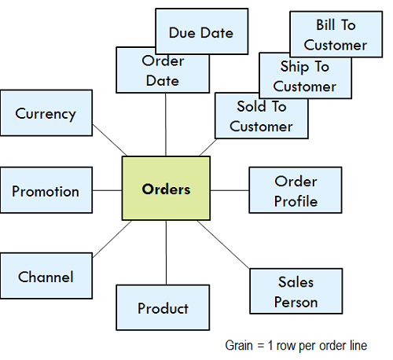
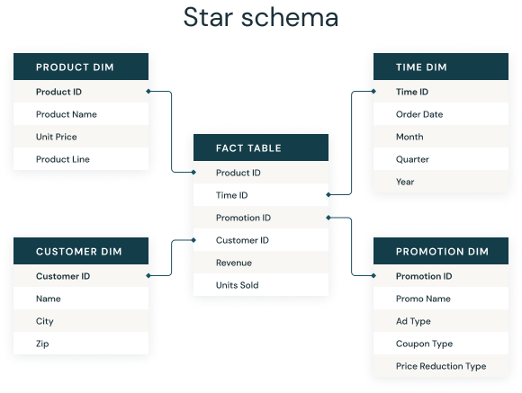
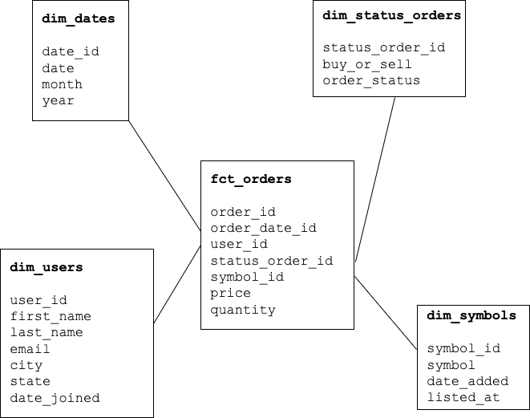
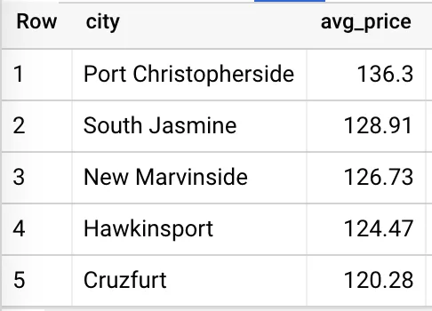
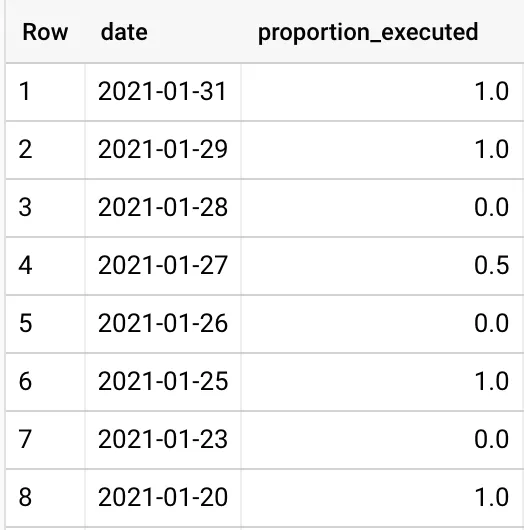

#  The Star Schema   A Hands-On Approach to Modeling

# 1. Stage: Stock Market Company

# 1.1 Stock Market Company

	We are on the data team for a fictional 
	stock market trading  firm  that  needs 
	some insights into its orders data.     

# Users trade stocks: BUY / SELL

* **Buy Stocks**
	* Example-1: user Alex buys 1000 shares of ILMN
	* Example-2: user Jane buys 5000 shares of FB

* **Sell Stocks**
	* Example-1: user Terry sells 700 shares of APL
	* Example-2: user Betty sells 2000 shares of ILMN

# 1.2 Data Warehouding & Analysis

	After analyzing our source data  and     
	business needs, the team has decided     
	that modeling the orders  data as  a     
	star schema would be the optimal choice. 

# 1.3 Operational Database Tables

	We receive data exports from our backend    
	team. The means  of this  transfer  isn’t   
	important as we will start our project at   
	the point which it is  loaded  into  our   
	warehouse. The raw data will be normalized, 
	comprised of three tables:                  

## Operational Database Tables

| Operational Table Name  | Table Description |
|-------------------------|-------------------|             
| **Users**               | Users buying or selling stocks 
| **Orders**              | Stock orders by users          
| **Symbols**             | Stock symbols                  

# 2. Business Intelligence Questions:

### 2.1. On average, which cities are trading the highest-priced stocks#

### 2.2. What is the daily proportion of orders that are executed (as opposed to canceled)?#

# 3. Operational Database tables

## Users table

~~~sql

CREATE TABLE users (
    user_id INTEGER,
    first_name VARCHAR(155),
    last_name VARCHAR(155),
    email VARCHAR(155),
    city VARCHAR(155),
    state VARCHAR(155),
    date_joined DATE
);
~~~

# Users table sample records#

~~~text

+---------+------------+-----------+--------+------+-------+------------+
| user_id | first_name | last_name | email  | city |state | date_joined |
+---------+------------+-----------+--------+------+------+-------------+
| 1122001 | Alex       | Smith     |a@g.com | Ames | IA   | 2/23/2020   |
+---------+------------+-----------+--------+------+-------+------------+
| 1122002 | Bob        | Fox       |f@g.com | Tampa| FL   | 4/20/2021   |
+---------+------------+-----------+--------+------+------+-------------+
...
~~~

## Orders table

~~~sql
CREATE TABLE orders (
    order_id INTEGER,
    user_id INTEGER,
    symbol_id INTEGER,
    price DOUBLE,
    quantity INTEGER,
    order_date DATE
    buy_or_sell VARCHAR(1),  -- { 'buy', 'sell' }
    order_status VARCHAR(1), -- { 'executed', 'cancelled' }
);
~~~

# Orders table sample records#

~~~text
+----------+---------+---------+-------+---------+-----------+-------------+-------------+
| order_id | user_id |symbol_id| price | quantity| order_date| buy_or_sell | order_status|
+----------+---------+---------+-------+---------+-----------+-------------+-------------+
| 999901   | 1122001 | 45      | 123.45| 12000   | 1/5/2022  | buy         | executed    |
+----------+---------+---------+-------+---------+-----------+-------------+-------------+
| 999902   | 1122001 | 46      |  65.00|  2000   | 1/6/2022  | sell        | executed    |
+----------+---------+---------+-------+---------+-----------+-------------+-------------+
| 999903   | 1122002 | 49      |   9:00|  8000   | 1/8/2022  | buy         | executed    |
+----------+---------+---------+-------+---------+-----------+-------------+-------------+
| 999904   | 1122002 | 40      |  35.00|  1000   | 1/10/2022 | sell        | executed    |
+----------+---------+---------+-------+---------+-----------+-------------+-------------+
| 999905   | 1122002 | 60      | 129:00|  5000   | 1/17/2022 | buy         | cancelled   |
+----------+---------+---------+-------+---------+-----------+-------------+-------------+
| 999906   | 1122002 | 60      | 128.00| 15000   | 1/17/2022 | sell        | cancelled   |
+----------+---------+---------+-------+---------+-----------+-------------+-------------+
...

~~~

## Stock Symbols table

~~~sql
CREATE TABLE symbols (
    symbol_id INTEGER,
    symbol VARCHAR(16),
    date_added DATE,
    listed_at VARCHAR(16)
)
~~~

# Stock Symbols table sample records:

~~~text
+-----------+---------+-----------+-----------+
| symbol_id | symbol  | date_added| listed_at |
+-----------+---------+-----------+-----------+
| 40        | TEZ     | 1/1/2010  | Dow       |
+-----------+---------+-----------+-----------+
| 45        | MAK     | 1/1/2010  | Dow       |
+-----------+---------+-----------+-----------+
| 46        | IBT     | 1/1/2010  | Nasdaq    |
+-----------+---------+-----------+-----------+
| 49        | TEE     | 1/1/2009  | Nasdaq    |
+-----------+---------+-----------+-----------+
| 60        | AAA     | 1/1/2008  | Dow       |
+-----------+---------+-----------+-----------+
...
~~~

### NOTE: 3 tables: operational database tables

	Remember, this is not our analytical 
	model. Data modeling optimized for 
	operational use is very different 
	from the one used for analytics. 
	Transforming the former into the 
	latter is one of the reasons why 
	data and analytics engineers exist.

# The Dimensional Design Process

There are 4 decisions we need to make at this stage.

1. Selecting the business process.

2. Declaring the grain.

3. Identifying the dimensions.

4. Identifying the facts.

## Bsiness Process

The business process in our project is the 
orders placed by our users. Taking a quick 
look at the raw orders table, we see two 
numerical columns:

## 1. price

## 2. quantity
  

	from which we can generate key metrics 
	for the business. These  will  be  the 
	facts/measures in our final facts table.

## Order as a FACT Table

Now that we have our #business process#
clearly defined, we can tackle the grain. 
Kimball encourages targeting the atomic grain 
— ‘the lowest level at which data is captured 
by a given business process’ — which in our 
case would be defining our records at the 
order level.

This means we don’t try to limit our business 
users by preemptively guessing their questions, 
instead, we give them the most amount of data 
and allow them to explore on their own.

## Dimensional Tables

# Next to grain...
Next to grain, the most important contributor 
to BI users adopting our model is the dimension 
tables. Requests usually come in at least two parts:

* first is the measure (how much, how many, etc.), 

* second is the filter/descriptor (who, what, when, etc.). 

The more dimensions we make available, the more our 
users will be able to uncover by slicing up the data.

Finally, we move to our #fact table#. There are a few 
different types of fact tables, however, choosing one 
isn’t really up to us. Taking a close look at our 
business process and its grain, and it is clear that 
our table is transactional. Each order is an event 
that only happens once at a specific point in time.

Other types of fact tables include Periodic Snapshot — 
each row summarizes a measurement over some period of 
time, Accumulating Periodic Snapshot — each row represents 
an instance of some business process (such as the lifecycle 
of an order, or claim), and Factless Tables — a table 
without measures.

# Forming the Star Schema

## Understand Left Join

# Understand Star Schema

# What is a star schema?#

1. A star schema is a **multi-dimensional data model** used 
to organize datain a database so that it is easy to understand and analyze.

2. Star schemas can be applied to data warehouses, databases, data marts, and other tools. 

3. The star schema design is optimized for querying large data sets.

4. Introduced by Ralph Kimball in the 1990s, star schemas are 
  efficient at storing data, maintaining history, and updating 
  data by reducing the duplication of repetitive business 
  definitions, #making it fast to aggregate# and filter data in 
  the data warehouse.

## Fact tables and Dimension tables

  1. A star schema is used to denormalize 
     business data into dimensions (like 
     time and product)  and facts (like 
     transactions in amounts and quantities).

  2. A star schema has a single fact table 
     in the center, containing business"facts"
     (like transaction amounts and quantities). 

  3. The fact table connects to multiple other 
     dimension tables along "dimensions" like 
     time, or product. 

  4. Star schemas enable users to slice and dice 
     the data however they see fit, typically by 
     joining two or more fact tables and dimension 
     tables together.

----

# Denormalized data

1. Star schemas denormalize the data, which means 
     adding redundant columns to some dimension tables 
     to make querying and working with the data faster 
     and easier. 
     
2. The purpose is to trade some redundancy (duplication 
      of data) in the data model for increased query speed, 
      by avoiding computationally expensive join operations.

## Designing the Star Schema

The easiest way to begin the design of the star 
schema is to denormalize the raw tables into one 
record. This will give us a wide view of our orders 
transaction and help us build out our dimensions.

The following query will do just that.

# 3 tables joined AS (denormalized table)

~~~sql
  SELECT
    u.user_id,
    u.last_name,
    u.email,
    u.city,
    u.state,
    u.date_joined,
    o.order_id,
    o.price,
    o.quantity,
    o.order_date,
    o.buy_or_sell,
    o.order_status,
    s.symbol_id,
    s.symbol,
    s.date_added,
    s.listed_at
  FROM orders AS o
  LEFT JOIN symbols AS s 
    ON o.symbol_id = s.symbol_id
  LEFT JOIN users AS u 
    ON o.user_id = u.user_id
~~~

 
# Star Schema Tables

   
	Looking a this join, we figure 
	that Orders is the most important 
	FACT table and the following are 
	dimension (DIM) tables:

## FACT table : fct_orders

## Dimension Tables:
###  `dim_users`
###  `dim_symbols`
###  `dim_dates`
###  `dim_status_orders`

------

# Fact Table: `fct_orders`

We build a fact table from the #raw orders table#

~~~sql

CREATE TABLE `fct_orders` AS (
SELECT
  order_id,
  order_date as order_date_id,
  user_id,
  CASE
    WHEN buy_or_sell = 'buy' and order_status = 'executed'   THEN 1
    WHEN buy_or_sell = 'buy' and order_status = 'cancelled'  THEN 2
    WHEN buy_or_sell = 'sell' and order_status = 'executed'  THEN 3
    WHEN buy_or_sell = 'sell' and order_status = 'cancelled' THEN 4
    ELSE 0
  END AS status_order_id,
  symbol_id,
  price,
  quantity
FROM `orders`
)
~~~

# DIM Table: `dim_date`

For the dates dimension table, there are plenty of ways to 
go about generating a series of past and future dates. This 
really depends on the dialect your database is using

~~~sql

CREATE TABLE `dim_dates` AS (
  SELECT
    date AS date_id,
    date,
    EXTRACT(MONTH FROM date) AS month,
    EXTRACT(YEAR FROM date) AS year
  FROM UNNEST(
    GENERATE_DATE_ARRAY('2014-01-01', CURRENT_DATE('America/New_York'), INTERVAL 1 DAY)
  ) AS date
  
~~~

### The query above generates a table of distinct dates, one day apart, starting from the arbitrary date ‘2014–01–01’ to the current date. Since dates are distinct, I’ve chosen to also use them for the date_id field.#

# DIM Table: `dim_status_orders`
 

	The **"buy_or_sell"** and **"order_status"** columns 
	from Orders table, can be used to create what is called 
	a `dim_status_orders` dimension table, where the rows 
	are simply all possible combinations of the attributes 
	of the columns.

# `dim_status_orders` table

## Table Definition

~~~sql

CREATE TABLE dim_status_orders (
   status_orders_id INT PRIMARY KEY,
   buy_or_sell TEXT,
   order_status TEXT
);
~~~

## Populate Table

~~~sql
INSERT INTO  dim_status_orders (
   status_orders_id, 
   buy_or_sell,
   order_status
)
VALUES
(1, 'buy', 'executed'),
(2, 'buy', 'cancelled'),
(3, 'sell', 'executed'),
(4, 'sell', 'cancelled');
~~~

~~~sql
select * from `dim_status_orders `
+-----------------+------------+--------------+
| status_order_id |buy_or_sell | order_status |
+-----------------+------------+--------------+
| 1               | buy        | executed     |
+-----------------+------------+--------------+
| 2               | buy        | cancelled    |
+-----------------+------------+--------------+
| 3               | sell       | executed     |
+-----------------+------------+--------------+
| 4               | sell       | cancelled    |

~~~

# Business Intelligence Analysis

We now have a star schema model that can be fed 
into most BI tools and made available to end-users.

Let's use our model to answer a few hypothetical questions.

### #1. On average, which cities are trading the highest-priced stocks?#

~~~sql
SELECT
      U.city,
      ROUND(AVG(F.price),2) AS avg_price

FROM `fct_orders` AS F
LEFT JOIN `dim_users` as U
   ON F.user_id = U.user_id
GROUP BY U.city
ORDER BY avg_price DESC
LIMIT 5
~~~

### #2. What is the daily proportion of orders that are executed (as opposed to canceled)?#

~~~sql
SELECT
  date,
  SUM(CASE WHEN order_status = 'executed' THEN 1 ELSE 0 END) /
    COUNT(*) AS proportion_executed

FROM `fct_orders` as F
LEFT JOIN `dim_dates` as D   ON F.order_date_id = D.date_id
LEFT JOIN `dim_status_orders ` as S  ON F.status_order_id = S.status_order_id
GROUP BY date
ORDER BY date DESC
~~~

# Source
[The Star Schema: A Hands-On Approach to Modeling by Jonathan Duran](https://medium.com/mlearning-ai/the-star-schema-a-hands-on-approach-to-modeling-fcf9e87edc08)

