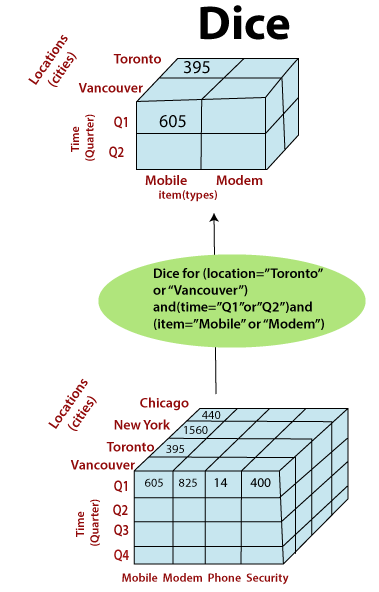

# OLAP DICE operation

	Provide a star schema in mysql with 
	sample records for all tables and then 
	provide 4 examples (simple to complex) 
	of a "dice" operation in sql

### **What is a Dice Operation?**
- **Dice filters on multiple dimensions at the same time**.

  


Let's start by defining a star schema for a retail store database, which consists of one fact table (Sales) and three dimension tables (Product, Customer, and Time).

1. **Star Schema**:
   - **Fact Table**:
     - `Sales(sales_id, product_id, customer_id, time_id, quantity_sold, revenue)`
   - **Dimension Tables**:
     - `Product(product_id, product_name, category, price)`
     - `Customer(customer_id, customer_name, city, state, country)`
     - `Time(time_id, date, month, quarter, year)`

2. **Sample Records**:

   - **Product Table**:
   
     ```sql
     INSERT INTO Product (product_id, product_name, category, price) VALUES
     (1, 'Laptop', 'Electronics', 1200),
     (2, 'Smartphone', 'Electronics', 800),
     (3, 'Tablet', 'Electronics', 500);
     ```

   - **Customer Table**:
   
     ```sql
     INSERT INTO Customer (customer_id, customer_name, city, state, country) VALUES
     (1, 'Alice', 'San Diego', 'CA', 'USA'),
     (2, 'Bob', 'New York', 'NY', 'USA'),
     (3, 'Charlie', 'Los Angeles', 'CA', 'USA');
     ```

   - **Time Table**:
   
     ```sql
     INSERT INTO Time (time_id, date, month, quarter, year) VALUES
     (1, '2025-01-01', 'January', 'Q1', 2025),
     (2, '2025-02-01', 'February', 'Q1', 2025),
     (3, '2025-03-01', 'March', 'Q1', 2025);
     ```

   - **Sales Table**:
   
     ```sql
     INSERT INTO Sales (sales_id, product_id, customer_id, time_id, quantity_sold, revenue) VALUES
     (1, 1, 1, 1, 2, 2400),
     (2, 2, 2, 2, 1, 800),
     (3, 3, 3, 3, 3, 1500);
     ```

3. **Examples of "Dice" Operation**:
   - The dice operation is used to filter data based on multiple dimensions. Here are four examples ranging from simple to complex:

   - **Simple Example**:
     *Filter sales data for the product 'Laptop' and month 'January'.*
     
     ```sql
     SELECT * FROM Sales
     JOIN Product ON Sales.product_id = Product.product_id
     JOIN Time ON Sales.time_id = Time.time_id
     WHERE 
          Product.product_name = 'Laptop' AND 
          Time.month = 'January';
     ```

   - **Moderately Complex Example**:
     *Filter sales data for products in the 'Electronics' category and customers from 'California'.*
     
     ```sql
     SELECT * FROM Sales
     JOIN Product ON Sales.product_id = Product.product_id
     JOIN Customer ON Sales.customer_id = Customer.customer_id
     WHERE 
          Product.category = 'Electronics' AND 
          Customer.state = 'CA';
     ```

   - **Complex Example**:
     *Filter sales data for the product 'Smartphone', in 'February', and for customers in 'New York'.*
     
     ```sql
     SELECT * FROM Sales
     JOIN Product ON Sales.product_id = Product.product_id
     JOIN Time ON Sales.time_id = Time.time_id
     JOIN Customer ON Sales.customer_id = Customer.customer_id
     WHERE 
           Product.product_name = 'Smartphone' AND 
           Time.month = 'February' AND Customer.city = 'New York';
     ```

   - **Complex Example**:
     *Filter sales data for 'Q1' of '2025', for products in the 'Electronics' category, and customers from the 'USA'.*
     
     ```sql
     SELECT * FROM Sales
     JOIN Product ON Sales.product_id = Product.product_id
     JOIN Time ON Sales.time_id = Time.time_id
     JOIN Customer ON Sales.customer_id = Customer.customer_id
     WHERE 
          Time.quarter = 'Q1' AND 
          Time.year = 2025 AND 
          Product.category = 'Electronics' AND 
          Customer.country = 'USA';
     ```


