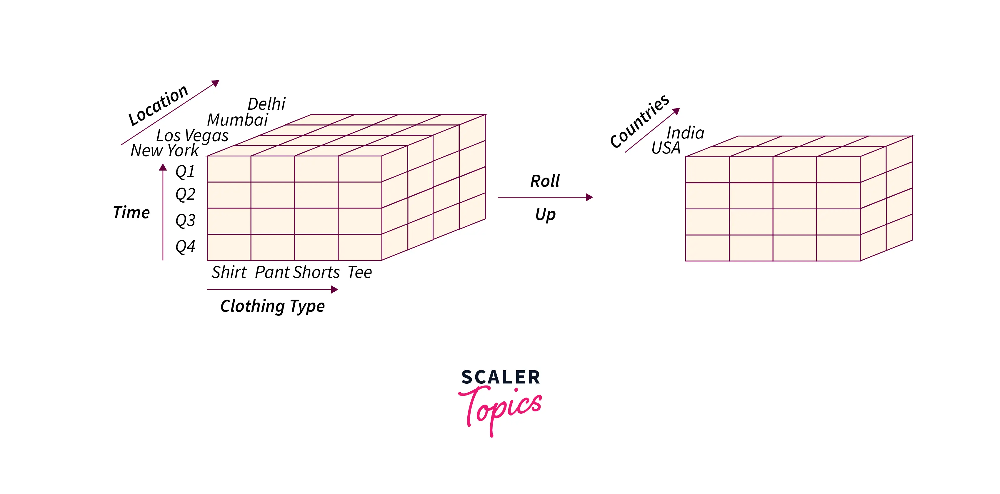
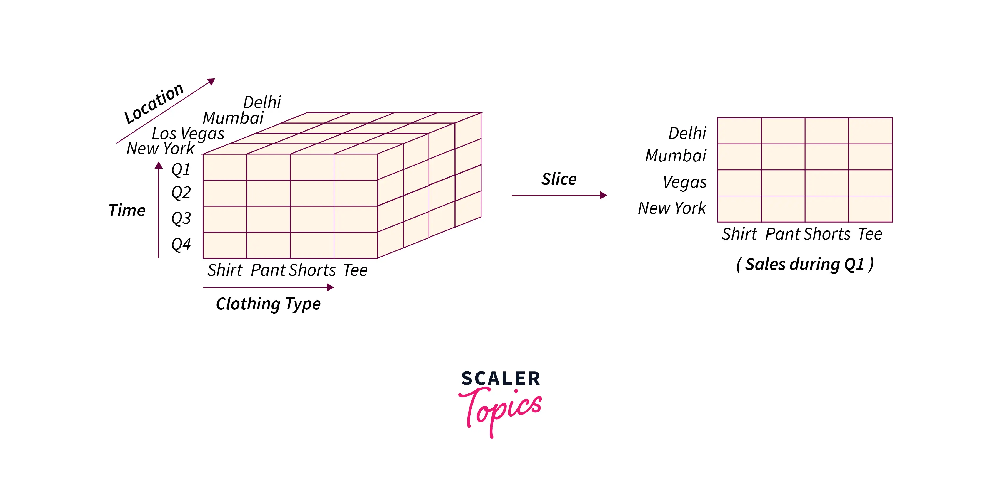
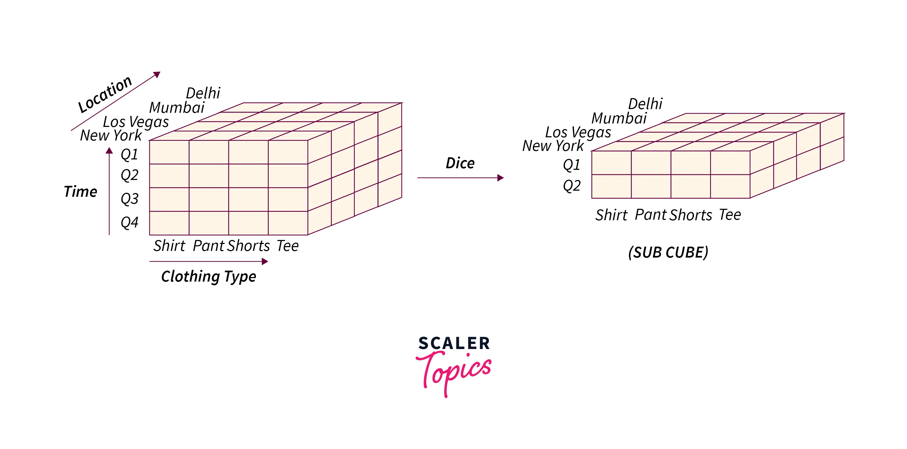
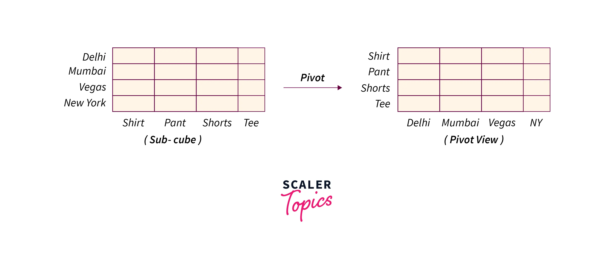

# OLAP Operations

OLAP = Online Analytical Processing
 
	OLAP operations are used in **data warehousing** 
	and **business intelligence** to analyze large 
	datasets efficiently. 
	
	These operations allow users to **explore data 
	at different levels of granularity** and across 
	multiple dimensions.


---

## **Summary of OLAP Operations**
| **Operation**   | **Purpose** | **Example** |
|----------------|------------|-------------|
| **Roll-Up**   | Aggregates data (e.g., daily → monthly) | Sales per year |
| **Drill-Down** | Increases detail (e.g., yearly → quarterly) | Sales per month |
| **Slice**     | Filters a single dimension | Only Electronics sales |
| **Dice**      | Filters multiple dimensions | Sales in Q1 for Electronics & Home Appliances |
| **Pivot**     | Rotates data structure | Years as columns instead of rows |
| **Drill-Through** | Retrieves detailed transactional data | All sales in Q1 2024 |


-----
-----


## **1. Types of OLAP Operations**  
Here are the key OLAP operations:

## **1. Roll-Up (Aggregation)**
- Moves **from a lower level of detail to a higher level**.
- Aggregates data (e.g., **daily → monthly → yearly**).
- Uses **GROUP BY** in SQL with **SUM, AVG, COUNT, etc.**  
- **Example**:  

  ```sql
  SELECT d.year, 
         SUM(s.sales_amount) AS total_sales
  FROM 
      sales_fact s
  JOIN 
      date_dim d ON s.date_id = d.date_id
  GROUP BY 
      d.year;
  ```
  ✅ **Rolls up** sales from daily to yearly level.



## Roll-Up Summary...

* **Description**: 

		It involves summarizing or aggregating data, 
		typically moving from detailed data to a 
		higher level of data.

* **Example**: 

		If you have sales data at the day level, 
		rolling up might mean aggregating this 
		data to the monthly level, so instead 
		of seeing sales per day, you'd see 
		total sales per month.

-----
-----

## **2. Drill-Down (Roll-Down)**
- Moves **from a higher level of detail to a lower level**.
- Provides more **granular insights** (e.g., **yearly → quarterly → monthly**).  
- **Example**:  

  ```sql
  SELECT d.year, 
         d.quarter, 
         d.month, 
         SUM(s.sales_amount) AS total_sales
  FROM 
      sales_fact s
  JOIN 
      date_dim d ON s.date_id = d.date_id
  GROUP BY 
      d.year, 
      d.quarter, 
      d.month;
  ```
  ✅ **Drills down** sales from **year → quarter → month**.


## Roll-down (or Drill-down) Summary...

* **Description**: 

		This is the opposite of roll-up. 
		It involves breaking down the data 
		into more detail.

* **Example**: 

		If you have sales data at the monthly level, 
		drilling down would involve breaking this 
		data down to see sales for individual days 
		within the month.

-----
-----

## **3. Slice**
- **Filters** data for a specific value in one dimension while showing all others.  
- **Example**: **Sales in the Electronics category only**  

  ```sql
  SELECT p.category, 
         d.year, 
         SUM(s.sales_amount) AS total_sales
  FROM 
      sales_fact s
  JOIN 
      product_dim p ON s.product_id = p.product_id
  JOIN 
      date_dim d ON s.date_id = d.date_id
  WHERE 
      p.category = 'Electronics'
  GROUP BY 
      p.category,
      d.year;
  ```
  
  ✅ **Slices the data to show only Electronics sales**.



## Slice Summary...

* **Description**: 

		Slice operation creates a subset of 
		the data by selecting a single dimension 
		and fixing it at a certain value.

* **Example**: 

		If you have a cube of sales data by 
		time, region, and product, a slice might 
		involve selecting data for just one 
		specific product across all regions 
		and time periods.

-----
-----

## **4. Dice**
- **Filters multiple dimensions at the same time**.  
- **Example**: **Sales in Q1 of 2024 for Electronics & Home Appliances**  

  ```sql
  SELECT p.category, 
         d.quarter, 
         SUM(s.sales_amount) AS total_sales
  FROM 
      sales_fact s
  JOIN 
      product_dim p ON s.product_id = p.product_id
  JOIN 
      date_dim d ON s.date_id = d.date_id
  WHERE d.year = 2024    AND 
        d.quarter = 'Q1' AND 
        p.category IN ('Electronics', 'Home Appliances')
  GROUP BY 
        p.category, d.quarter;
  ```
  ✅ **Dices the data to filter for Q1, Electronics & Home Appliances**.




* **Description**: 

		This operation is similar to slice 
		but more flexible, allowing you to 
		select multiple dimensions and values 
		to create a subcube.

* **Example**: 

		Using the same sales cube, dicing might 
		involve selecting data for a specific 
		region and a  specific  time period, 
		producing a smaller cube focused on 
		those parameters.


-----
-----

## **5. Pivot (Rotation)**
- **Rearranges** data to provide different perspectives.  
- **Example**: Showing **years as columns** instead of rows.

  ```sql
  SELECT category,
         SUM(CASE WHEN year = 2022 THEN sales_amount ELSE 0 END) AS sales_2022,
         SUM(CASE WHEN year = 2023 THEN sales_amount ELSE 0 END) AS sales_2023,
         SUM(CASE WHEN year = 2024 THEN sales_amount ELSE 0 END) AS sales_2024
  FROM 
      sales_fact s
  JOIN 
      date_dim d ON s.date_id = d.date_id
  JOIN 
      product_dim p ON s.product_id = p.product_id
  GROUP BY 
      p.category;
  ```
  
  ✅ **Pivots sales data to compare across years**.



## Pivot (or Rotate) Summary...

* **Description**: 

		This involves reorienting the data cube, 
		allowing users to view the data from 
		different perspectives.
	
		
* **Example**: 

		If you're looking at sales data by 
		product and region, pivoting might 
		change the view to look at sales data 
		by region and product, effectively 
		swapping rows and columns to gain 
		new insights.


-----
-----

## **6. Drill-Through (Detail View)**
- **Retrieves raw transactional data** behind aggregated summaries.
- **Example**: Retrieve all sales transactions for **Q1 2024**.

  ```sql
  SELECT s.*, 
         d.year, 
         d.quarter, 
         p.product_name, 
         c.customer_name, 
         st.store_name
  FROM 
       sales_fact s
  JOIN date_dim d ON s.date_id = d.date_id
  JOIN product_dim p ON s.product_id = p.product_id
  JOIN customer_dim c ON s.customer_id = c.customer_id
  JOIN store_dim st ON s.store_id = st.store_id
  WHERE 
        d.year = 2024 AND 
        d.quarter = 'Q1';
  ```
  ✅ **Shows all sales details for Q1 2024**.

----
----

# ✅ What is OLAP and OLAP Cube

### **What is OLAP? (Online Analytical Processing)**
**OLAP (Online Analytical Processing)** is a category of database technologies that allows users to analyze multidimensional data interactively. It is used in **business intelligence (BI)**, **data warehousing**, and **reporting** to perform complex queries on large datasets efficiently.

### **Key Features of OLAP**
- **Multidimensional Analysis** → Allows users to analyze data across multiple dimensions (e.g., time, product, region).  
- **Aggregations & Summarization** → Supports operations like **sum, average, count, min, max** across different hierarchies.  
- **Fast Query Performance** → Uses **precomputed summaries** to speed up queries.  
- **Interactive Data Exploration** → Enables users to **drill down, roll up, slice, dice, and pivot** data.

---

### **What is an OLAP Cube?**
An **OLAP Cube** is a **multidimensional data structure** that allows efficient querying and reporting. Unlike traditional **2D relational tables**, an OLAP cube organizes data into multiple **dimensions**, enabling **fast aggregation and analysis**.

### Cube with 2 dimensions:

~~~
A    B     value1
A    NULL  value2
NULL B     value3
NULL NULL  value4
~~~

### Cube with 3 dimensions:

~~~
A     B     C     value1
A     B     NULL  value2
A     NULL  C     value3
A     NULL  NULL  value4
NULL  B     C     value5
NULL  B     NULL  value6
NULL  NULL  C     value7
NULL  NULL  NULL  value8
~~~


## **Example: Sales Data OLAP Cube**

A simple **OLAP cube** for sales data could have **three dimensions**:

1. **Time Dimension** → Year, Quarter, Month, Day  
2. **Product Dimension** → Category, Brand, Product Name  
3. **Region Dimension** → Country, State, City  

And the **fact measure**:

- **Total Sales Amount**  
- **Total Units Sold**  

This allows users to answer questions like:

- **"What were the total sales in Q1 2024 for Smartphones in the USA?"**  
- **"Compare total revenue for Brand A vs. Brand B over the last 3 years."**  

---

## **OLAP Cube Operations**
1. **Roll-Up** → Aggregating data to a higher level (e.g., from Month → Quarter → Year).  
2. **Drill-Down** → Going into more detailed levels (e.g., from Year → Month → Day).  
3. **Slice** → Filtering a single dimension (e.g., Sales in **Q1 2024** only).  
4. **Dice** → Filtering multiple dimensions (e.g., Sales in **Q1 2024** for Smartphones in the USA).  
5. **Pivot** → Rotating the cube to change perspectives on the data.


### **Example: OLAP Cube in SQL with Queries for OLAP Operations**  

We will create a **star schema** for a sales analytics system using an **OLAP cube** with dimensions for **time, product, and region**, and a **fact table** for sales.

---

## **1. OLAP Cube Schema**

### **Fact Table: `sales_fact`**  
Stores sales transactions.

| sale_id | date_id| product_id | region_id | total_sales | units_sold |
|---------|--------|------------|-----------|-------------|------------|
| 1       | 1      | 1          | 1         | 1000        | 10         |
| 2       | 2      | 2          | 2         | 500         | 5          |
| 3       | 3      | 3          | 3         | 1500        | 15         |
| 4       | 4      | 1          | 1         | 1200        | 12         |
| 5       | 5      | 2          | 2         | 800         | 8          |

---

### **Dimension Table: `time_dim`**  
Stores time-related attributes.

| date_id | date       | year | quarter | month |
|---------|------------|------|---------|-------|
| 1       | 2024-01-01 | 2024 | Q1      | Jan   |
| 2       | 2024-02-01 | 2024 | Q1      | Feb   |
| 3       | 2024-03-01 | 2024 | Q1      | Mar   |
| 4       | 2024-04-01 | 2024 | Q2      | Apr   |
| 5       | 2024-05-01 | 2024 | Q2      | May   |

---

### **Dimension Table: `product_dim`**  
Stores product-related attributes.

| product_id | product_name | category   | brand     |
|------------|-------------|------------|----------|
| 1          | Phone A     | Smartphone | Brand X  |
| 2          | Laptop B    | Laptop     | Brand Y  |
| 3          | Tablet C    | Tablet     | Brand Z  |

---

### **Dimension Table: `region_dim`**  
Stores region-related attributes.

| region_id | country | state  | city       |
|-----------|---------|--------|-----------|
| 1         | USA     | CA     | Los Angeles |
| 2         | UK      | London | London     |
| 3         | Canada  | ON     | Toronto    |

---

## **2. OLAP Operations with SQL Queries**

---

## **A. Roll-Up (Aggregating Data to a Higher Level)**
### **Query 1: Aggregate Sales from Month to Quarter**
```sql
SELECT t.year, 
       t.quarter, 
       SUM(s.total_sales) AS total_sales
FROM 
    sales_fact s
JOIN 
    time_dim t ON s.date_id = t.date_id
GROUP BY 
    t.year, t.quarter;
```

### **Query 2: Aggregate Sales from Quarter to Year**
```sql
SELECT t.year, 
       SUM(s.total_sales) AS total_sales
FROM 
     sales_fact s
JOIN 
     time_dim t ON s.date_id = t.date_id
GROUP BY 
     t.year;
```

#### **Query 3: Aggregate Sales by Category at Yearly Level**
```sql
SELECT t.year, 
       p.category, 
       SUM(s.total_sales) AS total_sales
FROM 
     sales_fact s
JOIN 
     time_dim t ON s.date_id = t.date_id
JOIN 
     product_dim p ON s.product_id = p.product_id
GROUP BY 
     t.year, p.category;
```

---

## **B. Drill-Down (Going into More Detailed Levels)**
### **Query 1: Drill Down from Year to Month**
```sql
SELECT t.year, 
       t.month, 
       SUM(s.total_sales) AS total_sales
FROM 
     sales_fact s
JOIN 
     time_dim t ON s.date_id = t.date_id
GROUP BY 
     t.year, t.month;
```

#### **Query 2: Drill Down to Daily Sales for Smartphones**
```sql
SELECT t.date, 
       p.product_name, 
       SUM(s.total_sales) AS total_sales
FROM 
     sales_fact s
JOIN 
     time_dim t ON s.date_id = t.date_id
JOIN 
     product_dim p ON s.product_id = p.product_id
WHERE 
     p.category = 'Smartphone'
GROUP BY 
     t.date, p.product_name;
```

#### **Query 3: Drill Down from Region to City-Level Sales**
```sql
SELECT r.country, 
       r.state, 
       r.city, 
       SUM(s.total_sales) AS total_sales
FROM 
     sales_fact s
JOIN 
     region_dim r ON s.region_id = r.region_id
GROUP BY 
     r.country, r.state, r.city;
```

---

## **C. Slice (Filtering a Single Dimension)**
#### **Query 1: Sales in Q1 2024**
```sql
SELECT t.month, 
       SUM(s.total_sales) AS total_sales
FROM 
     sales_fact s
JOIN 
     time_dim t ON s.date_id = t.date_id
WHERE 
     t.quarter = 'Q1' AND 
     t.year = 2024
GROUP BY 
     t.month;
```

#### **Query 2: Sales of Laptops Only**
```sql
SELECT t.year, 
       t.month, 
       SUM(s.total_sales) AS total_sales
FROM 
     sales_fact s
JOIN 
     product_dim p ON s.product_id = p.product_id
JOIN 
     time_dim t ON s.date_id = t.date_id
WHERE 
     p.category = 'Laptop'
GROUP BY 
     t.year, t.month;
```

#### **Query 3: Sales in USA Only**
```sql
SELECT t.year, 
       t.month, 
       SUM(s.total_sales) AS total_sales
FROM 
     sales_fact s
JOIN 
     region_dim r ON s.region_id = r.region_id
JOIN 
     time_dim t ON s.date_id = t.date_id
WHERE 
     r.country = 'USA'
GROUP BY 
     t.year, t.month;
```

---

## **D. Dice (Filtering Multiple Dimensions)**
#### **Query 1: Sales for Smartphones in Q1 2024**
```sql
SELECT t.month, 
       r.country, 
       SUM(s.total_sales) AS total_sales
FROM 
    sales_fact s
JOIN 
    time_dim t ON s.date_id = t.date_id
JOIN 
    product_dim p ON s.product_id = p.product_id
JOIN 
    region_dim r ON s.region_id = r.region_id
WHERE 
    t.quarter = 'Q1' AND 
    t.year = 2024    AND 
    p.category = 'Smartphone'
GROUP BY 
    t.month, r.country;
```

#### **Query 2: Sales for Laptops in London in 2024**
```sql
SELECT t.month, 
       SUM(s.total_sales) AS total_sales
FROM 
     sales_fact s
JOIN 
     time_dim t ON s.date_id = t.date_id
JOIN 
     product_dim p ON s.product_id = p.product_id
JOIN 
     region_dim r ON s.region_id = r.region_id
WHERE 
     p.category = 'Laptop'  AND 
     r.city = 'London'      AND 
     t.year = 2024
GROUP BY 
     t.month;
```

#### **Query 3: Sales for Tablets in Q2 for USA**
```sql
SELECT t.month, 
       r.state, 
       SUM(s.total_sales) AS total_sales
FROM 
     sales_fact s
JOIN 
     time_dim t ON s.date_id = t.date_id
JOIN 
     product_dim p ON s.product_id = p.product_id
JOIN 
     region_dim r ON s.region_id = r.region_id
WHERE 
     p.category = 'Tablet'   AND 
     t.quarter = 'Q2'        AND 
     r.country = 'USA'
GROUP BY 
     t.month, r.state;
```

---

## **E. Pivot (Changing Data Representation)**
#### **Query 1: Monthly Sales as Columns**
```sql
SELECT year,
    SUM(CASE WHEN month = 'Jan' THEN total_sales ELSE 0 END) AS Jan_sales,
    SUM(CASE WHEN month = 'Feb' THEN total_sales ELSE 0 END) AS Feb_sales,
    SUM(CASE WHEN month = 'Mar' THEN total_sales ELSE 0 END) AS Mar_sales
FROM 
    sales_fact s
JOIN 
    time_dim t ON s.date_id = t.date_id
GROUP BY year;
```

#### **Query 2: Product Category Sales per Year**
```sql
SELECT category,
    SUM(CASE WHEN year = 2023 THEN total_sales ELSE 0 END) AS sales_2023,
    SUM(CASE WHEN year = 2024 THEN total_sales ELSE 0 END) AS sales_2024
FROM 
    sales_fact s
JOIN 
    product_dim p ON s.product_id = p.product_id
JOIN 
   time_dim t ON s.date_id = t.date_id
GROUP BY 
   category;
```

---

### **Conclusion**
This provides a **complete OLAP cube schema** with SQL queries for **roll-up, drill-down, slice, dice, and pivot** operations.


