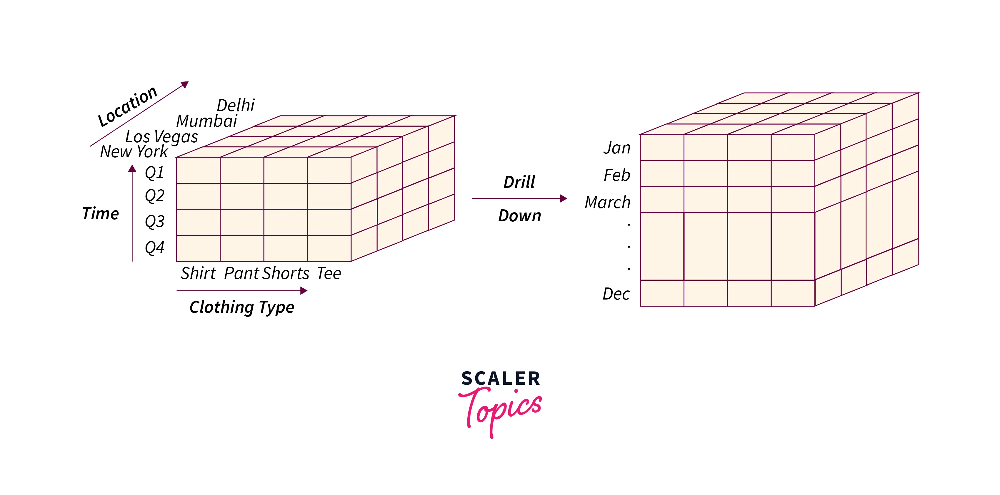

# OLAP Roll Down 
	Provide a star schema in mysql with 
	sample records for all tables and then 
	provide 4 examples (simple to complex) 
	of a "roll down" operation in sql

## **2. Roll-Down Operations in SQL**
### **What is Roll-Down?**
- **Drilling down** (opposite of roll-up) moves from **higher levels of aggregation to lower levels**, providing more granular details.

# Star Schema in MySQL

The Star Schema consists of a central fact table connected to dimension tables. Here’s an example of a simple Star Schema for a sales database:

## Fact Table: Sales

~~~
SaleID (Primary Key)

DateID (Foreign Key)

ProductID (Foreign Key)

CustomerID (Foreign Key)

Quantity

Amount
~~~

## Dimension Table: Date

~~~
DateID (Primary Key)

Date

Month

Year
~~~

## Dimension Table: Product

~~~
ProductID (Primary Key)

ProductName

Category
~~~

## Dimension Table: Customer

~~~
CustomerID (Primary Key)

CustomerName

Country
~~~

## Sample Records

* Inserting sample records into Date dimension table

~~~sql
INSERT INTO Date (DateID, Date, Month, Year) VALUES 
(1, '2025-02-24', 'February', 2025),
(2, '2025-02-25', 'February', 2025);
~~~

* Inserting sample records into Product dimension table

~~~sql
INSERT INTO Product (ProductID, ProductName, Category) 
VALUES 
(1, 'Laptop', 'Electronics'),
(2, 'Smartphone', 'Electronics');
~~~

* Inserting sample records into Customer dimension table

~~~sql
INSERT INTO Customer (CustomerID, CustomerName, Country) 
VALUES 
(1, 'John Doe', 'USA'),
(2, 'Jane Smith', 'Canada');
~~~

* Inserting sample records into Sales fact table

~~~sql
INSERT INTO Sales (SaleID, DateID, ProductID, CustomerID, Quantity, Amount) VALUES 
(1, 1, 1, 1, 2, 2000),
(2, 2, 2, 2, 1, 1000);
~~~

# Roll-Up Examples

### 1. Simple Roll-Up: Sum up the total sales amount by Product.

~~~sql
SELECT Product.ProductName, 
       SUM(Sales.Amount) AS TotalSales
FROM Sales
JOIN 
     Product ON Sales.ProductID = Product.ProductID
GROUP BY 
    Product.ProductName;
~~~
    
### 2. Roll-Up by Date: Sum up the total sales amount by Month.

~~~sql
SELECT Date.Month, 
       SUM(Sales.Amount) AS TotalSales
FROM 
     Sales
JOIN 
     Date ON Sales.DateID = Date.DateID
GROUP BY 
     Date.Month;
~~~

### 3. Roll-Up by Customer and Product: Sum up the total sales amount by Customer and Product.

~~~sql
SELECT Customer.CustomerName, 
       Product.ProductName, 
       SUM(Sales.Amount) AS TotalSales
FROM 
    Sales
JOIN 
    Customer ON Sales.CustomerID = Customer.CustomerID
JOIN 
    Product ON Sales.ProductID = Product.ProductID
GROUP BY 
    Customer.CustomerName, Product.ProductName;
~~~

### 4. Complex Roll-Up: Sum up the total sales amount by Year, Product Category, and Country.

~~~sql
SELECT Date.Year, 
       Product.Category, 
       Customer.Country, 
       SUM(Sales.Amount) AS TotalSales
FROM 
     Sales
JOIN 
     Date ON Sales.DateID = Date.DateID
JOIN 
     Product ON Sales.ProductID = Product.ProductID
JOIN 
     Customer ON Sales.CustomerID = Customer.CustomerID
GROUP BY 
     Date.Year, Product.Category, Customer.Country;

------

# Roll-Down Examples

### 1. Simple Roll-Down: Break down the total sales amount by individual sale within a specific month.

~~~sql
SELECT Sales.SaleID, 
       Sales.Amount
FROM 
     Sales
JOIN 
     Date ON Sales.DateID = Date.DateID
WHERE 
     Date.Month = 'February';
~~~

### 2. Roll-Down by Customer: Break down the total sales amount by individual sale for a specific customer.

~~~sql
SELECT Sales.SaleID, 
       Sales.Amount
FROM 
     Sales
JOIN 
     Customer ON Sales.CustomerID = Customer.CustomerID
WHERE 
     Customer.CustomerName = 'John Doe';
~~~

### 3. Roll-Down by Product: Break down the total sales amount by individual sale for a specific product.

~~~sql
SELECT Sales.SaleID, 
       Sales.Amount
FROM 
     Sales
JOIN 
     Product ON Sales.ProductID = Product.ProductID
WHERE 
     Product.ProductName = 'Laptop';
~~~

### 4. Complex Roll-Down: Break down the total sales amount by individual sale for a specific customer and product within a specific year.

~~~sql
SELECT Sales.SaleID, 
       Sales.Amount
FROM 
     Sales
JOIN 
     Date ON Sales.DateID = Date.DateID
JOIN 
     Customer ON Sales.CustomerID = Customer.CustomerID
JOIN 
     Product ON Sales.ProductID = Product.ProductID
WHERE 
     Customer.CustomerName = 'John Doe' AND 
     Product.ProductName = 'Laptop' AND 
     Date.Year = 2025;
~~~
