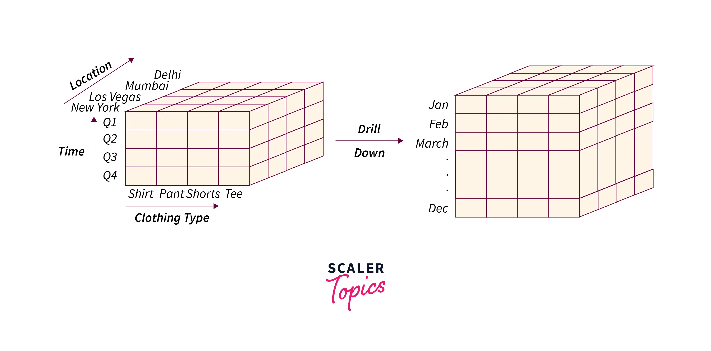

# Understanding OLAP Queries and Design Patterns

## Complete Teaching Guide Using a Retail Star Schema

------------------------------------------------------------------------

# 1️⃣ Star Schema Definition (Retail Sales)

## Fact Table: fact_sales

``` sql
CREATE TABLE fact_sales (
    sales_key BIGINT PRIMARY KEY AUTO_INCREMENT,
    date_key INT,
    customer_key INT,
    product_key INT,
    store_key INT,
    channel_key INT,
    quantity INT,
    sales_amount DECIMAL(12,2)
);
```

## Dimensions

-   `dim_date(date_key, full_date, year, quarter, month, day)`
-   `dim_product(product_key, product_name, category, brand)`
-   `dim_customer(customer_key, city, state, country)`
-   `dim_store(store_key, store_name, state, country)`
-   `dim_channel(channel_key, channel_name)`

Grain: **One row per product sold per order line.**

------------------------------------------------------------------------

# 2️⃣ TOP-N (Top-10 Pattern) <br> LIMIT N

## Semantics

Retrieve the highest-performing entities based on a metric.

## SQL Design Pattern

``` sql
SELECT dimension, 
       SUM(measure) AS metric
FROM fact
JOIN dimension_table ON ...
GROUP BY dimension
ORDER BY metric DESC
LIMIT N;
```

## Example 1

#### Query: Top 10 products by total sales.

``` sql
SELECT p.product_name, 
       SUM(f.sales_amount) AS total_sales
FROM fact_sales f
JOIN dim_product p ON f.product_key = p.product_key
GROUP BY p.product_name
ORDER BY total_sales DESC
LIMIT 10;
```

## Example 2

#### Query: Top 5 states by revenue.

``` sql
SELECT c.state, 
       SUM(f.sales_amount) AS total_sales
FROM fact_sales f
JOIN dim_customer c ON f.customer_key = c.customer_key
GROUP BY c.state
ORDER BY total_sales DESC
LIMIT 5;
```

------------------------------------------------------------------------

# 2️⃣ TOP-N (Advanced Pattern Using Ranking Functions)

## Semantics

Retrieve Top-N within partitions or complex analytical contexts.

## Design Pattern

``` sql
SELECT *
FROM (
    SELECT dimension,
           SUM(measure) AS metric,
           RANK() OVER (PARTITION BY partition_dimension 
                        ORDER BY SUM(measure) DESC) AS rnk
    FROM fact
    JOIN dimension_table
    GROUP BY partition_dimension, dimension
) t
WHERE rnk <= N;

-- -- --
-- OR --
-- -- --


WITH ranked AS (
    SELECT dimension,
           SUM(measure) AS metric,
           RANK() OVER (PARTITION BY partition_dimension 
                        ORDER BY SUM(measure) DESC) AS rnk
    FROM fact
    JOIN dimension_table
    GROUP BY partition_dimension, dimension
) 
SELECT *
FROM ranked
WHERE rnk <= N;
```

------------------------------------------------------------------------

## Advanced Example 1

Top 10 products per year by revenue.

``` sql
SELECT *
FROM (
    SELECT
        d.year,
        p.product_name,
        SUM(f.sales_amount) AS total_sales,
        RANK() OVER (PARTITION BY d.year 
                     ORDER BY SUM(f.sales_amount) DESC) 
          AS rnk
    FROM fact_sales f
    JOIN dim_date d ON f.date_key = d.date_key
    JOIN dim_product p ON f.product_key = p.product_key
    GROUP BY d.year, p.product_name
) ranked
WHERE rnk <= 10
ORDER BY year, rnk;
```

-- -- --
-- OR --
-- -- --

```sql
WITH ranked AS (
    SELECT
        d.year,
        p.product_name,
        SUM(f.sales_amount) AS total_sales,
        RANK() OVER (PARTITION BY d.year 
                     ORDER BY SUM(f.sales_amount) DESC) 
          AS rnk
    FROM fact_sales f
    JOIN dim_date d ON f.date_key = d.date_key
    JOIN dim_product p ON f.product_key = p.product_key
    GROUP BY d.year, p.product_name
) 
SELECT *
FROM ranked
WHERE rnk <= 10
ORDER BY year, rnk;
```

### Why Ranking Is Needed

We cannot use simple LIMIT because we need Top 10 **per year**, not
globally.

------------------------------------------------------------------------

## Advanced Example 2

Top 10 stores within each state by revenue.

``` sql
SELECT *
FROM (
    SELECT
        c.state,
        s.store_name,
        SUM(f.sales_amount) AS total_sales,
        DENSE_RANK() OVER (PARTITION BY c.state 
                           ORDER BY SUM(f.sales_amount) DESC) 
          AS rnk
    FROM fact_sales f
    JOIN dim_customer c ON f.customer_key = c.customer_key
    JOIN dim_store s ON f.store_key = s.store_key
    GROUP BY c.state, s.store_name
) ranked
WHERE rnk <= 10
ORDER BY state, rnk;
```

-- -- --
-- OR --
-- -- --

```sql
WITH ranked AS (
    SELECT
        c.state,
        s.store_name,
        SUM(f.sales_amount) AS total_sales,
        DENSE_RANK() OVER (PARTITION BY c.state 
                           ORDER BY SUM(f.sales_amount) DESC) 
          AS rnk
    FROM fact_sales f
    JOIN dim_customer c ON f.customer_key = c.customer_key
    JOIN dim_store s ON f.store_key = s.store_key
    GROUP BY c.state, s.store_name
) 
SELECT *
FROM ranked
WHERE rnk <= 10
ORDER BY state, rnk;
```


### Why DENSE_RANK?

Avoid gaps in ranking when ties occur.

------------------------------------------------------------------------

# 3️⃣ Comparison: LIMIT vs RANK()

```
  Feature                     LIMIT     RANK()
  --------------------------- --------- --------
  Global Top-N                ✔         ✔
  Partitioned Top-N           ✖         ✔
  Handles ties                Limited   ✔
  Advanced analytics          ✖         ✔
  Required for complex OLAP   ✖         ✔
```
------------------------------------------------------------------------

# Teaching Notes

-   Use LIMIT for simple global Top-N.

-   Use RANK() / DENSE_RANK() for partitioned analytics.

-   Use ROW_NUMBER() when you need strict unique ranking.

-   Always compute aggregation before applying window functions.

------------------------------------------------------------------------


# 3️⃣ ROLLUP

## Semantics

Aggregate across hierarchical levels and compute subtotals.


	Roll Up: it is the opposite of the drill-down 
	operation and is also known as a drill-up or 
	aggregation operation. 
	
	It is a dimension-reduction technique that 
	performs aggregation on a data cube. It makes 
	the data less detailed and it can be performed 
	by combining similar dimensions across any axis.

	Example: Considering the clothing company sales 
	example: Here, we are performing the Roll-up 
	operation on the given data cube by combining 
	and categorizing the sales based on the countries 
	instead of cities.


## Pattern

``` sql
GROUP BY dimension1, dimension2 WITH ROLLUP;
```

## Example 1

Sales by year and month including subtotals.

``` sql
SELECT d.year, d.month, 
       SUM(f.sales_amount) AS total_sales
FROM fact_sales f
JOIN dim_date d ON f.date_key = d.date_key
GROUP BY d.year, d.month WITH ROLLUP;
```

## Example 2

Sales by country and state.

``` sql
SELECT c.country, c.state, SUM(f.sales_amount) AS total_sales
FROM fact_sales f
JOIN dim_customer c ON f.customer_key = c.customer_key
GROUP BY c.country, c.state WITH ROLLUP;
```

------------------------------------------------------------------------

# 4️⃣ DRILL-DOWN

## Semantics

Move from aggregated to more detailed levels.


	Drill Down: Drill down operation allows a user 
	to zoom in on the data cube i.e., the less 
	detailed data is converted into highly detailed 
	data. It can be implemented by either stepping 
	down a concept hierarchy for a dimension or 
	adding additional dimensions to the hypercube.

	Example: Consider a cube that represents the 
	annual sales (4 Quarters: Q1, Q2, Q3, Q4) of 
	various kinds of clothes (Shirt, Pant, Shorts, Tees) 
	of a company in 4 cities (Delhi, Mumbai, Las Vegas, 
	New York) as shown below: Here, the drill-down 
	operation is applied on the time dimension and 
	the quarter Q1 is drilled down to January, February, 
	and March. Hence, by applying the drill-down 
	operation, we can move down from quarterly sales 
	in a year to monthly or weekly records.




## Example 1

Year → Month.

``` sql
SELECT d.year, d.month, 
       SUM(f.sales_amount)
FROM fact_sales f
JOIN dim_date d ON f.date_key = d.date_key
GROUP BY d.year, d.month;
```

## Example 2

Category → Product.

``` sql
SELECT p.category, p.product_name, 
       SUM(f.sales_amount)
FROM fact_sales f
JOIN dim_product p ON f.product_key = p.product_key
GROUP BY p.category, p.product_name;
```

------------------------------------------------------------------------

# 5️⃣ SLICE

## Semantics

Filter on one dimension value.

	Slice: Slice operation is used to select a 
	SINGLE dimension from the given cube to 
	generate a new sub-cube. It represents the 
	information from another point of view.

	Example: Considering our clothing company 
	sales example: Here, the sales done by the 
	company during the first quarter are retrieved 
	by performing the slice operation on the given 
	hypercube.


## Example 1

Sales in 2025.

``` sql
SELECT SUM(f.sales_amount)
FROM fact_sales f
JOIN dim_date d ON f.date_key = d.date_key
WHERE d.year = 2025;
```

## Example 2

Online sales only.

``` sql
SELECT SUM(f.sales_amount)
FROM fact_sales f
JOIN dim_channel ch ON f.channel_key = ch.channel_key
WHERE ch.channel_name = 'Online';
```

------------------------------------------------------------------------

# 6️⃣ DICE

## Semantics

Filter on multiple dimensions.

	Dice: Dice operation is used to generate a 
	new sub-cube from the existing hypercube. 
	It selects two or more dimensions from the 
	hypercube to generate a new sub-cube for 
	the given data.

	Example: Considering our clothing company 
	sales example:  Here, we are using the dice 
	operation to retrieve the sales done by the 
	company in the first half of the year i.e., 
	the sales in the first two quarters.


## Example 1

2025 + CA + Online.

``` sql
SELECT SUM(f.sales_amount)
FROM fact_sales f
JOIN dim_date d ON f.date_key = d.date_key
JOIN dim_customer c ON f.customer_key = c.customer_key
JOIN dim_channel ch ON f.channel_key = ch.channel_key
WHERE d.year = 2025
AND c.state = 'CA'
AND ch.channel_name = 'Online';
```

## Example 2

Q1 + Bikes category.

``` sql
SELECT SUM(f.sales_amount)
FROM fact_sales f
JOIN dim_date d ON f.date_key = d.date_key
JOIN dim_product p ON f.product_key = p.product_key
WHERE d.quarter = 1
AND p.category = 'Bikes';
```

------------------------------------------------------------------------

# 7️⃣ PIVOT

## Semantics

Transform row categories into columns.

	Pivot: it is used to provide an alternate 
	view of the data available to the users. It 
	is also known as ROTATE operation as it rotates 
	the cube’s orientation to view the data from 
	different perspectives.

	Example: Considering our clothing company sales 
	example: Here, we are using the Pivot operation 
	to view the sub-cube from a different perspective.


## Example 1

Channel sales per year.

``` sql
SELECT
    d.year,
    SUM(CASE WHEN ch.channel_name = 'Online' THEN f.sales_amount END) AS online_sales,
    SUM(CASE WHEN ch.channel_name = 'In-Store' THEN f.sales_amount END) AS store_sales
FROM fact_sales f
JOIN dim_date d ON f.date_key = d.date_key
JOIN dim_channel ch ON f.channel_key = ch.channel_key
GROUP BY d.year;
```

## Example 2

Category sales per state.

``` sql
SELECT
    c.state,
    SUM(CASE WHEN p.category = 'Bikes' THEN f.sales_amount END) AS bike_sales,
    SUM(CASE WHEN p.category = 'Accessories' THEN f.sales_amount END) AS accessory_sales
FROM fact_sales f
JOIN dim_customer c ON f.customer_key = c.customer_key
JOIN dim_product p ON f.product_key = p.product_key
GROUP BY c.state;
```

------------------------------------------------------------------------

# 8️⃣ RANKING (Window Functions)

## Semantics

Rank within partitions.

## Example 1

Top 3 products per year.

``` sql
SELECT *
FROM (
    SELECT
        d.year,
        p.product_name,
        SUM(f.sales_amount) AS total_sales,
        RANK() OVER (PARTITION BY d.year ORDER BY SUM(f.sales_amount) DESC) AS rnk
    FROM fact_sales f
    JOIN dim_date d ON f.date_key = d.date_key
    JOIN dim_product p ON f.product_key = p.product_key
    GROUP BY d.year, p.product_name
) t
WHERE rnk <= 3;
```

## Example 2

Top 2 stores per state.

``` sql
SELECT *
FROM (
    SELECT
        c.state,
        s.store_name,
        SUM(f.sales_amount) AS total_sales,
        RANK() OVER (PARTITION BY c.state ORDER BY SUM(f.sales_amount) DESC) AS rnk
    FROM fact_sales f
    JOIN dim_customer c ON f.customer_key = c.customer_key
    JOIN dim_store s ON f.store_key = s.store_key
    GROUP BY c.state, s.store_name
) t
WHERE rnk <= 2;
```

------------------------------------------------------------------------

# 9️⃣ PERCENT CONTRIBUTION

## Example 1

Product contribution to total.

``` sql
SELECT
    p.product_name,
    SUM(f.sales_amount) AS total_sales,
    SUM(f.sales_amount) / SUM(SUM(f.sales_amount)) OVER () AS pct_total
FROM fact_sales f
JOIN dim_product p ON f.product_key = p.product_key
GROUP BY p.product_name;
```

## Example 2

State contribution per year.

``` sql
SELECT
    d.year,
    c.state,
    SUM(f.sales_amount) AS total_sales,
    SUM(f.sales_amount) / SUM(SUM(f.sales_amount)) OVER (PARTITION BY d.year) AS pct_year
FROM fact_sales f
JOIN dim_date d ON f.date_key = d.date_key
JOIN dim_customer c ON f.customer_key = c.customer_key
GROUP BY d.year, c.state;
```

------------------------------------------------------------------------

# 🔟 RUNNING TOTAL

## Example 1

Running yearly sales.

``` sql
SELECT
    d.year,
    SUM(f.sales_amount) AS yearly_sales,
    SUM(SUM(f.sales_amount)) OVER (ORDER BY d.year) AS running_total
FROM fact_sales f
JOIN dim_date d ON f.date_key = d.date_key
GROUP BY d.year;
```

## Example 2

Monthly running sales per year.

``` sql
SELECT
    d.year,
    d.month,
    SUM(f.sales_amount) AS monthly_sales,
    SUM(SUM(f.sales_amount)) OVER (PARTITION BY d.year ORDER BY d.month) AS running_total
FROM fact_sales f
JOIN dim_date d ON f.date_key = d.date_key
GROUP BY d.year, d.month;
```

------------------------------------------------------------------------

# Summary

Core OLAP design patterns:

-   Top-N
-   Rollup
-   Drill-down
-   Slice
-   Dice
-   Pivot
-   Ranking
-   Percent Contribution
-   Running Totals

All rely on clear grain definition and correct dimension joins.

------------------------------------------------------------------------

End of Document
