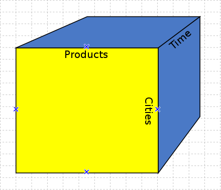
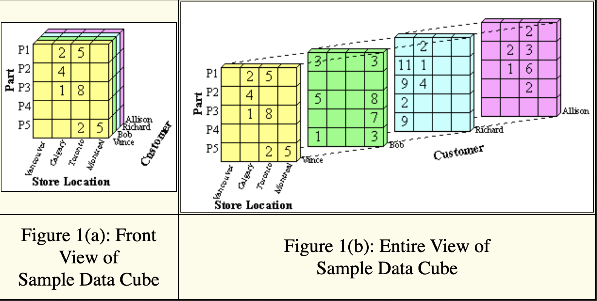
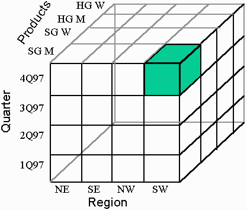

# OLAP Basics

	DEF-1: An OLAP cube is a multi-dimensional 
	       array of data.
	
	DEF-2: Online analytical processing (OLAP) 
	       is a computer-based technique of analyzing 
	       data to look for insights. 
	
	DEF-3: The term cube here refers to a multi-dimensional 
	       dataset, which is also sometimes called a hypercube 
	       if the number of dimensions is greater than three.

	1. Understanding and utilizing the SQL 
	   'CUBE' and 'ROLLUP' operators is vital 
	   for any software developer working with 
	   data aggregation in SQL. 

	2. OLAP USES A snapshot of a database taken 
	   at one point in time and then puts the data 
	   into a dimensional model. 

	3. The purpose of the OLAP/CUBE model is 
	   to run queries that deal with aggregations 
	   of data rather than individual transactions. 

	4. In traditional file systems, we used indexes, 
	   hashing, and other tricks for the same purpose. 
	   We still have those tools, but we have added 
	   new ones:  Star schemas, snowflake schemas, and 
	   multidimensional storage methods are all ways 
	   to get to the data faster.
	   

# Cubes

	One such structure is the cube (or hypercube). 
	Think of a two dimensional cross-tabulation or 
	a spreadsheet that models, say, a location, encoded as 
	
	     “North,” “South,” “East,” and “West”
	     
	and  a product (encoded with category names). 

	You have a grid that shows all possible combinations 
	of (locations and products), but many of the cells are 
	going to be empty — you do not sell fur coats in the 
	South or bikinis in the North.

	MULTI-DIMENSION:
		Now extend the idea to more and more dimensions, 
		such as “payment method,” “coupons or not,” and 
		so forth; the grid becomes a cube, then a hypercube, 
		and so forth. If you have trouble visualizing more 
		than three dimensions, then imagine a control panel 
		like you find on a stereo system. Each slider switch 
		controls one aspect of the sound, such as balance, 
		volume, bass, and treble. 

# Cubes in Pictures

	Table 1 shows an ordered set representation of the 
	data cube.  Each attribute value combination is paired 
	with its corresponding count. This representation can 
	be easily stored in a database table to facilitate 
	queries on the data cube.

~~~text
Table 1:

(part,location,customer)(count)

Combination           Count
{P1, Calgary, Vance}      2
{P2, Calgary, Vance}      4
{P3, Calgary, Vance}      1
{P1, Toronto, Vance}      5
{P3, Toronto, Vance}      8
{P5, Toronto, Vance}      2
{P5, Montreal, Vance}     5
{P1, Vancouver, Bob}      3
{P3, Vancouver, Bob}      5
{P5, Vancouver, Bob}      1
{P1, Montreal, Bob}       3
{P3, Montreal, Bob}       8
{P4, Montreal, Bob}       7
{P5, Montreal, Bob}       3
{P2, Vancouver, Richard} 11
{P3, Vancouver, Richard}  9
{P4, Vancouver, Richard}  2
{P5, Vancouver, Richard}  9
{P1, Calgary, Richard}    2
{P2, Calgary, Richard}    1
{P3, Calgary, Richard}    4
{P2, Calgary, Allison}    2
{P3, Calgary, Allison}    1
{P1, Toronto, Allison}    2
{P2, Toronto, Allison}    3
{P3, Toronto, Allison}    6
{P4, Toronto, Allison}    2
~~~

# Cube with Totals

# Materializing a Cube

	EMPTY CELLs:
	
		As you can see, actually materializing 
		a cube would be very expensive, and most 
		of the cells would be empty. 

		Fortunately, we have prior experience with 
		sparse arrays from scientific programming 
		and a lot of database access methods.

# OLAP Cube is Created from Star Schema

	FACT Table:
	
	The OLAP cube is created from a star schema of 
	tables, which we’ll discuss shortly. At the center 
	is the fact table, which lists the core facts that 
	make up the query. 
	
	Basically, a star schema has a fact table that 
	models the cells of a sparse array by linking them 
	to dimension tables.

# Goal of Cube 

	The real goal of the cube is to make aggregate 
	calculations fast and easy. I want to be able 
	to pick my dimensions and then pick the scales 
	used to measure them.

# Understanding Cubes

	SQL-99 Extension
	
	The CUBE supergroup is the other SQL-99 
	extension to the GROUP BY clause. 

	It produces a result set that contains all 
	the subtotal rows of a ROLLUP aggregation and, 
	in addition, contains cross-tabulation rows.

	Cross-tabulation rows are additional superaggregate 
	rows. They are, as the name implies, summaries across 
	columns if the data were represented as a spreadsheet. 

	Like ROLLUP, a CUBE group can also be thought of as a 
	series of grouping sets. In the case of a CUBE, all 
	permutations of the cubed grouping expression are 
	computed along with the grand 	total. 

Therefore, the n elements of a CUBE translate to 2**n
grouping sets.

~~~sql
     GROUP BY CUBE (a, b, c)
~~~

is equivalent to:

GROUP BY GROUPING SETS

~~~text
     (a, b, c) 
     (a, b) 
     (a, c) 
     (b, c) 
     (a) 
     (b) 
     (c) 
     ()
~~~

		Notice that the three (3) elements of the CUBE 
		translate to eight (8 = 2**3) grouping sets. 

		Unlike ROLLUP, the order of specification of 
		elements doesn’t matter for CUBE: CUBE (a, b) 
		is the same as CUBE (b, a). But the rows might 
		not be produced in the same order, depending 
		on your product.

# CUBE is an extension of the ROLLUP function

	CUBE is an extension of the ROLLUP function. 

	The CUBE function not only provides the column 
	summaries we saw in ROLLUP but also calculates 
	the row summaries and grand totals for the various
	dimensions. 

~~~sql
SELECT gender_code as gender,
       race_code as race,
       COUNT(*) AS total
   FROM Census
   WHERE EXTRACT (YEAR FROM trans_date) = 1999
   GROUP BY CUBE (gender_code, race_code);

gender  race     total
------ --------- -----
’M’    ’Asian’   14
’M’    ’White’   12
’M’    ’Black’   10

’F’    ’Asian’   16
’F’    ’White’   11
’F’    ’Black’   10

’M’     NULL     36  --  column totals
’F’     NULL     37

NULL   ’Asian’   30  --  row totals
NULL   ’White’   23
NULL   ’Black’   20

NULL    NULL     73  --  grand total
~~~

# SQL CUBE Operator

	The CUBE operator generates multiple 
	grouping sets inside a GROUP BY.

	Sub-Totals:
			CUBE generates subtotals across all 
			column combinations specified in GROUP BY.

# CUBE is similar to ROLLUP 

Example

	To see how CUBE works, we'll start with a 
	GROUP BY operation.  
	
	This example groups total sales by year.

~~~sql
SELECT YEAR(Order_Date) AS Year,
       SUM(TotalAmount) AS Annual_Sales
  FROM Orders
 GROUP BY YEAR(Order_Date)
 ORDER BY YEAR(Order_Date)
 
Result:  3 records

YEAR    ANNUAL_SALES
----    ------------
2012    226298.50
2013    658388.75
2014    469771.34
~~~

### Next: Adding CUBE

	Now, we add a CUBE operator, which generates 
	subtotals accross all columns in the GROUP BY 
	operation, which in this case is just one, i.e. Year.

~~~sql
SELECT YEAR(Order_Date) AS Year,
       SUM(TotalAmount) AS Annual_Sales
  FROM Orders
  GROUP BY CUBE(YEAR(Order_Date))
  
Result:  4 records

YEAR	ANNUAL_SALES
----    ------------
2012    226298.50
2013    658388.75
2014    469771.34
NULL   1354458.59
~~~

This adds a summary row representing total sales over all years.

# CUBE vs ROLLUP

	Consider the grouping columns: 
	   column1 and column2.
	   
	Here are the grouping sets created 
	by the two GROUP BY subclauses.

CUBE generates these grouping sets:

~~~text
(column1, column2)
(column1)
(column2)
()
~~~

ROLLUP generates these grouping sets:

~~~text
(column1, column2)
(column1)
()
~~~

# Understanding the 'CUBE' Operator

	The 'CUBE' operator in SQL is a type of 
	GROUP BY clause that generates a result set 
	that represents aggregates for all combinations 
	of values in the selected columns.

~~~sql
SELECT column1, column2, aggregate_function(column3)
FROM table
GROUP BY column1, column2 WITH CUBE;
~~~

	In the above example, the CUBE operator 
	will  generate  a  result set  for  the 
	following combinations:

~~~sql
column1, column2
column1
column2
All rows
~~~

# Understanding the 'ROLLUP' Operator

	The 'ROLLUP' operator in SQL is a type of 
	GROUP BY clause that produces a result set 
	similar to the one generated by CUBE but with 
	fewer subtotals. 
	
	ROLLUP generates a result set that is equivalent 
	to the sets of GROUP BY queries. It creates subtotals 
	that roll up from the most detailed level to a grand 
	total, following a grouping list specified in the 
	ROLLUP clause.

~~~sql
SELECT column1, column2, aggregate_function(column3)
FROM table
GROUP BY column1, column2 WITH ROLLUP;
~~~

	In the above example, the ROLLUP operator will generate 
	a result set for the following combinations:

~~~text
column1, column2
column1
All rows
~~~

# CUBE and ROLLUP

	The CUBE and ROLLUP operations let you 
	group by different subsets of a specified 
	set of columns in a SELECT clause.

	CUBE(column_list) groups by all subsets of 
	the columns specified in column_list. 
	
	For example, CUBE(a, b) groups by 
	
	    (a), (b), (a, b) and () 
	
	which represents the entire input set of rows). 
	
	ROLLUP(column_list) groups by all subsets, 
	including the entire set of input rows, (), 
	then the leftmost column, the two leftmost columns, 
	and so on. 
	
	For example, ROLLUP(a, b) groups by 
	
	    (), (a), and (a, b).

Syntax

	Refer to the definition of the SELECT clause 
	for where extended_grouping_expr can be used.

	extended_grouping_expr ::=
    	CUBE ( col_name | expr | position}, ...)
  	| ROLLUP ( col_name | expr | position}, ... )

Examples

	The following table contains some hypothetical 
	sales quantities for products sold by state.

Create Table:

~~~sql
	CREATE TABLE cube_sales(
		state VARCHAR(30), 
		product_id INT, 
		quantity INT
	);
~~~

Populate Table:

~~~sql
	INSERT cube_sales VALUES
  		("Oregon", 1, 10), 
  		("Washington", 1, 15), 
  		("California", 1, 40),
  		("Oregon", 2, 15), 
  		("Washington", 2, 25), 
  		("California", 2, 70);
~~~

	This query uses CUBE to group by all 
	subsets of columns in (state, product_id):
	
~~~sql
SELECT state, product_id, SUM(quantity) as total
FROM cube_sales
GROUP BY CUBE(state, product_id)
ORDER BY state, product_id;

-- The first row above represents the grand total. 
-- The second row represents the total for 
-- product 1 across all states. 
-- The fifth row represents the total for 
-- product 1 in California.
+------------+------------+---------------+
| state      | product_id |      total    |
+------------+------------+---------------+
| NULL       |       NULL |           175 |
| NULL       |          1 |            65 |
| NULL       |          2 |           110 |
| California |       NULL |           110 |
| California |          1 |            40 |
| California |          2 |            70 |
| Oregon     |       NULL |            25 |
| Oregon     |          1 |            10 |
| Oregon     |          2 |            15 |
| Washington |       NULL |            40 |
| Washington |          1 |            15 |
| Washington |          2 |            25 |
+------------+------------+---------------+
~~~

# ROLLUP Query

	This query is the same as the one above 
	but uses ROLLUP instead of CUBE:

~~~sql
SELECT state, product_id, SUM(quantity) as total
FROM cube_sales
GROUP BY ROLLUP(state, product_id)
ORDER BY state, product_id;

+------------+------------+---------------+
| state      | product_id |         total |
+------------+------------+---------------+
| NULL       |       NULL |           175 |
| California |       NULL |           110 |
| California |          1 |            40 |
| California |          2 |            70 |
| Oregon     |       NULL |            25 |
| Oregon     |          1 |            10 |
| Oregon     |          2 |            15 |
| Washington |       NULL |            40 |
| Washington |          1 |            15 |
| Washington |          2 |            25 |
+------------+------------+---------------+
~~~

	NOTE: Notice that the results are the same as 
	for CUBE except that there is no total for 
	product_id 1 and product_id 2 across all states.

GROUPING() Function

	The GROUPING(column_name) can be used in the output 
	column list of a SELECT block to show whether an 
	output row of a query with a GROUP BY clause has 
	aggregated together all the input rows for different 
	values of column_name. 
	
	The output of GROUPING(column_name) is 1 if the result 
	row has grouped together rows for column_name and 0 
	otherwise. 
	
For example:

~~~sql 
SELECT state, product_id, SUM(quantity) as total 
       GROUPING(state) as G_state, 
       GROUPING(product_id) as G_product_id
FROM cube_sales
GROUP BY CUBE(state, product_id)
ORDER BY state, product_id;

+------------+------------+-------+--------+-------------+
| state      | product_id | total | G_state| G_product_id|
+------------+------------+-------+--------+-------------+
| NULL       |       NULL |   175 |      1 |           1 |
| NULL       |          1 |    65 |      1 |           0 |
| NULL       |          2 |   110 |      1 |           0 |
| California |       NULL |   110 |      0 |           1 |
| California |          1 |    40 |      0 |           0 |
| California |          2 |    70 |      0 |           0 |
| Oregon     |       NULL |    25 |      0 |           1 |
| Oregon     |          1 |    10 |      0 |           0 |
| Oregon     |          2 |    15 |      0 |           0 |
| Washington |       NULL |    40 |      0 |           1 |
| Washington |          1 |    15 |      0 |           0 |
| Washington |          2 |    25 |      0 |           0 |
+------------+------------+-------+--------+-------------+
~~~

	1. The first row of output has GROUPING(state) = 1 
	   and GROUPING(product_id) = 1 because the row 
	   represents the grand total, meaning that rows for 
	   all state and product_id values have been combined 
	   together to form this row. 
	   
	2. The second row has 
	        GROUPING(state) = 1 but GROUPING(product_id) = 0 
	   because it represents a summary across all state values for 
	   a specific product_id.

# References:

1. [ROLLUP and CUBE](https://docs.data.world/documentation/sql/concepts/advanced/ROLLUP_and_CUBE.html)

2. [Examples of grouping sets, cube, and rollup queries](https://www.ibm.com/docs/en/ias?topic=clause-examples-grouping-sets-cube-rollup)

3. [Understanding OLAP Cubes - A guide for the perplexed](https://www.keboola.com/blog/olap-cubes#:~:text=OLAP%20cubes%20aggregate%20a%20metric,)%2C%20product%20categories%2C%20etc.)

4. [Data Cubes](https://www2.cs.uregina.ca/~dbd/cs831/notes/dcubes/dcubes.html)

5. [SQL Server ROLLUP, with examples](https://www.javatpoint.com/sql-server-rollup)