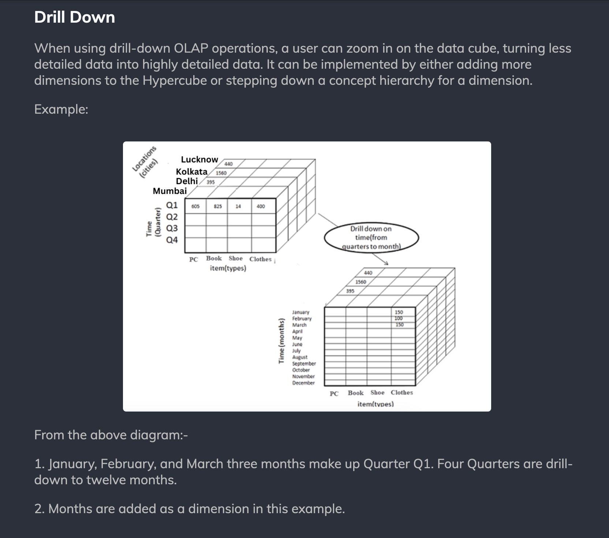
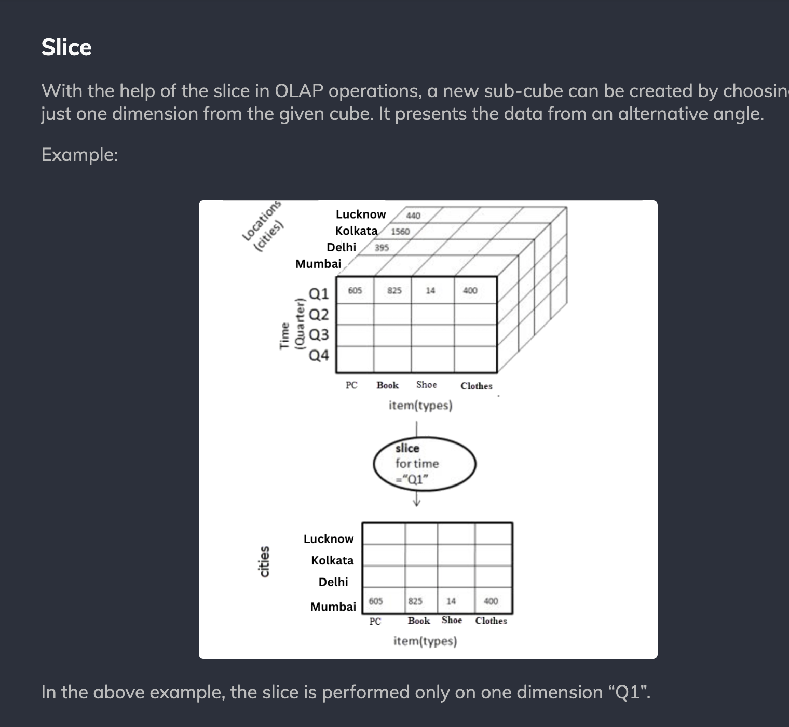

# 1. OLAP Operations Summary

	
	DEF: a cube has 3 dimentions.
	
	DEF: hypercube has at least 3 dimensions.
	
	OLAP operations extract insights from the 
	data stored in multidimensional hypercubes. 
	These actions consist of the following:

* Roll Up
* Drill Down
* Dice
* Slice
* Pivot

----------

# 2. OLAP Operations Definitions

The following table summarizing the key OLAP 
(Online Analytical Processing) operations:

| **OLAP Operation** | **Definition**                                                                                                           | **Example**                                                                                         |
|---------------------|-----------------------------------------------------------------------------------------------------------------------|-----------------------------------------------------------------------------------------------------|
| **Roll-Up**         | Aggregates data by moving up a hierarchy or by reducing dimensionality.                                                | Total sales by city rolled up to state level.                                                      |
| **Roll-Down**       | Drills down to more detailed levels of data by moving down a hierarchy or increasing dimensionality.                   | Breaking down state-level sales into city-level sales.                                              |
| **Slice**           | Selects a subset of data for a **single dimension**, effectively filtering by that dimension.                              | Sales for a specific year, like 2025.                                                              |
| **Dice**            | Filters data by selecting subsets based on **multiple dimensions** or criteria.                                            | Sales data for California and New York, filtered by Electronics category and customers aged 20–30. |
| **Pivot**           | Reorients data for multidimensional analysis, swapping rows and columns or aggregating data differently.               | Total sales by gender (rows) and item category (columns).                                           |

Let me know if you'd like examples or further clarification for any of these operations!

# Roll Up

----------

# Drill Down

----------

# Dice

----------

# Slice

----------

# Pivot

----------