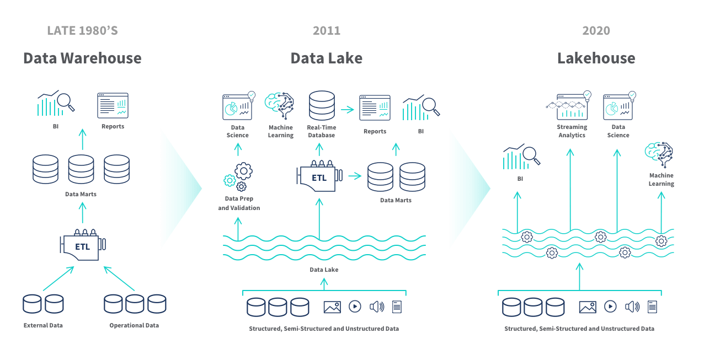

# Slide 1 --- Title

## From Traditional Data Warehouse to Lakehouse

### A Practical Tutorial Using DuckDB


------------------------------------------------------------------------

# Slide 2 --- Learning Objectives

-   Revisit traditional Data Warehouse architecture
-   Understand Lakehouse principles
-   Learn how DuckDB enables modern analytics
-   Compare ETL vs ELT
-   Design a 3‑Tier Lake → Silver → Gold architecture

------------------------------------------------------------------------

# Slide 3 --- Traditional Data Warehouse (Review)

-   Star Schema
-   Fact tables
-   Dimension tables
-   ETL pipelines
-   Physical modeling first

------------------------------------------------------------------------

# Slide 4 --- Star Schema Architecture

### Fact Table: 
- Measures (revenue, trips, distance) 
- Foreign keys to dimensions

### Dimensions: 
- Date 
- Zone 
- Vendor 
- Payment type

------------------------------------------------------------------------

# Slide 5 --- Traditional DW Pipeline

1.  Extract from source
2.  Transform
3.  Load into staging
4.  Build dimensions
5.  Load fact tables
6.  Build aggregates

------------------------------------------------------------------------

# Slide 6 --- Pain Points of Traditional DW

-   Heavy ETL development
-   Storage duplication
-   Slow schema evolution
-   Long data refresh cycles

------------------------------------------------------------------------

# Slide 7 --- What is a Data Lake?

-   Raw data storage
-   Schema-on-read
-   Flexible formats (CSV, Parquet, JSON)
-   Minimal transformation

------------------------------------------------------------------------

# Slide 8 --- What is a Lakehouse?

-   Combines Data Lake + Warehouse
-   Structured analytics on raw data
-   ACID support
-   SQL-first analytics

------------------------------------------------------------------------

# Slide 9 --- Why DuckDB?

-   Embedded analytics engine
-   Columnar execution
-   Vectorized processing
-   Reads CSV/Parquet directly

------------------------------------------------------------------------

# Slide 10 --- Traditional vs Lakehouse Mindset

### Traditional: 
- Model first 
- Load into tables
- Then analyze

### Lakehouse: 
- Query raw files 
- Transform dynamically 
- Materialize only when needed

------------------------------------------------------------------------

# Slide 11 --- Reading Raw CSV in DuckDB

```sql
CREATE VIEW fact_trip_raw AS 
SELECT * FROM
read_csv_auto(
   'data/taxi_trips/*.csv', 
   union_by_name = true,
   null_padding = true
);
```

------------------------------------------------------------------------

# Slide 12 --- Schema-on-Read Concept

-   Data is not transformed at ingestion
-   Structure applied during query
-   Flexible & fast experimentation

------------------------------------------------------------------------

# Slide 13 --- Creating Dimensional Views

```sql
CREATE VIEW dim_zone AS 
SELECT * FROM
   read_csv_auto('data/taxi_zones.csv');
```

------------------------------------------------------------------------

# Slide 14 --- Enrichment Layer (Silver)

```sql
CREATE VIEW fact_trip_enriched AS 
SELECT *, 
DATE_DIFF('second',
lpep_pickup_datetime, lpep_dropoff_datetime) 
  AS trip_duration_seconds
FROM fact_trip_raw;
```
------------------------------------------------------------------------

# Slide 15 --- Data Validation in Lakehouse

```sql
CASE WHEN trip_duration_seconds <= 0 
     THEN 0 
     ELSE 1 
END 
  AS is_valid_trip
```

------------------------------------------------------------------------

# Slide 16 --- Clean Layer (Gold)

```sql
CREATE VIEW fact_trip_clean 
AS SELECT * FROM fact_trip_enriched 
WHERE is_valid_trip = 1;
```
------------------------------------------------------------------------

# Slide 17 --- Lake → Silver → Gold Architecture

### Lake: - Raw files

### Silver: - Enriched views

### Gold: - Aggregated analytics views

------------------------------------------------------------------------

# Slide 18 --- Comparing ETL vs ELT

### ETL: - Transform before loading

### ELT: - Load raw, transform during query

> DuckDB favors ELT.

------------------------------------------------------------------------

# Slide 19 --- Aggregation Example

```sql
SELECT YEAR(lpep_pickup_datetime) AS year, 
       SUM(total_amount) AS revenue
FROM fact_trip_clean 
GROUP BY year;
```

------------------------------------------------------------------------

# Slide 20 --- Advanced OLAP with CUBE

```sql
SELECT YEAR(lpep_pickup_datetime) AS year, 
       pu_borough, 
       SUM(total_amount)
FROM fact_trip_clean_with_zones 
GROUP BY CUBE(year, pu_borough);
```

------------------------------------------------------------------------

# Slide 21 --- Why CUBE Matters

-   Automatic subtotal generation
-   Multi-dimensional analytics
-   No manual UNIONs required

------------------------------------------------------------------------

# Slide 22 --- Performance Model

DuckDB: 

- Vectorized execution 
- In-memory processing 
- Column pruning

------------------------------------------------------------------------

# Slide 23 --- When to Materialize?

-   Repeated heavy joins
-   Expensive transformations
-   Stable datasets
-   Dashboard workloads

------------------------------------------------------------------------

# Slide 24 --- When NOT to Materialize?

-   Exploratory analysis
-   Small datasets
-   Rapid schema iteration

------------------------------------------------------------------------

# Slide 25 --- Governance Considerations

-   Data quality checks
-   View definitions as documentation
-   Reproducibility through SQL scripts

------------------------------------------------------------------------

# Slide 26 --- Teaching Shift

Old Model: - Teach table creation

New Model: - Teach reasoning & modeling - Teach cost-awareness

------------------------------------------------------------------------

# Slide 27 --- Problem-Solving Focus

Students should ask: 

- What is the business question? 
- What grain is needed? 
- Do I need materialization?

------------------------------------------------------------------------

# Slide 28 --- Example Business Question

"How did revenue collapse during 2020?"

Requires: 

- Year/Month aggregation 
- YoY comparison 
- Shock analysis

------------------------------------------------------------------------

# Slide 29 --- Lakehouse Strength

-   Flexible
-   Lightweight
-   No heavy DBA dependency
-   Rapid experimentation

------------------------------------------------------------------------

# Slide 30 --- Traditional DW Strength

-   Strong governance
-   Mature BI ecosystem
-   Stable enterprise workloads

------------------------------------------------------------------------

# Slide 31 --- Modern Hybrid Approach

### Enterprise: - Core warehouse

### Data Science: - DuckDB Lakehouse

------------------------------------------------------------------------

# Slide 32 --- Architecture Diagram (Conceptual)

##### Sources 
##### → Data Lake 
#### → DuckDB Views 
#### → Aggregations 
#### → BI / ML

------------------------------------------------------------------------

# Slide 33 --- Summary Table


| Feature       | Traditional DW   | DuckDB Lakehouse |
|---------------|------------------|------------------|
| Storage       | Physical tables  | Raw files        |
| ETL           | Heavy            | Minimal          |
| Aggregation   | Pre-built        | On demand        |
| Flexibility   | Moderate         | High             |

------------------------------------------------------------------------

# Slide 34 --- Key Takeaways

-   Lakehouse reduces friction
-   DuckDB enables local analytics power
-   Think in layers, not tables

------------------------------------------------------------------------

# Slide 35 --- Final Reflection

### Future Data Engineers must: 
- Understand modeling deeply 
- Choose materialization strategically 
- Think in systems, not just SQL
- Think in problem solving, not just SQL

