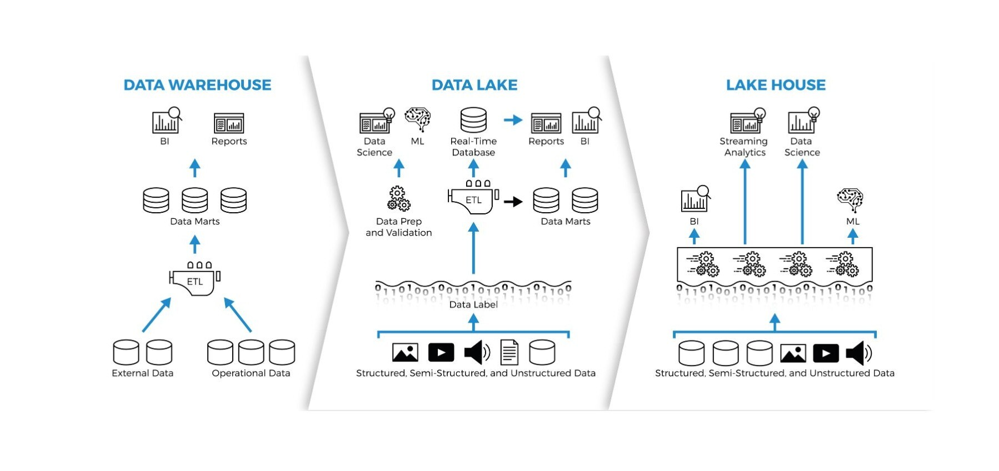

# 1. [Data lake](https://en.wikipedia.org/wiki/Data_lake#Data_lakehouses)

# 2. what is a lakehouse

	A lakehouse refers to a modern data 
	management architecture. 
	
	A data lakehouse is a modern, unified 
	data management architecture combining 
	the low-cost, flexible storage of a 
	data lake with the data management, 
	ACID transactions, and reliability of a 
	data warehouse. It enables querying 
	large-scale, diverse data (structured, 
	unstructured) for BI and AI/ML on a single 
	platform, eliminating siloed, costly 
	data movement.
	

# 2. The Data Lakehouse (Technology)

	In computing, a data lakehouse is a hybrid
	architecture that combines the strengths of 
	two traditional systems: 

	1. Data Lake: 
	   Provides low-cost, massive storage for all 
	   types of data (structured, semi-structured, 
	   and unstructured like images or video).

	2. Data Warehouse: 
	   Provides high-performance querying, data
	   governance, and ACID transactions (ensuring 
	   data reliability and consistency). 

# 3. Key Benefits:

	Single Source of Truth: 
	     Eliminates the need to move and duplicate 
	     data between separate "lake" and "warehouse"
	     silos.

# 4. AI and Machine Learning: 

	Allows data scientists to run advanced analytics
	directly on the raw data while business analysts 
	use SQL for reporting.

# 5. Cost Efficiency: 

	Uses inexpensive cloud object storage 
	(like Amazon S3 or Azure Blob Storage) 
	instead of expensive proprietary warehouse 
	formats.

# 6. Open Formats: 

	Typically built using open table formats 
	such as Delta Lake, Apache Iceberg, or 
	Apache Hudi. 

