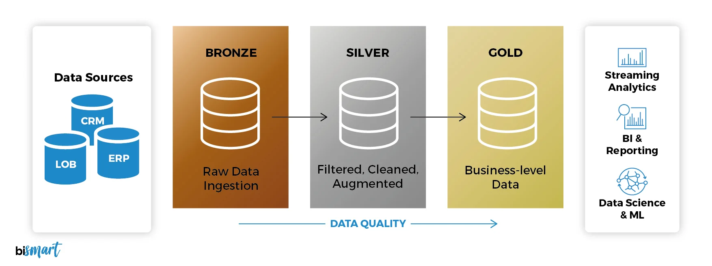

# What is a Medallion Data Architecture?
Medallion data architecture is a data design pattern, often called a "multi-hop" architecture, used in data lakehouses to organize data into three logical layers:

* Bronze (raw), 
* Silver (cleansed/validated), and 
* Gold (enriched)

progressively improving its structure and quality for analytics. It ensures data reliability, auditability, and efficiency. 

----------

## Medallion Architecture

----------

## Medallion Architecture Example

----------

## Key Layers and Usage Examples:

### Bronze (Raw Data): 
Stores raw, ingested data from sources (APIs, CRM) in its native format for historical auditing, acting as the system of record.

### Silver (Validated/Cleaned Data): 
Consists of cleansed, filtered, and standardized data. Used for data science, ad-hoc analysis, and cross-departmental reporting.

### Gold (Enriched Data): 
Features highly aggregated, business-level tables (e.g., star schemas) ready for BI reporting, dashboards (e.g., Power BI), and AI applications. 

# Synonyms and Related Concepts:

* **Multi-hop Architecture**: Refers to the flow of data through multiple stages.
* **Lakehouse Architecture**: The underlying storage approach (Databricks, Microsoft Fabric).
* **Three-tiered Data Structure**: Refers to the Bronze-Silver-Gold hierarchy.
* **Data Lake Refinement/Curating**: The process of improving data quality, often in a Reddit user discussion considered a flexible framework. 

Medallion architecture provides a simple, maintainable data model that allows users to re-create downstream tables from raw, immutable sources if needed. 

## Medallion Architecture with DuckDB

The Medallion Architecture can be implemented using 
DuckDB as the analytical engine to build a local, 
high-performance, and cost-effective data lakehouse. 

DuckDB fits naturally into this architecture, particularly 
for the transformation steps (the 'L' and 'T' in ELT/ETL) 
where its efficient SQL processing is highly valuable. 

## Medallion Architecture Layers with DuckDB
The architecture organizes data into three distinct 
layers, with DuckDB processing data as it moves 
through them: 

### Bronze (Raw Data): 
This is the landing zone for raw, unprocessed data 
exactly as it arrives from source systems (e.g., CSV 
files, API responses, database dumps). The data is 
usually stored in open formats like Parquet or Delta 
Lake on object storage, with minimal to no transformations 
applied. DuckDB can read these files natively, providing 
a flexible foundation.

### Silver (Cleaned & Conformed Data): 
In this layer, the raw data is cleansed, validated, 
and standardized. This involves tasks such as 

* removing duplicates, 
* handling missing values, 
* enforcing schemas, and 
* applying basic business logic 

DuckDB's powerful, in-process analytical engine is 
well-suited for these transformation tasks, often 
orchestrated using tools like dbt (data build tool).

### Gold (Curated & Aggregated Data): 
This final layer contains aggregated, business-ready 
data optimized for specific use cases like analytics, 
reporting, and machine learning. The data is often 
denormalized into a star schema and tailored for 
performance and consumption by end-users and BI tools. 

## Key Benefits of Using DuckDB for Medallion Architecture

* **Local Development**: DuckDB's embedded nature allows 
data engineers to develop and test a production-grade data 
stack entirely on a local machine, significantly shortening 
development cycles and simplifying testing.

* **Cost-Effectiveness**: By processing data locally or on a 
single powerful node, DuckDB helps avoid the high costs 
associated with distributed cloud computing for many workloads 
(the "forgotten middle" of 10GB-100TB datasets).

* **Performance**: DuckDB is a columnar-oriented, vectorized, 
and parallel analytical database designed for fast OLAP 
(Online Analytical Processing) queries, making it efficient 
for the heavy lifting involved in data transformations.

* **Simplicity and Integration**: As an in-process database, 
DuckDB requires zero server setup or maintenance, and integrates
seamlessly with popular tools like Python, R, and dbt, bridging 
the gap between data science notebooks and production pipelines.

* **Data Lineage and Governance**: The layered approach provides 
clear data lineage and quality gates at each stage, improving data governance and ensuring data reliability. 

------

## Medallion Architecure Summarized

What is Medallion Architecture and from 
whence does it come? The Medallion Architecture 
is a data design pattern popularized by Databricks. 
It organizes data into multiple layers (or “medallions”) 
to improve data quality, performance, and usability 
as it moves through the platform.

The layers are:

### Bronze (Raw Layer)

* Stores raw, unprocessed data.
* Ingested directly from source systems (databases, logs, IoT streams, APIs, etc.).
* Often includes duplicates, schema drift, and poor quality.

**Purpose:** Immutable record of truth – never delete, only append.

### Silver (Cleansed Layer)

* Data is cleaned, filtered, de-duplicated, and enriched.
* Joins from multiple bronze sources may occur.
* Business logic starts here (e.g., data quality rules, standard formats).

**Purpose:** Curated, analytics-ready views/tables.

### Gold (Business Layer)

* Data is aggregated and optimized for analytics, BI dashboards, and ML.
* Domain-specific data marts (e.g., sales KPIs, fraud detection aggregates).

**Purpose:**  High-performance, business-consumable datasets.

## Summary
In summary, combining the logical 
organization of the Medallion Architecture 
with the high-performance, embedded nature 
of DuckDB offers a robust, efficient, and 
scalable solution for modern data engineering 
challenges. 
