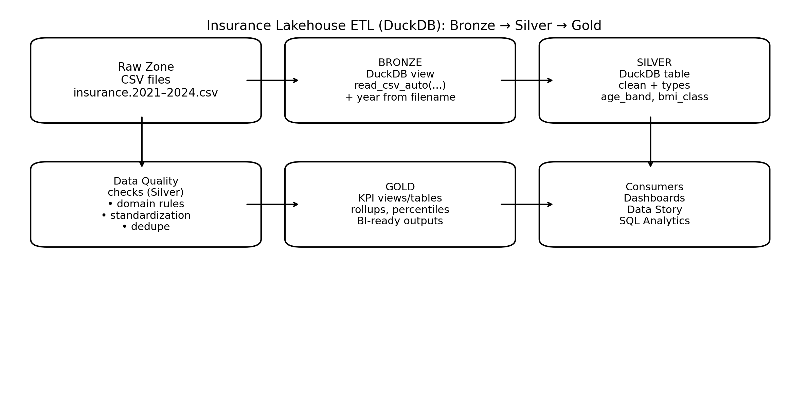

# Insurance Lakehouse SQL Exercises (Student)
### DuckDB • Bronze → Silver → Gold



---

## Setup (assumed)

Folder layout:

```
data/bronze/
  insurance.2021.csv
  insurance.2022.csv
  insurance.2023.csv
  insurance.2024.csv
```

You have a DuckDB connection `con` in Python.

---

## Lakehouse layers (reminder)

- **Bronze**: raw landing, minimal transformations, add `year` from filename.
- **Silver**: clean + standardize + derive columns (trusted analytics table).
- **Gold**: curated KPIs and rollups (BI-ready).

---

## Exercise 1 — Bronze view with injected year

Create a **Bronze** view `bronze_insurance` that:
- reads all CSVs with `read_csv_auto`
- adds `year` extracted from the filename `insurance.<year>.csv`

Then return row counts per year.

---

## Exercise 2 — Metadata discovery

Using the Bronze view, write SQL to show:
- column names and DuckDB inferred types
- a small sample of 5 rows

(Hint: `DESCRIBE` and `LIMIT`.)

---

## Exercise 3 — Silver table (typed + standardized)

Create a **Silver** table `silver_insurance` with:
- numeric types enforced (`age`, `bmi`, `children`, `charges`, `year`)
- `gender`, `smoker`, `region` standardized (lower/trim)
- add derived columns:
  - `bmi_class`: underweight/normal/overweight/obese
  - `age_band`: 18-29, 30-39, 40-49, 50-59, 60+

---

## Exercise 4 — Silver validation checks

Write SQL checks that return:
- total rows per year
- distinct values for: `gender`, `smoker`, `region`, `bmi_class`, `age_band`
- min/max for `age`, `bmi`, `charges`

---

## Exercise 5 — Gold KPI view

Create a **Gold** view `gold_kpi_year` with one row per year:
- members (count)
- avg charges
- median charges
- p90 charges
- total charges
- avg smoker charges
- avg non-smoker charges

---

## Exercise 6 — Insight query (trend)

Write a query:
- `year` vs `avg_charges`
- sorted by year

Then (in Python) plot a line chart.

---

## Exercise 7 — Smoker gap by year

Write a query that returns per year:
- avg charges for smokers
- avg charges for non-smokers
- the gap (smoker - non-smoker)

---

## Exercise 8 — Region ranking by year

For each year, rank regions by avg charges (highest to lowest).
Return:
- year, region, avg_charges, rank

(Hint: window functions like `ROW_NUMBER()`.)

---

## Exercise 9 — BMI class composition

For each year, compute:
- count and percent of members in each `bmi_class`

Return: year, bmi_class, cnt, pct

---

## Exercise 10 — Outlier proxy (p95)

For each year:
- compute the 95th percentile charge (p95)
- count how many members are above p95

Return: year, p95, above_p95_count

---

## Exercise 11 — Segment table (Gold-style)

Create a Gold view/table that summarizes the latest year by:
- age_band × bmi_class
- members
- avg_charges

---

## Exercise 12 — “Business story” questions

Answer in 3–5 bullet points each (based on your query results):

1) What is the biggest cost driver?  
2) Are regions materially different?  
3) Is the cost distribution becoming heavier-tailed over time?  
4) Which segment (age_band × bmi_class) is most expensive?

---

## Submission checklist

- SQL for Exercises 1–11
- Plots for Exercises 6 and 7 (at least)
- Short written answers for Exercise 12

---
