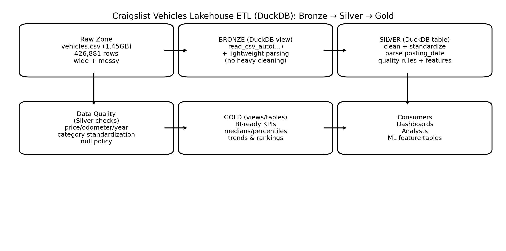

# Vehicles Lakehouse SQL Exercises (Instructor)
### DuckDB • Bronze → Silver → Gold — Solutions



---

## Q1 — Solution

```sql
DESCRIBE bronze_vehicles;

SELECT
  SUM(CASE WHEN price IS NULL OR CAST(price AS VARCHAR)='' THEN 1 ELSE 0 END) AS missing_price,
  SUM(CASE WHEN year IS NULL OR CAST(year AS VARCHAR)='' THEN 1 ELSE 0 END) AS missing_year,
  SUM(CASE WHEN odometer IS NULL OR CAST(odometer AS VARCHAR)='' THEN 1 ELSE 0 END) AS missing_odometer,
  SUM(CASE WHEN manufacturer IS NULL OR CAST(manufacturer AS VARCHAR)='' THEN 1 ELSE 0 END) AS missing_manufacturer,
  SUM(CASE WHEN model IS NULL OR CAST(model AS VARCHAR)='' THEN 1 ELSE 0 END) AS missing_model,
  SUM(CASE WHEN posting_date IS NULL OR CAST(posting_date AS VARCHAR)='' THEN 1 ELSE 0 END) AS missing_posting_date
FROM bronze_vehicles;
```

---

## Q2 — Solution

```sql
SELECT month, median_price, p90_price
FROM gold_kpi_month
ORDER BY month;
```

---

## Q3 — Solution

```sql
WITH t AS (SELECT COUNT(*) AS total FROM silver_vehicles),
m AS (
  SELECT manufacturer, COUNT(*) AS listings
  FROM silver_vehicles
  WHERE manufacturer IS NOT NULL AND manufacturer != ''
  GROUP BY 1
)
SELECT
  manufacturer,
  listings,
  ROUND(100.0 * listings / (SELECT total FROM t), 2) AS pct_of_total
FROM m
ORDER BY listings DESC
LIMIT 15;
```

---

## Q4 — Solution

```sql
SELECT
  vehicle_age,
  MEDIAN(price) AS median_price,
  COUNT(*) AS listings
FROM silver_vehicles
WHERE vehicle_age BETWEEN 0 AND 30
GROUP BY 1
HAVING COUNT(*) >= 500
ORDER BY 1;
```

---

## Q5 — Solution

```sql
SELECT
  state,
  COUNT(*) AS listings,
  MEDIAN(price) AS median_price
FROM silver_vehicles
WHERE state IS NOT NULL AND state != ''
GROUP BY 1
HAVING COUNT(*) >= 3000
ORDER BY median_price DESC
LIMIT 10;
```

---

## Q6 — Solution

```sql
WITH d AS (
  SELECT
    date_trunc('month', posting_date) AS month,
    state, manufacturer, model, price,
    ROW_NUMBER() OVER (
      PARTITION BY date_trunc('month', posting_date)
      ORDER BY price DESC
    ) AS rank_in_month
  FROM silver_vehicles
  WHERE posting_date IS NOT NULL AND price IS NOT NULL
)
SELECT *
FROM d
WHERE rank_in_month <= 3
ORDER BY month, rank_in_month;
```

---
