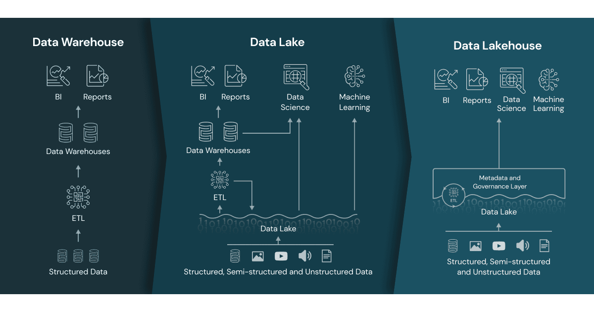

# From Traditional Data Warehouse to <br> Lakehouse with DuckDB
## A Step-by-Step Tutorial Module


Last updated date: 2026-02-28

---


# Slide 1 — Where We Are

You already know how to build a **Traditional Data Warehouse**:

- Star Schema
- Fact tables
- Dimension tables
- ETL pipelines
- Surrogate keys
- Referential integrity

**Now we transition to:**

> **Lakehouse architecture using DuckDB**

**Goal:**

> **Understand how lakehouse differs from traditional DW — conceptually and practically.**

---

# Slide 2 — Traditional Data Warehouse Architecture

**Classic Flow:**

OLTP → Staging → ETL → Star Schema → OLAP Queries

**Characteristics:**

- Structured data only
- Heavy ETL
- Physical fact/dimension tables
- Schema-on-write
- Centralized modeling before analysis

**Example: NYC Green Taxi Rides**

**Fact Table:**

- `fact_green_trip`

**Dimension Tables:**

- `dim_date`
- `dim_zone`
- `dim_vendor`
- `dim_payment_type`


---

# Slide 3 — Key Principles of Traditional DW

1. Schema-on-write
2. Data cleaned before loading
3. Surrogate keys
4. Referential integrity
5. Pre-aggregation (summary tables)
6. Rigid modeling before querying

### Strengths:
- High governance
- Strong consistency
- Clear dimensional modeling

### Limitations:
- Heavy ETL
- Slow iteration
- Storage duplication
- Less flexible exploration

---
⸻

# Slide 3.1 📦 What Is a Data Lake?

**Definition**

	1. A Data Lake is a centralized storage 
	   repository that holds raw data in its 
	   native format — structured, semi-structured, 
	   and unstructured — at any scale.

	2. It stores data as-is, without requiring 
	   predefined schema.

⸻

### 🏗 Core Characteristics

	•	🗂 Schema-on-Read (structure applied during query)
	•	📁 Stores raw files (CSV, JSON, Parquet, images, 
	     logs, etc.)
	•	📈 Designed for massive scale (cloud object storage)
	•	💰 Low storage cost
	•	🔄 Minimal upfront transformation

⸻

### 📊 Typical Architecture

```
Sources 
→ Cloud/Object Storage 
→ Processing Engine (Spark / DuckDB / etc.)
```

### Storage examples:

	•	S3
	•	Azure Data Lake Storage
	•	Google Cloud Storage
	•	Local file system (for teaching)

⸻

### 📌 Example (Flight Data Context)

Instead of creating tables:

```sql
CREATE TABLE flights (...);
```

We store raw files:

```
data/
  ├── flight_parquet/*.parquet
  ├── airport_lookup.csv
  └── carrier_lookup.csv
```

### Query directly:

```sql
SELECT *
FROM read_parquet('data/flight_parquet/*.parquet')
LIMIT 10;
```

⸻

### ✅ Advantages
	•	Flexible
	•	Cheap storage
	•	Supports AI / ML workloads
	•	No heavy ETL required

⸻

### ⚠ Challenges
	•	Can become a Data Swamp without governance
	•	No enforced schema
	•	Data quality issues
	•	Performance tuning required

⸻

### 🎯 Why It Matters

Data Lakes allow organizations to:

	•	Store everything first
	•	Decide how to use it later
	•	Support analytics + ML + streaming
	•	Enable modern Lakehouse architectures

⸻


# Slide 4 — What Is a Lakehouse?

### A Lakehouse combines:

#### Data Lake + Data Warehouse

Characteristics:

- Query raw files directly
- Schema-on-read
- Flexible transformations
- Minimal duplication
- SQL-first analytics

In DuckDB:

We read CSV files directly using:

```sql
SELECT * 
FROM read_csv_auto('data/*.csv');
```



---

# Slide 5 — Core Difference

| Traditional DW | Lakehouse |
|---------------|------------|
| Load into tables | Query files directly |
| Predefined schema | Schema inferred |
| Surrogate keys | Natural keys |
| ETL required | Transformation on demand |
| Heavy modeling | Agile modeling |


## Data Architecture Comparison: DW vs Data Lake vs Lakehouse

| Feature | Traditional Data Warehouse (DW) | Data Lake | Data Lakehouse |
|----------|--------------------------------|-----------|----------------|
| Primary Storage | Structured relational tables | Raw files (CSV, JSON, Parquet) | Raw files + structured query engine |
| Schema Strategy | Schema-on-write | Schema-on-read | Hybrid (managed schema-on-read) |
| Data Modeling | Star / Snowflake schemas | Minimal or none | Logical star schemas via views |
| Keys | Surrogate keys common | Natural keys | Supports surrogate + natural keys |
| ETL Approach | Heavy ETL before loading | Minimal ETL | ELT / transformation on demand |
| Data Types Supported | Structured only | Structured, semi, unstructured | Structured + semi + unstructured |
| Performance Optimization | Indexes, partitions | File pruning | Columnar formats + vectorized execution |
| Aggregations | Often pre-aggregated | Computed at runtime | Runtime + materialized views |
| Governance | Strong governance & constraints | Weak by default | Governance with flexibility |
| ACID Transactions | Yes | No (basic file system) | Yes (Delta/Iceberg/etc.) |
| Use Case Focus | BI & reporting | Data science & raw storage | Unified BI + ML + analytics |
| Flexibility | Moderate | Very high | High with structure |
| Cost Model | Higher storage/licensing | Low-cost storage | Low storage + efficient compute |
| Change Management | Rigid | Very flexible | Controlled agility |
| Example Tools | Oracle, SQL Server, Snowflake | S3, HDFS | DuckDB, Databricks, Delta Lake |
---

# Slide 6 — Star Schema vs Logical Views

### Traditional:

```sql
CREATE TABLE fact_trip (...);
```

### Lakehouse:

```sql
CREATE VIEW fact_trip_raw AS
SELECT * 
FROM read_csv_auto('data/taxi_trips/*.csv');
```

**No physical table required.**

---

# Slide 7 — Schema-on-Write vs Schema-on-Read

### Traditional DW:
- Enforce schema before load

### Lakehouse:
- Apply schema during query

### Example:

```sql
CREATE VIEW fact_trip_clean AS
SELECT *
FROM fact_trip_raw
WHERE trip_distance > 0;
```
---

# Slide 8 — Derived Measures in Lakehouse

Instead of storing:

```
trip_duration_seconds
avg_speed_mph
```

We compute dynamically:

```sql
SELECT
    DATE_DIFF('second', 
              lpep_pickup_datetime, 
              lpep_dropoff_datetime) 
    AS trip_duration_seconds,
    trip_distance / 
    (DATE_DIFF('second', 
               lpep_pickup_datetime, 
               lpep_dropoff_datetime)/3600.0) 
    AS avg_speed_mph
FROM fact_trip_raw;
```
---

# Slide 9 — Dimension Handling

### Traditional DW:
Separate `dim_zone` table with surrogate key.

### Lakehouse:
Join directly on natural key:

```sql
-- Borough = a town or district that 
--           is an administrative unit.
SELECT f.*, 
       z.Borough
FROM fact_trip_raw f
LEFT JOIN dim_zone z
ON z.LocationID = f.PULocationID;
```

---

# Slide 10 — CUBE Support in DuckDB

### DuckDB supports:

```sql
GROUP BY CUBE (year, borough)
```

Example:

```sql
SELECT
    pickup_year,
    pu_borough,
    SUM(total_amount)
FROM fact_trip_clean_with_zones
GROUP BY CUBE (pickup_year, pu_borough);
```

Produces subtotal combinations automatically.

Traditional MySQL requires manual UNION ALL or ROLLUP.

---

# Slide 11 — Lakehouse 3-Tier Model

```
Lake → Raw CSV files 
 
Silver → Cleaned/Enriched Views 
 
Gold → Aggregated Analytics Views  
```

Example:

```
Lake:
      fact_trip_raw

Silver:
      fact_trip_clean

Gold:
      monthly_revenue_summary
```

---

# Slide 12 — Silver Layer Example

```sql
CREATE VIEW fact_trip_enriched AS
SELECT
    *,
    DATE_DIFF('second', 
              lpep_pickup_datetime, 
              lpep_dropoff_datetime) 
    AS trip_duration_seconds
FROM fact_trip_raw
WHERE trip_distance > 0;
```
---

# Slide 13 — Gold Layer Example

```sql
CREATE VIEW monthly_summary AS
SELECT
    pickup_year,
    pickup_month,
    SUM(total_amount) AS revenue,
    COUNT(*) AS trips
FROM fact_trip_clean
GROUP BY pickup_year, pickup_month;
```
---

# Slide 14 — When to Materialize?

**Materialize when:**

- Repeated heavy queries
- Complex joins
- Stable curated dataset
- Performance bottleneck

Example:

```sql
CREATE TABLE gold_monthly_summary AS
SELECT ...
FROM fact_trip_clean;
```
---

# Slide 15 — Performance Comparison Insight

### Traditional DW:
Fast queries on indexed tables.

### Lakehouse:
Fast due to columnar execution and vectorized engine.

### DuckDB advantage:
- No server
- Embedded analytics
- Columnar storage
- Efficient CUBE support

---

# Slide 16 — Governance Tradeoffs

### Traditional DW:
Strong governance, rigid model.

### Lakehouse:
Flexible, but requires discipline in:

- Version control
- View management
- Documentation

---

# Slide 17 — Analytical Thinking Shift

### Traditional:
"How do we design tables?"

### Lakehouse:
"What question are we answering?"

### * Focus shifts from modeling-first to insight-first.

---

# Slide 18 — Summary

### Traditional DW:
- Structured
- Predefined
- Heavy ETL
- Fact/Dimension

### Lakehouse with DuckDB:
- Flexible
- Query-first
- Schema-on-read
- Views over files
- CUBE support
- Modern analytics workflow

---

# Slide 19 — Final Takeaway

Lakehouse does not replace DW.

It enhances agility.

Best Practice:

Teach both.

**Students should understand:**

- When to build star schema
- When to leverage lakehouse
- When to materialize
- When to compute dynamically

---

# End of Module
