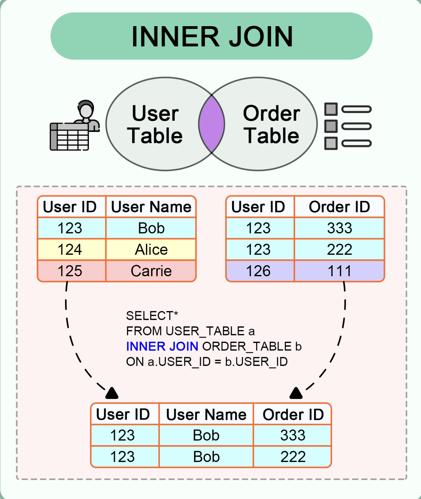
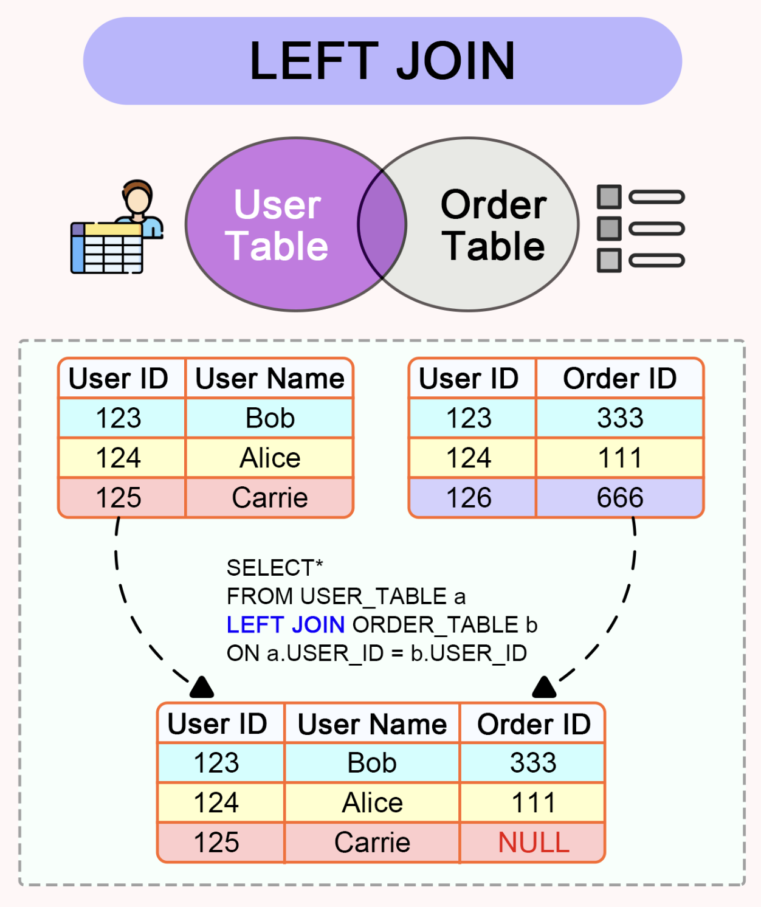
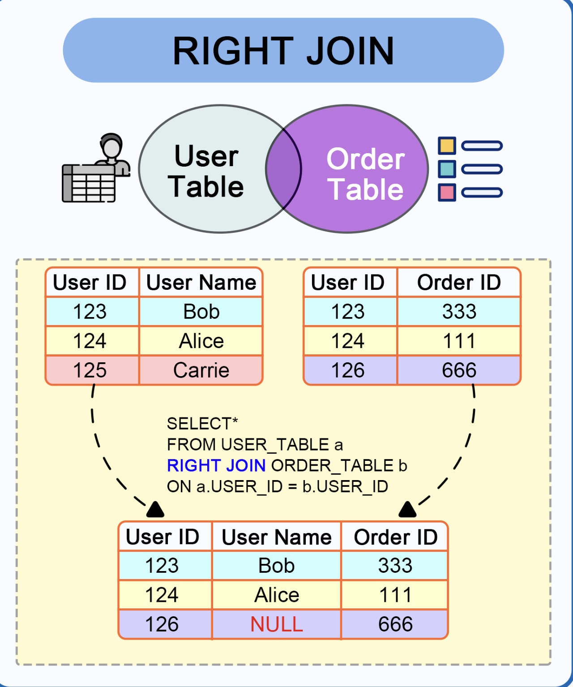
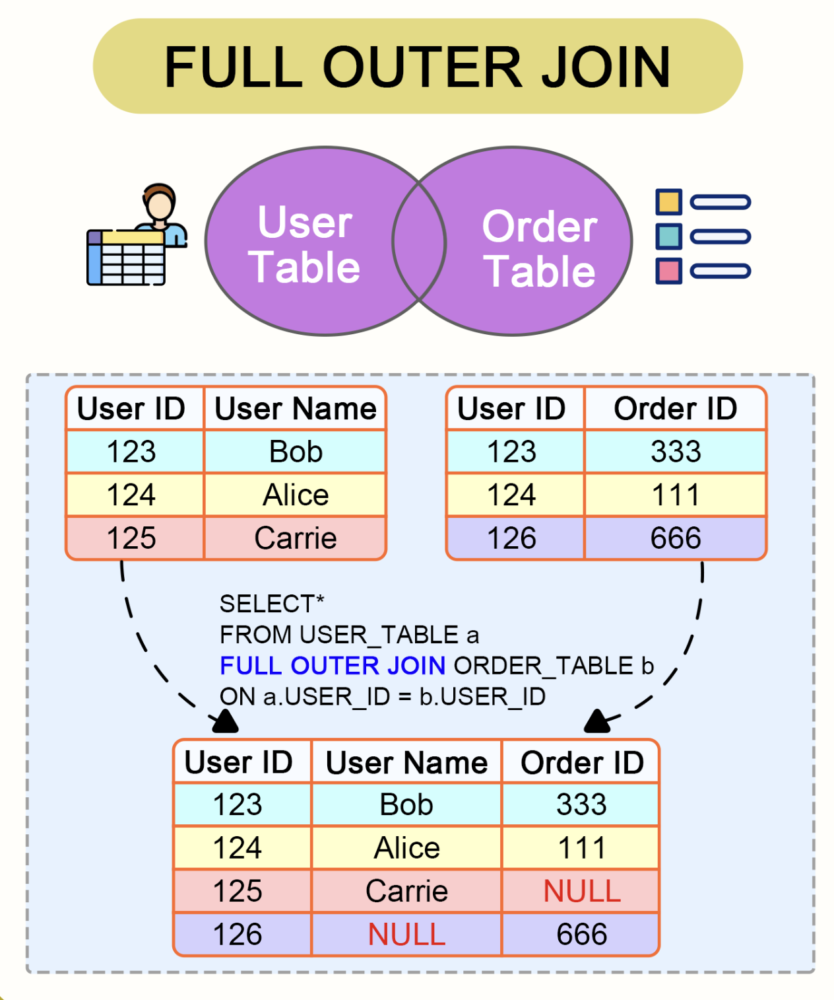

# JOIN operation in Action

	A JOIN operation combines rows from 
	two or more tables based on a related 
	column between them, using syntax like 
	
	   SELECT ... 
	   FROM table1 
	   JOIN table2 ON table1.column = table2.column;
	
	where column is a common attribute 
	in both table1 and table2.

	
## Common Join types include 

#### `INNER JOIN` (only matching rows)

#### `LEFT JOIN` (all left table rows + matches from right)

#### `RIGHT JOIN` (all right table rows + matches from left)

#### `FULL OUTER JOIN` (all rows from both)

	✅ All rows from the left table
	 + All rows from the right table
	 + Matches where they exist
	 + NULLs where there is no match


## Key concepts

	1. Related Columns: 
	
		Joins require a common column between 
		tables, such as a primary key (PK) in 
		one table and a foreign key  (FK)  in 
		another, to establish a logical connection.
		
	2. Join Condition: 
	
		This is the rule that determines how rows 
		are matched, usually an equality test in 
		the ON clause. The column names don't have 
		to be the same, but their data types must 
		be compatible.


## INNER JOIN: 

	Returns only the rows where there is a match 
	in both tables based on the join condition.
	
	Example: 
	         SELECT o.order_id, 
	                c.customer_name 
	         FROM orders o
	         INNER JOIN customers c 
	              ON o.customer_id = c.customer_id;



## A Complete Example

```sql
use testdb;


CREATE TABLE A (
   the_key INT, 
   value1 VARCHAR(2)
);

CREATE TABLE B (
   the_key INT, 
   value2 VARCHAR(2)
);

mysql> show tables;
+------------------+
| Tables_in_testdb |
+------------------+
| A                |
| B                |
+------------------+
2 rows in set (0.002 sec)

mysql> desc A;
+---------+------------+------+-----+---------+-------+
| Field   | Type       | Null | Key | Default | Extra |
+---------+------------+------+-----+---------+-------+
| the_key | int        | YES  |     | NULL    |       |
| value1  | varchar(2) | YES  |     | NULL    |       |
+---------+------------+------+-----+---------+-------+
2 rows in set (0.003 sec)

mysql> desc B;
+---------+------------+------+-----+---------+-------+
| Field   | Type       | Null | Key | Default | Extra |
+---------+------------+------+-----+---------+-------+
| the_key | int        | YES  |     | NULL    |       |
| value2  | varchar(2) | YES  |     | NULL    |       |
+---------+------------+------+-----+---------+-------+
2 rows in set (0.002 sec)
```

### Populate Tables A and B

```sql
INSERT INTO A(the_key, value1)
VALUES
(1, 'a1'),
(1, 'a2'),
(1, 'a3'),
(2, 'b1'),
(2, 'b2'),
(3, 'c1'),
(5, 'd1'),
(5, 'e1'),
(NULL, 'f'),
(NULL, 'g');

mysql> SELECT * FROM A;
+---------+--------+
| the_key | value1 |
+---------+--------+
|       1 | a1     |
|       1 | a2     |
|       1 | a3     |
|       2 | b1     |
|       2 | b2     |
|       3 | c1     |
|       5 | d1     |
|       5 | e1     |
|    NULL | f      |
|    NULL | g      |
+---------+--------+
10 rows in set (0.001 sec)

INSERT INTO B(the_key, value2)
VALUES
(1, 'p1'),
(1, 'p2'),
(2, 'v1'),
(2, 'v2'),
(2, 'v3'),
(3, 't3'),
(6, 'w6'),
(7, 'w7'),
(8, 'w8'),
(9, 'w9'),
(NULL, 'z1'),
(NULL, 'z2');

mysql> select * from B;
+---------+--------+
| the_key | value2 |
+---------+--------+
|       1 | p1     |
|       1 | p2     |
|       2 | v1     |
|       2 | v2     |
|       2 | v3     |
|       3 | t3     |
|       6 | w6     |
|       7 | w7     |
|       8 | w8     |
|       9 | w9     |
|    NULL | z1     |
|    NULL | z2     |
+---------+--------+
12 rows in set (0.001 sec)
```

### INNER JOIN

```sql   
	SELECT A.the_key AS a_key,
	       A.value1  AS a_value,
	       B.the_key AS b_key,
	       B.value2  AS b_value    
	FROM A
	INNER JOIN B 
	    ON A.the_key = B.the_key
	ORDER BY 
	         a_key,
	         a_value,
	         b_key,
	         b_value; 

+-------+---------+-------+---------+
| a_key | a_value | b_key | b_value |
+-------+---------+-------+---------+
|     1 | a1      |     1 | p1      |
|     1 | a1      |     1 | p2      |
|     1 | a2      |     1 | p1      |
|     1 | a2      |     1 | p2      |
|     1 | a3      |     1 | p1      |
|     1 | a3      |     1 | p2      |
|     2 | b1      |     2 | v1      |
|     2 | b1      |     2 | v2      |
|     2 | b1      |     2 | v3      |
|     2 | b2      |     2 | v1      |
|     2 | b2      |     2 | v2      |
|     2 | b2      |     2 | v3      |
|     3 | c1      |     3 | t3      |
+-------+---------+-------+---------+
13 rows in set (0.000 sec)
```   
    
------
       
## LEFT JOIN (or LEFT OUTER JOIN): 

	Returns all rows from the left table, 
	and the matched rows from the right table. 
	If there is no match, the result is NULL 
	for the right table's columns.



```sql
	SELECT A.the_key AS a_key,
	       A.value1  AS a_value,
	       B.the_key AS b_key,
	       B.value2  AS b_value    
	FROM A
	LEFT JOIN B 
	    ON A.the_key = B.the_key
	ORDER BY 
	         a_key,
	         a_value,
	         b_key,
	         b_value; 
+-------+---------+-------+---------+
| a_key | a_value | b_key | b_value |
+-------+---------+-------+---------+
|  NULL | f       |  NULL | NULL    |
|  NULL | g       |  NULL | NULL    |
|     1 | a1      |     1 | p1      |
|     1 | a1      |     1 | p2      |
|     1 | a2      |     1 | p1      |
|     1 | a2      |     1 | p2      |
|     1 | a3      |     1 | p1      |
|     1 | a3      |     1 | p2      |
|     2 | b1      |     2 | v1      |
|     2 | b1      |     2 | v2      |
|     2 | b1      |     2 | v3      |
|     2 | b2      |     2 | v1      |
|     2 | b2      |     2 | v2      |
|     2 | b2      |     2 | v3      |
|     3 | c1      |     3 | t3      |
|     5 | d1      |  NULL | NULL    |
|     5 | e1      |  NULL | NULL    |
+-------+---------+-------+---------+
17 rows in set (0.001 sec)
```
------
	
## RIGHT JOIN (or RIGHT OUTER JOIN): 

	Returns all rows from the right table, 
	and the matched rows from the left table. 
	If there is no match, the result is NULL 
	for the left table's columns.



```sql
	SELECT A.the_key AS a_key,
	       A.value1  AS a_value,
	       B.the_key AS b_key,
	       B.value2  AS b_value    
	FROM A
	RIGHT JOIN B 
	    ON A.the_key = B.the_key
	ORDER BY 
	         a_key,
	         a_value,
	         b_key,
	         b_value; 
+-------+---------+-------+---------+
| a_key | a_value | b_key | b_value |
+-------+---------+-------+---------+
|  NULL | NULL    |  NULL | z1      |
|  NULL | NULL    |  NULL | z2      |
|  NULL | NULL    |     6 | w6      |
|  NULL | NULL    |     7 | w7      |
|  NULL | NULL    |     8 | w8      |
|  NULL | NULL    |     9 | w9      |
|     1 | a1      |     1 | p1      |
|     1 | a1      |     1 | p2      |
|     1 | a2      |     1 | p1      |
|     1 | a2      |     1 | p2      |
|     1 | a3      |     1 | p1      |
|     1 | a3      |     1 | p2      |
|     2 | b1      |     2 | v1      |
|     2 | b1      |     2 | v2      |
|     2 | b1      |     2 | v3      |
|     2 | b2      |     2 | v1      |
|     2 | b2      |     2 | v2      |
|     2 | b2      |     2 | v3      |
|     3 | c1      |     3 | t3      |
+-------+---------+-------+---------+
19 rows in set (0.001 sec)
```

------

## FULL OUTER JOIN: 

	Returns all rows when there is a match 
	in either the left or right table. It 
	returns NULL for columns of the table 
	that doesn't have a match.




### ✅ `FULL OUTER JOIN` (Not supported natively in MySQL, but can be emulated)

```sql
	SELECT A.the_key AS a_key,
	       A.value1  AS a_value,
	       B.the_key AS b_key,
	       B.value2  AS b_value    
	FROM A
	LEFT JOIN B 
	    ON A.the_key = B.the_key
	    
	UNION

	SELECT A.the_key AS a_key,
	       A.value1  AS a_value,
	       B.the_key AS b_key,
	       B.value2  AS b_value    
	FROM A
	RIGHT JOIN B 
	    ON A.the_key = B.the_key
	    	    
	ORDER BY 
	         a_key,
	         a_value,
	         b_key,
	         b_value; 

+-------+---------+-------+---------+
| a_key | a_value | b_key | b_value |
+-------+---------+-------+---------+
|  NULL | NULL    |  NULL | z1      |
|  NULL | NULL    |  NULL | z2      |
|  NULL | NULL    |     6 | w6      |
|  NULL | NULL    |     7 | w7      |
|  NULL | NULL    |     8 | w8      |
|  NULL | NULL    |     9 | w9      |
|  NULL | f       |  NULL | NULL    |
|  NULL | g       |  NULL | NULL    |
|     1 | a1      |     1 | p1      |
|     1 | a1      |     1 | p2      |
|     1 | a2      |     1 | p1      |
|     1 | a2      |     1 | p2      |
|     1 | a3      |     1 | p1      |
|     1 | a3      |     1 | p2      |
|     2 | b1      |     2 | v1      |
|     2 | b1      |     2 | v2      |
|     2 | b1      |     2 | v3      |
|     2 | b2      |     2 | v1      |
|     2 | b2      |     2 | v2      |
|     2 | b2      |     2 | v3      |
|     3 | c1      |     3 | t3      |
|     5 | d1      |  NULL | NULL    |
|     5 | e1      |  NULL | NULL    |
+-------+---------+-------+---------+
23 rows in set (0.001 sec)
```


------

## CROSS JOIN: 

	Returns the Cartesian product of both 
	tables, combining every row from the 
	first table with every row from the 
	second table. 


```sql
	SELECT A.the_key AS a_key,
	       A.value1  AS a_value,
	       B.the_key AS b_key,
	       B.value2  AS b_value    
	FROM A,
	     B;

+-------+---------+-------+---------+
| a_key | a_value | b_key | b_value |
+-------+---------+-------+---------+
|  NULL | g       |     1 | p1      |
|  NULL | f       |     1 | p1      |
|     5 | e1      |     1 | p1      |
|     5 | d1      |     1 | p1      |
|     3 | c1      |     1 | p1      |
|     2 | b2      |     1 | p1      |
|     2 | b1      |     1 | p1      |
|     1 | a3      |     1 | p1      |
|     1 | a2      |     1 | p1      |
|     1 | a1      |     1 | p1      |
|  NULL | g       |     1 | p2      |
|  NULL | f       |     1 | p2      |
|     5 | e1      |     1 | p2      |
|     5 | d1      |     1 | p2      |
|     3 | c1      |     1 | p2      |
|     2 | b2      |     1 | p2      |
|     2 | b1      |     1 | p2      |
|     1 | a3      |     1 | p2      |
|     1 | a2      |     1 | p2      |
|     1 | a1      |     1 | p2      |
|  NULL | g       |     2 | v1      |
|  NULL | f       |     2 | v1      |
|     5 | e1      |     2 | v1      |
|     5 | d1      |     2 | v1      |
|     3 | c1      |     2 | v1      |
|     2 | b2      |     2 | v1      |
|     2 | b1      |     2 | v1      |
|     1 | a3      |     2 | v1      |
|     1 | a2      |     2 | v1      |
|     1 | a1      |     2 | v1      |
|  NULL | g       |     2 | v2      |
|  NULL | f       |     2 | v2      |
|     5 | e1      |     2 | v2      |
|     5 | d1      |     2 | v2      |
|     3 | c1      |     2 | v2      |
|     2 | b2      |     2 | v2      |
|     2 | b1      |     2 | v2      |
|     1 | a3      |     2 | v2      |
|     1 | a2      |     2 | v2      |
|     1 | a1      |     2 | v2      |
|  NULL | g       |     2 | v3      |
|  NULL | f       |     2 | v3      |
|     5 | e1      |     2 | v3      |
|     5 | d1      |     2 | v3      |
|     3 | c1      |     2 | v3      |
|     2 | b2      |     2 | v3      |
|     2 | b1      |     2 | v3      |
|     1 | a3      |     2 | v3      |
|     1 | a2      |     2 | v3      |
|     1 | a1      |     2 | v3      |
|  NULL | g       |     3 | t3      |
|  NULL | f       |     3 | t3      |
|     5 | e1      |     3 | t3      |
|     5 | d1      |     3 | t3      |
|     3 | c1      |     3 | t3      |
|     2 | b2      |     3 | t3      |
|     2 | b1      |     3 | t3      |
|     1 | a3      |     3 | t3      |
|     1 | a2      |     3 | t3      |
|     1 | a1      |     3 | t3      |
|  NULL | g       |     6 | w6      |
|  NULL | f       |     6 | w6      |
|     5 | e1      |     6 | w6      |
|     5 | d1      |     6 | w6      |
|     3 | c1      |     6 | w6      |
|     2 | b2      |     6 | w6      |
|     2 | b1      |     6 | w6      |
|     1 | a3      |     6 | w6      |
|     1 | a2      |     6 | w6      |
|     1 | a1      |     6 | w6      |
|  NULL | g       |     7 | w7      |
|  NULL | f       |     7 | w7      |
|     5 | e1      |     7 | w7      |
|     5 | d1      |     7 | w7      |
|     3 | c1      |     7 | w7      |
|     2 | b2      |     7 | w7      |
|     2 | b1      |     7 | w7      |
|     1 | a3      |     7 | w7      |
|     1 | a2      |     7 | w7      |
|     1 | a1      |     7 | w7      |
|  NULL | g       |     8 | w8      |
|  NULL | f       |     8 | w8      |
|     5 | e1      |     8 | w8      |
|     5 | d1      |     8 | w8      |
|     3 | c1      |     8 | w8      |
|     2 | b2      |     8 | w8      |
|     2 | b1      |     8 | w8      |
|     1 | a3      |     8 | w8      |
|     1 | a2      |     8 | w8      |
|     1 | a1      |     8 | w8      |
|  NULL | g       |     9 | w9      |
|  NULL | f       |     9 | w9      |
|     5 | e1      |     9 | w9      |
|     5 | d1      |     9 | w9      |
|     3 | c1      |     9 | w9      |
|     2 | b2      |     9 | w9      |
|     2 | b1      |     9 | w9      |
|     1 | a3      |     9 | w9      |
|     1 | a2      |     9 | w9      |
|     1 | a1      |     9 | w9      |
|  NULL | g       |  NULL | z1      |
|  NULL | f       |  NULL | z1      |
|     5 | e1      |  NULL | z1      |
|     5 | d1      |  NULL | z1      |
|     3 | c1      |  NULL | z1      |
|     2 | b2      |  NULL | z1      |
|     2 | b1      |  NULL | z1      |
|     1 | a3      |  NULL | z1      |
|     1 | a2      |  NULL | z1      |
|     1 | a1      |  NULL | z1      |
|  NULL | g       |  NULL | z2      |
|  NULL | f       |  NULL | z2      |
|     5 | e1      |  NULL | z2      |
|     5 | d1      |  NULL | z2      |
|     3 | c1      |  NULL | z2      |
|     2 | b2      |  NULL | z2      |
|     2 | b1      |  NULL | z2      |
|     1 | a3      |  NULL | z2      |
|     1 | a2      |  NULL | z2      |
|     1 | a1      |  NULL | z2      |
+-------+---------+-------+---------+
120 rows in set (0.000 sec)
```
------


## References

[1.The Join Operation](https://www.faastop.com/dbms/30.Join_Operator.html)

