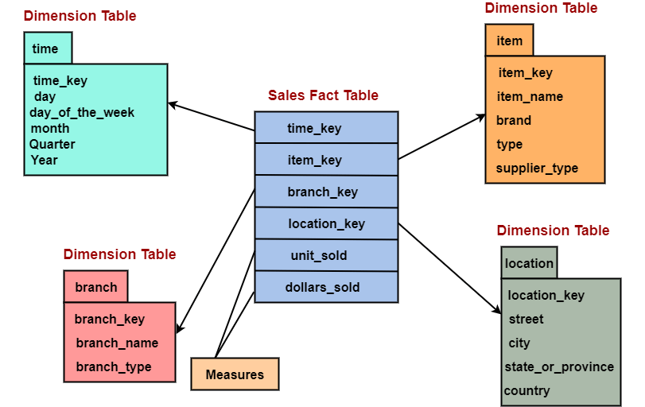

# Star Schema
A "star schema" is a database design used in data 
warehousing and business intelligence, where data 
is organized with a central "fact table" surrounded 
by multiple "dimension tables," resembling a star 
shape, making it efficient for querying and analyzing 
large datasets by providing easy access to both factual 
metrics and descriptive attributes about those metrics; essentially, it's a simple, easy-to-understand way to 
structure data for analysis, with the fact table holding 
key measures and the dimension tables providing context 
about those measures. 

## Key points about star schema:

### Structure:

		A central fact table is connected to multiple 
		dimension tables, each representing a different 
		aspect of the data (like time, product, customer,
		location). 

### Fact table:

		Contains the core metrics or measures you want 
		to analyze, usually with foreign keys referencing 
		the dimension tables. 

### Dimension tables:

		Provide descriptive details about the data in 
		the fact table, allowing for filtering and 
		grouping analysis. 

### Benefits:

		Fast querying: Optimized for quick analysis of 
		large datasets due to its simple structure and 
		reduced joins. 

		Easy to understand: The clear distinction between 
		facts and dimensions makes it intuitive for data 
		analysts. 

		Flexibility: Can be easily adapted to different 
		business needs by adding or modifying dimension tables. 
