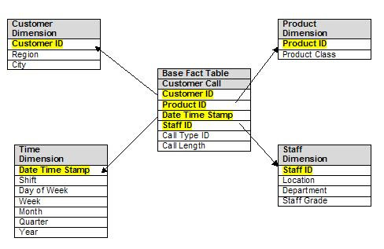

# ⭐️ Demo of a "Star Schema" 

#### Database Environment:  MyySQL database


#### For the first day of a data warehousing class: to see the big picture

## ✅ Star Schema for Retail Sales

✅ provide a star schema for retail sales:

* ✅ Fact table:
	* **sales** is a Fact table, and 
	
* ✅ Dimension tables are: 
	* **customers** 
	* **dates**
	* **products**
	* **stores**

## ⍰ What is a Star Schema ⭐️?

	☑️ A star schema is a data modeling design 
	for data warehouses, featuring a central 
	fact table (containing numerical measures 
	like sales amounts, quantity, ...) surrounded 
	by multiple dimension tables  (providing  
	descriptive context like customer, product, 
	and  time) in a  hub-and-spoke  pattern, 
	resembling a  star ⭐️. 
	
	☑️ This structure simplifies queries and boosts 
	performance by reducing the number of table 
	joins needed for analysis,  making  it ideal 
	for  business intelligence  and reporting by 
	allowing quick filtering and aggregation of 
	large datasets. 




-----

## Data Warehouse Population

✅ Provide SQL statements for schema, SQL INSERT for 
creating rows (descent number of rows), and then 

✅ Provide 12 solid business-insight OLAP queries to 
show the power of a DW. Make sure all is runnable 
for my demo.

✅ Below is a clean, first-day, fully runnable MySQL 
star-schema demo for a Retail Sales Data Warehouse.

This is designed exactly for a live classroom demo: 
simple, realistic, insightful.

🎓 One-sentence takeaway for students

		A data warehouse is designed to 
		answer business questions quickly, 
		not to record transactions.

You can copy–paste and run it as-is.

⸻

## 1️⃣ Star Schema Overview (Conceptual)

✅ Fact table

	•	fact_sales — measures (quantity, revenue)

✅ Dimension tables

	•	dim_customers
	•	dim_products
	•	dim_dates
	•	dim_stores

```
	
	               dim_customers
	                    |
	                    |
	dim_products ⸻ fact_sales ⸻ dim_dates
	                   |
	                   |
	                dim_stores

```
⸻

2️⃣ Create Database

```sql
CREATE DATABASE retail_dw;
USE retail_dw;
```

⸻

3️⃣ Dimension Tables

📅 Date Dimension

```sql
CREATE TABLE dim_dates (
  date_id INT PRIMARY KEY,
  full_date DATE,
  year INT,
  quarter INT,
  month INT,
  month_name VARCHAR(15),
  day INT
);

Sample Dates (multiple years)

INSERT INTO dim_dates VALUES
(20230101,'2023-01-01',2023,1,1,'January',1),
(20230315,'2023-03-15',2023,1,3,'March',15),
(20230710,'2023-07-10',2023,3,7,'July',10),
(20240105,'2024-01-05',2024,1,1,'January',5),
(20240420,'2024-04-20',2024,2,4,'April',20);
```

⸻

👤 Customer Dimension

```sql
CREATE TABLE dim_customers (
  customer_id INT PRIMARY KEY,
  name VARCHAR(50),
  gender VARCHAR(10),
  country VARCHAR(30)
);

INSERT INTO dim_customers VALUES
(1,'Alice','FEMALE','USA'),
(2,'Bob','MALE','USA'),
(3,'Carlos','MALE','MEXICO'),
(4,'Diana','FEMALE','CANADA'),
(5,'Eva','FEMALE','GERMANY');
```

⸻

📦 Product Dimension

```sql
CREATE TABLE dim_products (
  product_id INT PRIMARY KEY,
  product_name VARCHAR(50),
  category VARCHAR(30),
  brand VARCHAR(30)
);

INSERT INTO dim_products VALUES
(101,'Laptop','Electronics','Dell'),
(102,'Phone','Electronics','Apple'),
(103,'Headphones','Accessories','Sony'),
(104,'Desk','Furniture','Ikea'),
(105,'Chair','Furniture','Ikea');
```

⸻

🏬 Store Dimension

```sql
CREATE TABLE dim_stores (
  store_id INT PRIMARY KEY,
  store_name VARCHAR(50),
  country VARCHAR(30),
  store_type VARCHAR(20)
);

INSERT INTO dim_stores VALUES
(1,'NY Downtown','USA','PHYSICAL'),
(2,'LA Mall','USA','PHYSICAL'),
(3,'Toronto Central','CANADA','PHYSICAL'),
(4,'Online Store','USA','ONLINE');
```

⸻

4️⃣ Fact Table (Sales)

```sql
CREATE TABLE fact_sales (
  sales_id INT PRIMARY KEY AUTO_INCREMENT,
  date_id INT,
  customer_id INT,
  product_id INT,
  store_id INT,
  quantity INT,
  unit_price DECIMAL(10,2),
  total_amount DECIMAL(10,2),

  FOREIGN KEY (date_id) REFERENCES dim_dates(date_id),
  FOREIGN KEY (customer_id) REFERENCES dim_customers(customer_id),
  FOREIGN KEY (product_id) REFERENCES dim_products(product_id),
  FOREIGN KEY (store_id) REFERENCES dim_stores(store_id)
);
```

⸻

Sample Sales Data (fact table)

```sql
INSERT INTO fact_sales
(date_id, customer_id, product_id, store_id, quantity, unit_price, total_amount)
VALUES
(20230101,1,101,1,1,1200,1200),
(20230315,2,102,2,2,900,1800),
(20230710,3,103,4,3,150,450),
(20240105,4,104,3,1,400,400),
(20240420,5,105,4,4,100,400),
(20240420,1,102,4,1,950,950),
(20230315,2,103,1,2,140,280),
(20240105,3,101,4,1,1250,1250);
```

⸻

5️⃣ 12 Solid OLAP / Business Insight Queries

⸻

### 1️⃣ Total sales revenue by year (ROLL-UP)

```sql
SELECT d.year, 
       SUM(f.total_amount) AS total_revenue
FROM fact_sales f
JOIN dim_dates d ON f.date_id = d.date_id
GROUP BY d.year;
```

⸻

### 2️⃣ Revenue by product category

```sql
SELECT p.category, 
       SUM(f.total_amount) AS revenue
FROM fact_sales f
JOIN dim_products p ON f.product_id = p.product_id
GROUP BY p.category;
```


⸻

### 3️⃣ Top 3 products by revenue

```sql
SELECT p.product_name, 
       SUM(f.total_amount) AS revenue
FROM fact_sales f
JOIN dim_products p ON f.product_id = p.product_id
GROUP BY p.product_name
ORDER BY revenue DESC
LIMIT 3;
```


⸻

###  4️⃣ Revenue by country (customer geography)

```sql
SELECT c.country, 
       SUM(f.total_amount) AS revenue
FROM fact_sales f
JOIN dim_customers c ON f.customer_id = c.customer_id
GROUP BY c.country;
```


⸻

### 5️⃣ Online vs Physical store performance

```sql
SELECT s.store_type, 
       SUM(f.total_amount) AS revenue
FROM fact_sales f
JOIN dim_stores s ON f.store_id = s.store_id
GROUP BY s.store_type;
```


⸻

### 6️⃣ Average order value per store

```sql
SELECT s.store_name, 
       AVG(f.total_amount) AS avg_order_value
FROM fact_sales f
JOIN dim_stores s ON f.store_id = s.store_id
GROUP BY s.store_name;
```


⸻

### 7️⃣ Monthly revenue trend (time series)

```sql
SELECT d.year, 
       d.month,
       d.month_name, 
       SUM(f.total_amount) AS revenue
FROM fact_sales f
JOIN dim_dates d ON f.date_id = d.date_id
GROUP BY d.year, d.month, d.month_name
ORDER BY d.year, d.month;
```


⸻

### 8️⃣ Best-selling product per year

```sql
SELECT d.year, 
       p.product_name, 
       SUM(f.quantity) AS units_sold
FROM fact_sales f
JOIN dim_dates d ON f.date_id = d.date_id
JOIN dim_products p ON f.product_id = p.product_id
GROUP BY d.year, p.product_name
ORDER BY d.year, units_sold DESC;
```


⸻

### 9️⃣ Customer lifetime value (CLV)

```sql
SELECT c.name, 
       SUM(f.total_amount) AS lifetime_value
FROM fact_sales f
JOIN dim_customers c ON f.customer_id = c.customer_id
GROUP BY c.name
ORDER BY lifetime_value DESC;
```


⸻

###  🔟 Furniture vs Electronics trend over years

```sql
SELECT d.year, 
       p.category, 
       SUM(f.total_amount) AS revenue
FROM fact_sales f
JOIN dim_dates d ON f.date_id = d.date_id
JOIN dim_products p ON f.product_id = p.product_id
GROUP BY d.year, p.category
ORDER BY d.year, p.category;
```


⸻


###  OLAP QUERY 11: Customers who have never purchased any products

```sql
SELECT c.customer_id, 
       c.name, 
       c.country
FROM dim_customers c
LEFT JOIN fact_sales f
  ON c.customer_id = f.customer_id
WHERE f.customer_id IS NULL;
```


###  OLAP QUERY 12: Products that have never been sold

```sql
SELECT p.product_id, 
       p.product_name, 
       p.category
FROM dim_products p
LEFT JOIN fact_sales f
  ON p.product_id = f.product_id
WHERE f.product_id IS NULL;
```

6️⃣ Teaching Notes (First-Day Friendly)

Why this is perfect for Day 1

	•	Clear Fact vs Dimensions
	•	Clean surrogate keys
	•	Easy joins
	•	Powerful business questions
	•	Introduces OLAP thinking (time, geography, product)

Concepts students see immediately

	•	Star schema
	•	Measures vs attributes
	•	Roll-up, slice, dice
	•	Time-based analytics
	•	Why DW ≠ OLTP

⸻

🎓 One-sentence takeaway for students

	A data warehouse is designed to answer 
	business questions quickly, not to record 
	transactions.

⸻

Possible next tasks:

	•	Extend this to snowflake schema
	•	Add slowly changing dimensions (SCD-2)
	•	Generate 1000+ rows automatically
	•	Show ETL loading scripts
	•	Convert this to Star Schema → Spark SQL
	