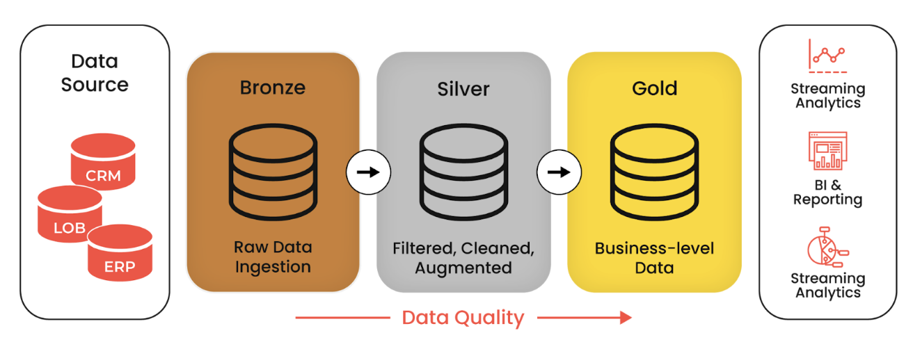
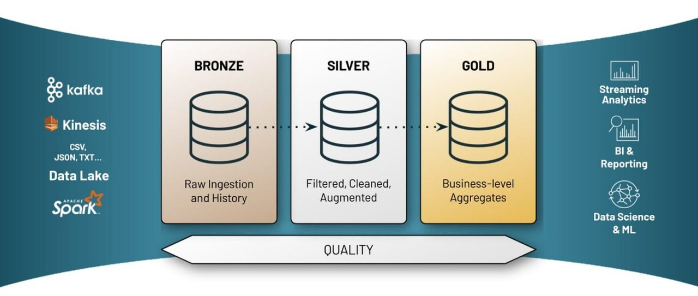
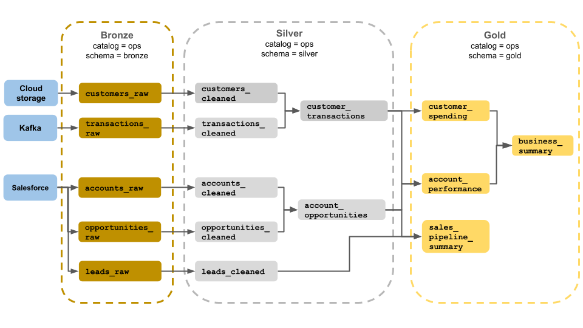

# 🧠 Medallion Architecture

## From raw data → clean data → analytics-ready data

---

# 🎯 Why students should care

Real-world data usually starts as:

- messy
- duplicated
- inconsistent
- difficult to analyze

Medallion architecture gives us a **step-by-step process** to improve data quality.

---

# 🪜 The 4 Layers

## Simple view

- 🟫 **Bronze** = raw messy data
- ⚪ **Silver** = cleaned and validated data
- 🟡 **Gold** = business model for analytics
- 📊 **BI Layer** = queries, dashboards, OLAP analysis

---



---



---

# 🟫 Bronze Layer

## What it means

Bronze stores data **as it arrives** from files, APIs, or source systems.

Typical issues:

- duplicate rows
- missing values
- inconsistent date formats
- inconsistent location names
- prices stored as text

---

# 🟫 Bronze SQL Example

## Load raw CSV files directly

```sql
CREATE OR REPLACE TABLE bronze_books AS
SELECT *
FROM read_csv_auto('data/books.csv');

CREATE OR REPLACE TABLE bronze_sales AS
SELECT *
FROM read_csv_auto('data/sales.csv');
```

### Why this matters
- We keep the original data
- We do not clean anything yet
- This gives us a trusted raw copy

---

# 🟫 Bronze Check

## Basic row counts

```sql
SELECT 'books' AS table_name, COUNT(*) AS row_count FROM bronze_books
UNION ALL
SELECT 'sales', COUNT(*) FROM bronze_sales;
```

### Explanation
This is a **sanity check**.
Before cleaning data, make sure the load actually worked.

---

# 🟫 Bronze Data Quality Example

## Detect duplicate sales rows

```sql
SELECT
    order_id,
    book_id,
    location,
    date_sold,
    COUNT(*) AS cnt
FROM bronze_sales
GROUP BY order_id, book_id, location, date_sold
HAVING COUNT(*) > 1;
```

### Explanation
This shows duplicate groups in the raw data.
At Bronze, duplicates are expected. We detect them, but usually do not fix them yet.

---

# ⚪ Silver Layer

## What it means

Silver contains **cleaned, standardized, validated** data.

Typical tasks:

- parse dates correctly
- standardize text values
- cast numeric fields
- remove duplicates
- filter invalid records

---

# ⚪ Silver SQL Example

## Standardize and clean sales data

```sql
CREATE OR REPLACE TABLE silver_sales AS
SELECT DISTINCT
    order_id,
    CAST(book_id AS INTEGER) AS book_id,
    TRIM(location) AS location,
    CAST(price AS DOUBLE) AS price,
    CAST(quantity AS INTEGER) AS quantity,
    COALESCE(
        TRY_STRPTIME(date_sold, '%m/%d/%Y'),
        TRY_STRPTIME(date_sold, '%Y-%m-%d')
    ) AS date_sold
FROM bronze_sales
WHERE book_id IS NOT NULL
  AND price IS NOT NULL
  AND quantity IS NOT NULL;
```

### Explanation
This query:
- removes duplicate rows with `DISTINCT`
- converts text to proper numeric types
- fixes dates
- removes obviously invalid rows

---

# ⚪ Silver Validation Example

## Check for null dates after cleaning

```sql
SELECT COUNT(*) AS bad_date_rows
FROM silver_sales
WHERE date_sold IS NULL;
```

### Explanation
If this count is high, our date-cleaning logic failed for many rows.
Silver is where we verify data quality.

---

# ⚪ Silver Business Benefit

## Why Silver matters

Without Silver:

- year-based analysis may fail
- price calculations may be wrong
- location grouping may split similar values

Silver gives us **trusted operational data**.

---

# 🟡 Gold Layer

## What it means

Gold contains **business-friendly analytical tables**.

For this course, Gold is a **star schema**:

- `fact_sales`
- `dim_book`
- `dim_location`
- `dim_date`

This makes OLAP and BI easier.

---



---

# 🟡 Gold Example 1

## Create `dim_book`

```sql
CREATE OR REPLACE TABLE dim_book AS
SELECT DISTINCT
    book_id,
    book_title,
    book_genre,
    author_name,
    publisher
FROM silver_books;
```

### Explanation
A dimension table stores descriptive information.
`dim_book` helps us analyze sales by title, genre, author, or publisher.

---

# 🟡 Gold Example 2

## Create `dim_location`

```sql
CREATE OR REPLACE TABLE dim_location AS
SELECT DISTINCT
    ROW_NUMBER() OVER () AS location_id,
    location
FROM (
    SELECT DISTINCT location
    FROM silver_sales
);
```

### Explanation
This creates a location dimension with a surrogate key.
Later, the fact table can reference `location_id` instead of raw text.

---

# 🟡 Gold Example 3

## Create `dim_date`

```sql
CREATE OR REPLACE TABLE dim_date AS
SELECT DISTINCT
    CAST(strftime(date_sold, '%Y%m%d') AS INTEGER) AS date_id,
    date_sold AS full_date,
    YEAR(date_sold) AS year,
    MONTH(date_sold) AS month,
    DAY(date_sold) AS day
FROM silver_sales;
```

### Explanation
Date dimensions are extremely useful for:
- yearly analysis
- monthly trends
- quarter-based reporting

---

# 🟡 Gold Example 4

## Create `fact_sales`

```sql
CREATE OR REPLACE TABLE fact_sales AS
SELECT
    CAST(strftime(s.date_sold, '%Y%m%d') AS INTEGER) AS date_id,
    b.book_id,
    l.location_id,
    s.quantity,
    s.price,
    s.quantity * s.price AS sales_amount
FROM silver_sales s
JOIN dim_book b
  ON s.book_id = b.book_id
JOIN dim_location l
  ON s.location = l.location;
```

### Explanation
The fact table stores:
- keys to dimensions
- numeric business measures

This is the center of the star schema.

---

# ⭐ Why Star Schema Helps

## Business-friendly analytics

Fact table:
- numeric measures

Dimensions:
- descriptive context

This makes questions like these easy:

- Which genre sold most?
- Which city performed best?
- What happened by year or month?

---

# 📊 BI Layer

## Now we ask real business questions

At the BI layer, we do not clean data anymore.
We use Gold tables to answer analytical questions.

---

# 📊 BI Query 1

## Total sales by year

```sql
SELECT
    d.year,
    SUM(f.sales_amount) AS total_sales
FROM fact_sales f
JOIN dim_date d
  ON f.date_id = d.date_id
GROUP BY d.year
ORDER BY d.year;
```

### Explanation
This is a classic **time-based roll-up**.

---

# 📊 BI Query 2

## Top 5 books by revenue

```sql
SELECT
    b.book_title,
    SUM(f.sales_amount) AS revenue
FROM fact_sales f
JOIN dim_book b
  ON f.book_id = b.book_id
GROUP BY b.book_title
ORDER BY revenue DESC
LIMIT 5;
```

### Explanation
This identifies the highest-performing products.

---

# 📊 BI Query 3

## Sales by genre

```sql
SELECT
    b.book_genre,
    SUM(f.sales_amount) AS revenue
FROM fact_sales f
JOIN dim_book b
  ON f.book_id = b.book_id
GROUP BY b.book_genre
ORDER BY revenue DESC;
```

### Explanation
This helps compare categories instead of individual books.

---

# 📊 BI Query 4

## Sales by location

```sql
SELECT
    l.location,
    SUM(f.sales_amount) AS revenue
FROM fact_sales f
JOIN dim_location l
  ON f.location_id = l.location_id
GROUP BY l.location
ORDER BY revenue DESC;
```

### Explanation
This is a geographic slice of the business.

---

# 📊 BI Query 5

## Monthly sales trend

```sql
SELECT
    d.year,
    d.month,
    SUM(f.sales_amount) AS revenue
FROM fact_sales f
JOIN dim_date d
  ON f.date_id = d.date_id
GROUP BY d.year, d.month
ORDER BY d.year, d.month;
```

### Explanation
This supports trend analysis over time.

---

# 📊 Full OLAP Coverage

## Common OLAP operations

- **Roll-up**: daily → monthly → yearly sales
- **Drill-down**: year → month → day
- **Slice**: only one genre
- **Dice**: one genre + one location + one year
- **Pivot**: compare values across categories

Gold tables make these operations straightforward.

---

# 📌 Example Slice and Dice

```sql
SELECT
    d.year,
    l.location,
    SUM(f.sales_amount) AS revenue
FROM fact_sales f
JOIN dim_date d ON f.date_id = d.date_id
JOIN dim_location l ON f.location_id = l.location_id
JOIN dim_book b ON f.book_id = b.book_id
WHERE b.book_genre = 'Fiction'
GROUP BY d.year, l.location
ORDER BY d.year, revenue DESC;
```

### Explanation
This is more focused than a general query:
only **Fiction**, then broken down by year and location.

---

# ✅ Final Takeaway

## The simple story

- 🟫 Bronze = keep raw data
- ⚪ Silver = fix and validate data
- 🟡 Gold = model data for analytics
- 📊 BI = answer business questions

> Medallion architecture is not just a storage pattern.  
> It is a way to move from **messy data to reliable decisions**.
