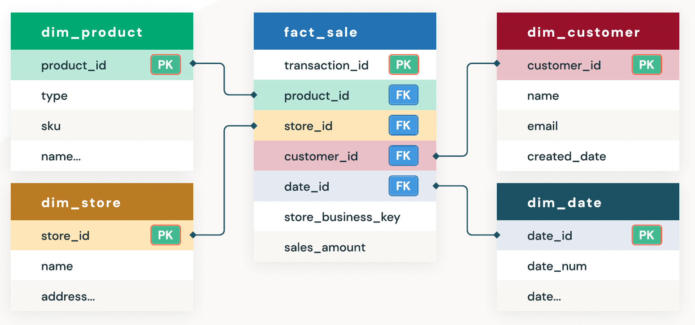

# Book Seller to Star Schema

## Purpose of This Example

The purpose of this example is to 

1. To understand the given operational/transactional 
   database tables

2. Design a Star Schema based on operational/transactional 
   database tables

3. Understand the ETL process to convert transactional 
   database tables into a Star Schema 

4. Understand the FACT table and its associated Dimensional Tables

5. Define 3 Business Intelligence questions in English language 

6. Express 3 Business Intelligence questions in SQL using 
   the Star Schema
   
   
## Book Seller Story: 

A new book seller sells books everywhere in the world.

Given the following 2 operational/transactional database tables

### 1. Sales table
### 2. Books table

Note that these tables might not be the perfect designed tables!
Questions:

1. What is a Star Schema

2. How would you design a Star Schema for these given tables

2. What are your ETL programs to create 
   Star Schema from these 2 operational tables

4. What are the 3 Business Intelligence SQL 
   queries to give an insight to book sales

You should apply the steps
Links to an external site. here to build a Star schema.

## Book Seller Operational/Transactional Tables

### Sales table:
~~~
  COLUMN NAME      DATA TYPE
  --------------   ----------
  transaction_id   INTEGER
  book_id          INTEGER, 
  book_title       TEXT, 
  book_genre       TEXT
  date_sold        DATE
  year_sold        INTEGER
  month_sold       INTEGER
  day_sold         INTEGER
  sale_price       DOUBLE
  promotion_amount DOUBLE
  promotion_used   BOOLEAN {true, false}
  country_sold     TEXT
  city_sold        TEXT
  region_sold      TEXT
  hard_copy        BOOLEAN
  paperback        BOOLEAN
  kindle           BOOLEAN
  soft_copy        BOOLEAN
~~~

### Books table:

~~~
  COLUMN NAME      DATA TYPE
  --------------   ----------
  author_id         INTEGER
  book_id           INTEGER
  book_title        TEXT
  author_last_name  TEXT
  author_first_name TEXT
  author_web_site   TEXT
  book_published    DATE
~~~

# Star Schema Example

# Star Schema BOOK SELLER

### Sales table => Star Schema tables

## 1. Book table (as DIMENSION)

	The book dimension stores the 
	name and genre of each book sold

~~~sql	
book_id           INTEGER, 
book_title        TEXT, 
book_genre        TEXT
author_id         INTEGER
author_last_name  TEXT
author_first_name TEXT
author_web_site   TEXT
book_published    DATE
~~~

## 2. Location table  (as DIMENSION)

	The location dimension stores the 
	city and region of the stores

~~~sql
location_id INTEGER 
country     TEXT
city        TEXT 
region      TEXT
~~~

## 3. `Time_dim` table (as DIMENSION)

	`Time_dim` table stores 
	the date of each sale.

~~~sql
time_id    INTEGER
date       DATE 
day        INTEGER, 
month      INTEGER, 
year       INTEGER
~~~

## 4. Type of Book DIMENSION

~~~sql
type_of_book_id  INTEGER
hard_copy        BOOLEAN
paperback        BOOLEAN
kindle           BOOLEAN
soft_copy        BOOLEAN
~~~

## 5. FACT TABLE sale

	The fact table stores facts about 
	how many of each book is sold each day.

~~~sql
book_id          INTEGER,  -- FK
location_id      INTEGER,  -- FK
date_id          INTEGER,  -- FK
sale_price       DOUBLE
promotion_used   BOOLEAN {true, false}
promotion_amount DOUBLE
type_of_book_id  INTEGER
~~~