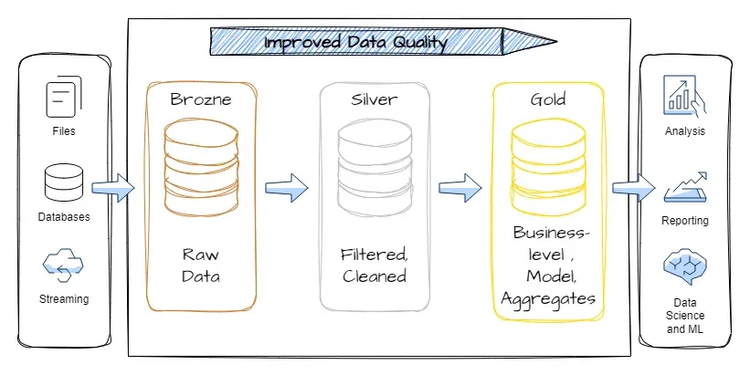

# Medallion Architecture in Action

## Executive Summary

This project presents a comprehensive data 
warehousing and analytics solution for an 
insurance dataset (spans for 4 years) using 
a modern Medallion Architecture approach 
(**Bronze → Silver → Gold**). The primary 
objective is to demonstrate how raw, messy 
operational data can be transformed into clean, 
trusted, and analytics-ready information through 
the application of structured business rules and 
data quality processes.

The project focuses on building a scalable and 
educational framework for data ingestion, cleansing, 
validation, transformation, and analytical modeling. 
At the core of the solution is a well-defined set of 
business rules designed to enforce data integrity, 
standardize inconsistent values, remove duplicates, 
validate domains, and identify semantic anomalies 
within the dataset.

Key business rules address critical data quality 
dimensions, including:

* Validity checks for age, BMI, charges, and number of children
* Standardization of categorical attributes such as gender, smoker status, and region
* Deduplication of repeated records
* Semantic validation to detect suspicious or anomalous business behavior
* Flexible handling of evolving regional values and schema inconsistencies

## Medallion Architecture

The architecture is divided into three logical layers:

### 1. Bronze Layer

Stores raw ingested data exactly as received 
from source systems, preserving all inconsistencies 
and errors for auditability and traceability.

### 2. Silver Layer
Applies business rules, cleanses data, standardizes 
formats, validates domains, removes duplicates, and 
prepares trusted datasets for downstream consumption.

### 3. Gold Layer
Produces analytics-ready datasets optimized for reporting, 
business intelligence, OLAP analysis, and decision-making.

This project also demonstrates best practices in modern 
data engineering, including:

* Data quality enforcement
* Schema normalization
* Reusable transformation pipelines
* Analytical modeling
* Educational examples for SQL, DuckDB, PySpark, and data warehousing concepts

## Final Outcome

The final outcome is a reliable analytical foundation 
that supports business insights, reporting accuracy, 
and advanced analytics while simultaneously serving as 
a teaching and learning platform for students studying 
data warehousing, analytics engineering, and modern 
data platforms.

Overall, the project illustrates how business rules 
and Medallion Architecture principles can significantly 
improve data reliability, governance, and analytical 
value in real-world enterprise environments.

## Files in this folder...

| File                      | Description                                          |
|---------------------------|------------------------------------------------------|
| `README.md`               | the file you are reading now
| [`business_rules.md`](./business_rules.md)      | Business rules applied to messy insurance data       |
| [`create_messy_data.py`](create_messy_data.py)    | Python program, wchich generates messy data          |
| [`data_messy`](./data_messy)             | Data folder for messy data                           |
| [`data_original`](./data_original)           | Data folder for original clean data.                 |
| [`data.is.messy`]()           | To remind us that the data is messy for analysis.    |
| [`EDA_insurance_dw.ipynb`](./EDA_insurance_dw.ipynb)  | EDA for messy insurance data                         |
| [`images`](./images)                  | Image folder                                         |
| [`medallion_build_star_schema.ipynb`](./medallion_build_star_schema.ipynb) | Notebook: Medallion Architecture in Action |
| [`medallion_executive_dashboard.ipynb`](./medallion_executive_dashboard.ipynb) | Notebook: Executive Dashboard            |
